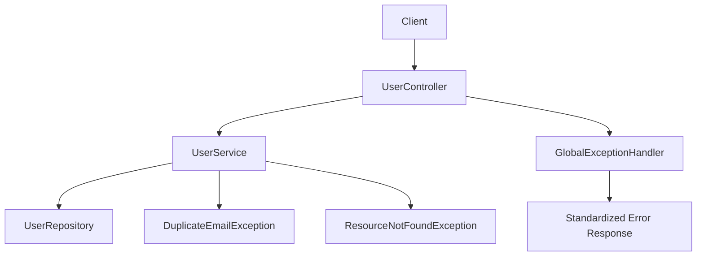
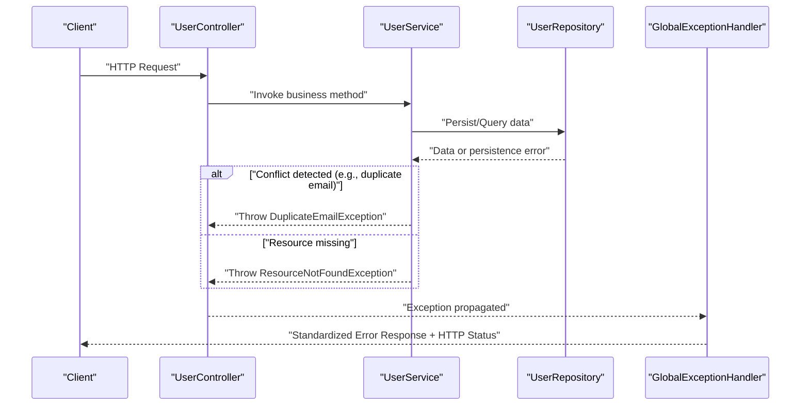
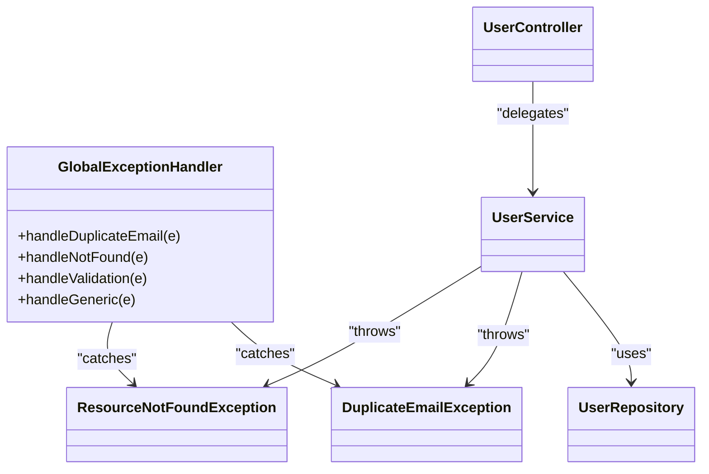

# Error Handling & Status Codes

<cite>
**Referenced Files in This Document**
- [GlobalExceptionHandler.java](file://src/main/java/com/first/app/exception/GlobalExceptionHandler.java)
- [DuplicateEmailException.java](file://src/main/java/com/first/app/exception/DuplicateEmailException.java)
- [ResourceNotFoundException.java](file://src/main/java/com/first/app/exception/ResourceNotFoundException.java)
- [UserController.java](file://src/main/java/com/first/app/controller/UserController.java)
- [UserService.java](file://src/main/java/com/first/app/service/UserService.java)
- [UserRepository.java](file://src/main/java/com/first/app/repository/UserRepository.java)
- [CreateUserRequest.java](file://src/main/java/com/first/app/dto/CreateUserRequest.java)
- [UpdateUserRequest.java](file://src/main/java/com/first/app/dto/UpdateUserRequest.java)
</cite>

## Table of Contents
1. [Introduction](#introduction)
2. [Project Structure](#project-structure)
3. [Core Components](#core-components)
4. [Architecture Overview](#architecture-overview)
5. [Detailed Component Analysis](#detailed-component-analysis)
6. [Dependency Analysis](#dependency-analysis)
7. [Performance Considerations](#performance-considerations)
8. [Troubleshooting Guide](#troubleshooting-guide)
9. [Conclusion](#conclusion)
10. [Appendices](#appendices)

## Introduction
This document explains the API error handling strategy and standardized response formats used across the application. It covers HTTP status codes, custom exceptions, global exception handling, and consistent error payloads. It also provides client-side best practices for robust error handling and retry strategies.

## Project Structure
The project follows a layered architecture:
- Controller layer exposes REST endpoints and validates input.
- Service layer implements business logic and throws domain-specific exceptions.
- Repository layer interacts with persistence.
- Exception package defines custom exceptions and a global handler that normalizes all errors into a consistent format.

[No sources needed since this diagram shows conceptual workflow, not actual code structure]

## Core Components
- GlobalExceptionHandler: Centralized controller advice that catches exceptions and converts them into uniform JSON responses with appropriate HTTP status codes.
- DuplicateEmailException: Domain exception thrown when attempting to register or update with an email already in use.
- ResourceNotFoundException: Domain exception thrown when a requested resource (e.g., user by ID) is not found.
- UserController: REST endpoints that delegate to UserService and may trigger validation or domain exceptions.
- UserService: Business logic that enforces constraints (e.g., uniqueness of email) and throws custom exceptions.
- UserRepository: Persistence interface; repository-level errors are typically translated into domain exceptions at the service layer.
- DTOs (CreateUserRequest, UpdateUserRequest): Request models validated by framework annotations; validation failures are handled globally.

Key responsibilities:
- Controllers should remain thin and rely on services for business rules.
- Services throw specific exceptions for predictable client behavior.
- The global handler maps exceptions to consistent error responses.

**Section sources**
- [GlobalExceptionHandler.java](file://src/main/java/com/first/app/exception/GlobalExceptionHandler.java)
- [DuplicateEmailException.java](file://src/main/java/com/first/app/exception/DuplicateEmailException.java)
- [ResourceNotFoundException.java](file://src/main/java/com/first/app/exception/ResourceNotFoundException.java)
- [UserController.java](file://src/main/java/com/first/app/controller/UserController.java)
- [UserService.java](file://src/main/java/com/first/app/service/UserService.java)
- [UserRepository.java](file://src/main/java/com/first/app/repository/UserRepository.java)
- [CreateUserRequest.java](file://src/main/java/com/first/app/dto/CreateUserRequest.java)
- [UpdateUserRequest.java](file://src/main/java/com/first/app/dto/UpdateUserRequest.java)

## Architecture Overview
End-to-end flow from request to standardized error response:

**Diagram sources**
- [UserController.java](file://src/main/java/com/first/app/controller/UserController.java)
- [UserService.java](file://src/main/java/com/first/app/service/UserService.java)
- [UserRepository.java](file://src/main/java/com/first/app/repository/UserRepository.java)
- [GlobalExceptionHandler.java](file://src/main/java/com/first/app/exception/GlobalExceptionHandler.java)

## Detailed Component Analysis

### Global Exception Handler
Responsibilities:
- Catch domain exceptions and convert them to consistent JSON bodies.
- Map each exception to the correct HTTP status code.
- Include timestamp and correlation-friendly fields for debugging.

Behavior highlights:
- DuplicateEmailException -> 409 Conflict
- ResourceNotFoundException -> 404 Not Found
- Validation failures (from DTO annotations) -> 400 Bad Request
- Unhandled exceptions -> 500 Internal Server Error (recommended)

Error payload shape (fields):
- timestamp: ISO-8601 string indicating when the error occurred.
- status: Numeric HTTP status code.
- error: Short machine-readable error code.
- message: Human-readable description.
- path: Request path where the error occurred.
- details: Optional structured details (e.g., field-level validation issues).

Example scenarios:
- Duplicate email registration: 409 with error code indicating conflict.
- Invalid user ID lookup: 404 with message referencing the missing resource.
- Validation failure: 400 with details listing invalid fields.

**Section sources**
- [GlobalExceptionHandler.java](file://src/main/java/com/first/app/exception/GlobalExceptionHandler.java)

### Custom Exceptions

#### DuplicateEmailException
Purpose:
- Signal that an email address is already registered or conflicts with existing records.

Trigger conditions:
- Creating a new user with an existing email.
- Updating a user’s email to one that already exists.

Mapped status:
- 409 Conflict

Recommended error code:
- DUPLICATE_EMAIL

**Section sources**
- [DuplicateEmailException.java](file://src/main/java/com/first/app/exception/DuplicateEmailException.java)

#### ResourceNotFoundException
Purpose:
- Indicate that a requested resource does not exist.

Trigger conditions:
- Fetching a user by an ID that does not exist.
- Any operation targeting a non-existent entity.

Mapped status:
- 404 Not Found

Recommended error code:
- RESOURCE_NOT_FOUND

**Section sources**
- [ResourceNotFoundException.java](file://src/main/java/com/first/app/exception/ResourceNotFoundException.java)

### Controller Layer
Responsibilities:
- Accept requests, validate inputs via DTO annotations, and delegate to services.
- Do not implement business rules here; keep controllers thin.

Typical flows:
- Create user: Validates CreateUserRequest, calls service, returns created resource with 201 Created.
- Get user by ID: Calls service, handles 404 if not found.
- Update user: Validates UpdateUserRequest, calls service, returns updated resource with 200 OK.

Validation:
- Framework-level validation failures produce 400 Bad Request with field-level details.

**Section sources**
- [UserController.java](file://src/main/java/com/first/app/controller/UserController.java)
- [CreateUserRequest.java](file://src/main/java/com/first/app/dto/CreateUserRequest.java)
- [UpdateUserRequest.java](file://src/main/java/com/first/app/dto/UpdateUserRequest.java)

### Service Layer
Responsibilities:
- Enforce business rules such as email uniqueness.
- Throw domain-specific exceptions for predictable client behavior.
- Translate low-level persistence errors into domain exceptions.

Common operations:
- create(user): Checks for duplicate email, persists, returns created entity.
- getById(id): Returns entity or throws ResourceNotFoundException.
- update(id, dto): Applies updates, checks for duplicate email, returns updated entity.

**Section sources**
- [UserService.java](file://src/main/java/com/first/app/service/UserService.java)
- [UserRepository.java](file://src/main/java/com/first/app/repository/UserRepository.java)

### Data Models and Validation
DTOs define request contracts and validation rules:
- CreateUserRequest: Fields such as email, username, password with constraints (e.g., required, format).
- UpdateUserRequest: Subset of fields allowed for updates.

Validation outcomes:
- Missing or malformed fields result in 400 Bad Request with details per field.

**Section sources**
- [CreateUserRequest.java](file://src/main/java/com/first/app/dto/CreateUserRequest.java)
- [UpdateUserRequest.java](file://src/main/java/com/first/app/dto/UpdateUserRequest.java)

## Dependency Analysis
High-level dependencies among error-handling components:

**Diagram sources**
- [GlobalExceptionHandler.java](file://src/main/java/com/first/app/exception/GlobalExceptionHandler.java)
- [DuplicateEmailException.java](file://src/main/java/com/first/app/exception/DuplicateEmailException.java)
- [ResourceNotFoundException.java](file://src/main/java/com/first/app/exception/ResourceNotFoundException.java)
- [UserController.java](file://src/main/java/com/first/app/controller/UserController.java)
- [UserService.java](file://src/main/java/com/first/app/service/UserService.java)
- [UserRepository.java](file://src/main/java/com/first/app/repository/UserRepository.java)

## Performance Considerations
- Keep exception creation lightweight; avoid heavy logging inside exception constructors.
- Prefer returning 4xx for client errors to prevent unnecessary retries.
- Use idempotent operations for safe retries (e.g., GET, PUT with stable keys).
- Avoid deep stack traces in production responses; log server-side instead.

[No sources needed since this section provides general guidance]

## Troubleshooting Guide
Common scenarios and expected behaviors:
- Duplicate email registration: Expect 409 Conflict with error code indicating conflict. Check the email field in the request body.
- Invalid user ID: Expect 404 Not Found when fetching a non-existent user. Verify the ID format and existence.
- Validation failures: Expect 400 Bad Request with details listing invalid fields and reasons. Correct the request payload accordingly.

Debugging tips:
- Inspect the standardized error response fields (timestamp, status, error, message, path, details).
- Correlate server logs using the timestamp and request path.
- For transient failures, implement exponential backoff with jitter and respect Retry-After headers if present.

**Section sources**
- [GlobalExceptionHandler.java](file://src/main/java/com/first/app/exception/GlobalExceptionHandler.java)
- [DuplicateEmailException.java](file://src/main/java/com/first/app/exception/DuplicateEmailException.java)
- [ResourceNotFoundException.java](file://src/main/java/com/first/app/exception/ResourceNotFoundException.java)
- [UserController.java](file://src/main/java/com/first/app/controller/UserController.java)
- [UserService.java](file://src/main/java/com/first/app/service/UserService.java)

## Conclusion
This application uses a clear separation of concerns for error handling:
- Controllers accept and validate requests.
- Services enforce business rules and throw domain exceptions.
- A global handler normalizes all errors into a consistent JSON format with appropriate HTTP status codes.
Clients should handle 4xx errors gracefully, avoid retrying non-idempotent requests, and implement resilient retry policies for transient failures.

[No sources needed since this section summarizes without analyzing specific files]

## Appendices

### HTTP Status Codes and Trigger Conditions
- 200 OK: Successful retrieval or update of a resource.
- 201 Created: Successfully created a new resource.
- 400 Bad Request: Validation failures or malformed request payloads.
- 404 Not Found: Requested resource does not exist.
- 409 Conflict: Email already exists (duplicate email).

[No sources needed since this section aggregates previously analyzed behavior]

### Standardized Error Response Format
Fields:
- timestamp: When the error occurred.
- status: HTTP status code.
- error: Machine-readable error code.
- message: Human-readable explanation.
- path: Request path.
- details: Optional structured information (e.g., field errors).

Examples:
- Duplicate email registration: 409 with error code for duplicate email.
- Invalid user ID: 404 with message referencing missing resource.
- Validation failure: 400 with details listing invalid fields.

[No sources needed since this section describes the standardized format conceptually]

### Client-Side Best Practices
- Always check the HTTP status before parsing the body.
- Handle 4xx errors by prompting users to fix input or informing them of conflicts.
- Implement exponential backoff with jitter for transient 5xx errors.
- Make only idempotent requests retriable (GET, PUT with stable keys).
- Respect Retry-After headers when provided.
- Log contextual information (request path, timestamps) for support.

[No sources needed since this section provides general guidance]