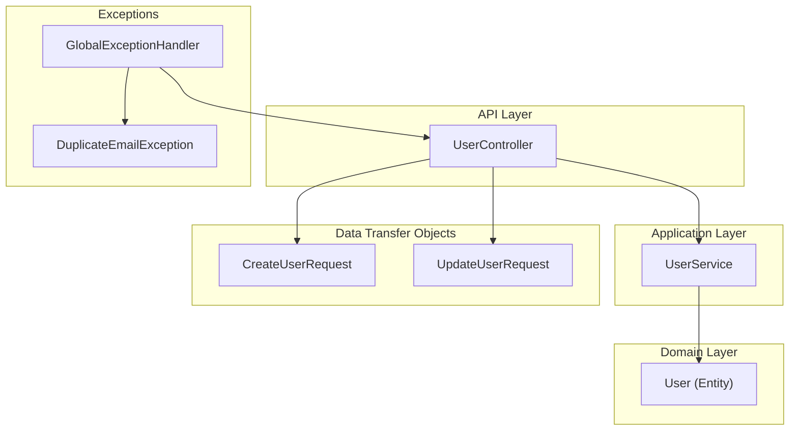
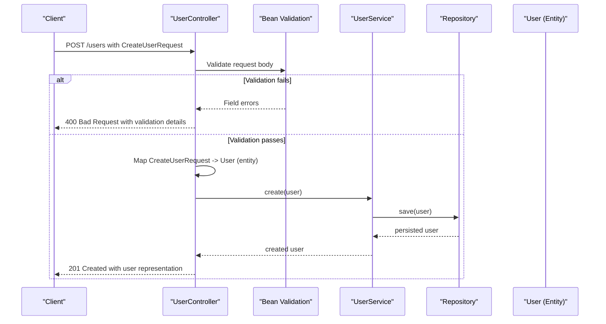
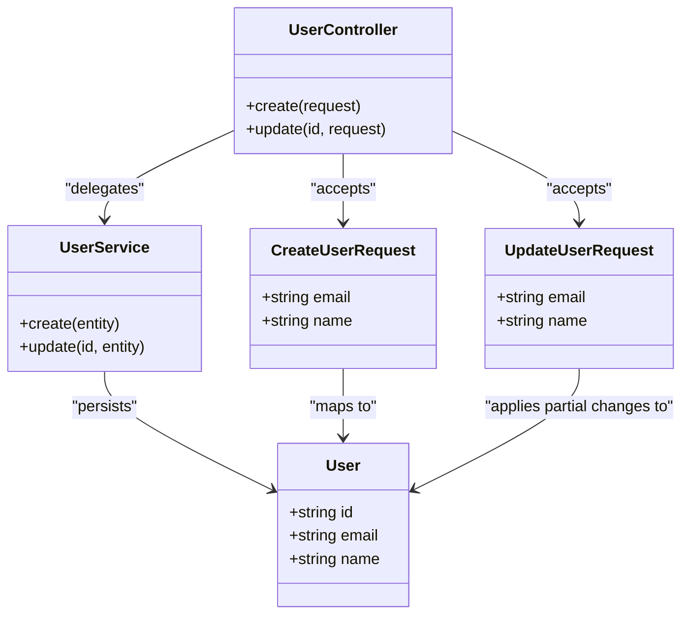
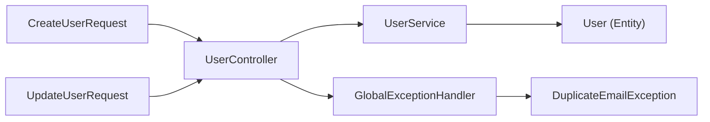

# Request & Response Schemas

<cite>
**Referenced Files in This Document**
- [CreateUserRequest.java](file://src/main/java/com/first/app/dto/CreateUserRequest.java)
- [UpdateUserRequest.java](file://src/main/java/com/first/app/dto/UpdateUserRequest.java)
- [User.java](file://src/main/java/com/first/app/entity/User.java)
- [UserController.java](file://src/main/java/com/first/app/controller/UserController.java)
- [UserService.java](file://src/main/java/com/first/app/service/UserService.java)
- [GlobalExceptionHandler.java](file://src/main/java/com/first/app/exception/GlobalExceptionHandler.java)
- [DuplicateEmailException.java](file://src/main/java/com/first/app/exception/DuplicateEmailException.java)
</cite>

## Table of Contents
1. [Introduction](#introduction)
2. [Project Structure](#project-structure)
3. [Core Components](#core-components)
4. [Architecture Overview](#architecture-overview)
5. [Detailed Component Analysis](#detailed-component-analysis)
6. [Dependency Analysis](#dependency-analysis)
7. [Performance Considerations](#performance-considerations)
8. [Troubleshooting Guide](#troubleshooting-guide)
9. [Conclusion](#conclusion)

## Introduction
This document describes the API request and response schemas used by the User management endpoints. It focuses on the data transfer objects (DTOs) for creating and updating users, including field definitions, validation rules, business constraints, and examples of valid and invalid payloads. It also explains how DTOs are transformed into domain entities and how validation errors are returned to clients.

## Project Structure
The relevant parts of the project for this documentation are:
- DTOs: CreateUserRequest, UpdateUserRequest
- Domain entity: User
- Controller: UserController
- Service: UserService
- Exception handling: GlobalExceptionHandler, DuplicateEmailException

**Diagram sources**
- [UserController.java](file://src/main/java/com/first/app/controller/UserController.java)
- [UserService.java](file://src/main/java/com/first/app/service/UserService.java)
- [User.java](file://src/main/java/com/first/app/entity/User.java)
- [CreateUserRequest.java](file://src/main/java/com/first/app/dto/CreateUserRequest.java)
- [UpdateUserRequest.java](file://src/main/java/com/first/app/dto/UpdateUserRequest.java)
- [GlobalExceptionHandler.java](file://src/main/java/com/first/app/exception/GlobalExceptionHandler.java)
- [DuplicateEmailException.java](file://src/main/java/com/first/app/exception/DuplicateEmailException.java)

**Section sources**
- [UserController.java](file://src/main/java/com/first/app/controller/UserController.java)
- [UserService.java](file://src/main/java/com/first/app/service/UserService.java)
- [User.java](file://src/main/java/com/first/app/entity/User.java)
- [CreateUserRequest.java](file://src/main/java/com/first/app/dto/CreateUserRequest.java)
- [UpdateUserRequest.java](file://src/main/java/com/first/app/dto/UpdateUserRequest.java)
- [GlobalExceptionHandler.java](file://src/main/java/com/first/app/exception/GlobalExceptionHandler.java)
- [DuplicateEmailException.java](file://src/main/java/com/first/app/exception/DuplicateEmailException.java)

## Core Components
This section documents the two primary request DTOs used by the User API.

### CreateUserRequest
Purpose:
- Represents a new user creation request payload.

Fields:
- email: string
  - Type: String
  - Required: Yes
  - Validation: Not blank; must be a valid email format; size constraints apply as defined by annotations.
  - Business rule: Must be unique across existing users.
- name: string
  - Type: String
  - Required: Yes
  - Validation: Not blank; size constraints apply as defined by annotations.

Validation annotations:
- NotBlank: Ensures fields are present and not empty strings or whitespace-only.
- Email: Validates that the value conforms to an email format.
- Size: Enforces minimum and maximum length constraints.

Business rules:
- Uniqueness of email is enforced at the service/repository layer.

Transformation:
- The controller maps CreateUserRequest to a domain User entity before persisting via the service.

Example valid JSON payload:
{
  "email": "alice@example.com",
  "name": "Alice"
}

Example malformed requests and expected error behavior:
- Missing required fields:
  {
    "email": ""
  }
  Expected outcome: Field-level validation errors indicating missing or invalid values.
- Invalid email format:
  {
    "email": "not-an-email",
    "name": "Bob"
  }
  Expected outcome: Field-level validation error for email format.
- Name too short or too long:
  {
    "email": "bob@example.com",
    "name": "B"
  }
  Expected outcome: Field-level validation error for name length constraint.

Notes:
- All field-level validation errors are aggregated and returned by the global exception handler.

**Section sources**
- [CreateUserRequest.java](file://src/main/java/com/first/app/dto/CreateUserRequest.java)
- [UserController.java](file://src/main/java/com/first/app/controller/UserController.java)
- [UserService.java](file://src/main/java/com/first/app/service/UserService.java)
- [GlobalExceptionHandler.java](file://src/main/java/com/first/app/exception/GlobalExceptionHandler.java)
- [DuplicateEmailException.java](file://src/main/java/com/first/app/exception/DuplicateEmailException.java)

### UpdateUserRequest
Purpose:
- Represents a partial update request for an existing user.

Optional fields:
- email: string
  - Type: String
  - Optional: Yes
  - Validation: If provided, must be a valid email format and satisfy size constraints.
  - Business rule: Must be unique among existing users.
- name: string
  - Type: String
  - Optional: Yes
  - Validation: If provided, must satisfy size constraints.

Partial update semantics:
- Only fields included in the request are applied to the existing user record.
- Fields omitted from the request remain unchanged.

Example valid JSON payload (partial update):
{
  "name": "Alice Updated"
}

Example valid JSON payload (full update):
{
  "email": "alice.new@example.com",
  "name": "Alice New"
}

Example malformed requests and expected error behavior:
- Invalid email when provided:
  {
    "email": "invalid-email"
  }
  Expected outcome: Field-level validation error for email format.
- Name length violation:
  {
    "name": "A"
  }
  Expected outcome: Field-level validation error for name length constraint.

Notes:
- Because fields are optional, absence of a field does not trigger validation errors.
- When email is provided, uniqueness is enforced at the service/repository layer.

**Section sources**
- [UpdateUserRequest.java](file://src/main/java/com/first/app/dto/UpdateUserRequest.java)
- [UserController.java](file://src/main/java/com/first/app/controller/UserController.java)
- [UserService.java](file://src/main/java/com/first/app/service/UserService.java)
- [GlobalExceptionHandler.java](file://src/main/java/com/first/app/exception/GlobalExceptionHandler.java)
- [DuplicateEmailException.java](file://src/main/java/com/first/app/exception/DuplicateEmailException.java)

## Architecture Overview
The following sequence diagram shows the end-to-end flow for creating a user, including validation and transformation.

**Diagram sources**
- [UserController.java](file://src/main/java/com/first/app/controller/UserController.java)
- [UserService.java](file://src/main/java/com/first/app/service/UserService.java)
- [User.java](file://src/main/java/com/first/app/entity/User.java)
- [GlobalExceptionHandler.java](file://src/main/java/com/first/app/exception/GlobalExceptionHandler.java)

## Detailed Component Analysis

### Data Model Relationships
The DTOs map to the domain entity during request processing. The class diagram below illustrates the relationships between DTOs, the controller, the service, and the entity.

**Diagram sources**
- [CreateUserRequest.java](file://src/main/java/com/first/app/dto/CreateUserRequest.java)
- [UpdateUserRequest.java](file://src/main/java/com/first/app/dto/UpdateUserRequest.java)
- [User.java](file://src/main/java/com/first/app/entity/User.java)
- [UserController.java](file://src/main/java/com/first/app/controller/UserController.java)
- [UserService.java](file://src/main/java/com/first/app/service/UserService.java)

### Field-Level Validation Rules
- Mandatory fields:
  - CreateUserRequest.email: Not blank, valid email format, within size limits.
  - CreateUserRequest.name: Not blank, within size limits.
- Optional fields:
  - UpdateUserRequest.email: If present, must be valid email format and within size limits; uniqueness enforced.
  - UpdateUserRequest.name: If present, must be within size limits.
- Error responses:
  - Field-level validation failures return a structured error response listing each invalid field and its messages.
  - Business rule violations (e.g., duplicate email) return appropriate error codes and messages.

**Section sources**
- [CreateUserRequest.java](file://src/main/java/com/first/app/dto/CreateUserRequest.java)
- [UpdateUserRequest.java](file://src/main/java/com/first/app/dto/UpdateUserRequest.java)
- [GlobalExceptionHandler.java](file://src/main/java/com/first/app/exception/GlobalExceptionHandler.java)
- [DuplicateEmailException.java](file://src/main/java/com/first/app/exception/DuplicateEmailException.java)

### Request Transformation Patterns
- Mapping strategy:
  - The controller transforms CreateUserRequest into a domain User entity before calling the service.
  - For updates, the controller loads the existing entity and applies only the non-null fields from UpdateUserRequest.
- Immutability considerations:
  - Prefer constructing new instances or using builder patterns where applicable to avoid unintended mutations.
- Validation timing:
  - Bean validation runs before controller logic, ensuring early rejection of malformed requests.

**Section sources**
- [UserController.java](file://src/main/java/com/first/app/controller/UserController.java)
- [UserService.java](file://src/main/java/com/first/app/service/UserService.java)
- [User.java](file://src/main/java/com/first/app/entity/User.java)

## Dependency Analysis
The following diagram highlights key dependencies among components involved in request processing and validation.

**Diagram sources**
- [CreateUserRequest.java](file://src/main/java/com/first/app/dto/CreateUserRequest.java)
- [UpdateUserRequest.java](file://src/main/java/com/first/app/dto/UpdateUserRequest.java)
- [UserController.java](file://src/main/java/com/first/app/controller/UserController.java)
- [UserService.java](file://src/main/java/com/first/app/service/UserService.java)
- [User.java](file://src/main/java/com/first/app/entity/User.java)
- [GlobalExceptionHandler.java](file://src/main/java/com/first/app/exception/GlobalExceptionHandler.java)
- [DuplicateEmailException.java](file://src/main/java/com/first/app/exception/DuplicateEmailException.java)

**Section sources**
- [UserController.java](file://src/main/java/com/first/app/controller/UserController.java)
- [UserService.java](file://src/main/java/com/first/app/service/UserService.java)
- [User.java](file://src/main/java/com/first/app/entity/User.java)
- [CreateUserRequest.java](file://src/main/java/com/first/app/dto/CreateUserRequest.java)
- [UpdateUserRequest.java](file://src/main/java/com/first/app/dto/UpdateUserRequest.java)
- [GlobalExceptionHandler.java](file://src/main/java/com/first/app/exception/GlobalExceptionHandler.java)
- [DuplicateEmailException.java](file://src/main/java/com/first/app/exception/DuplicateEmailException.java)

## Performance Considerations
- Keep DTOs minimal to reduce serialization overhead.
- Avoid unnecessary object copying during mapping; prefer efficient constructors or builders.
- Ensure database indexes exist on frequently validated fields such as email to support uniqueness checks efficiently.

## Troubleshooting Guide
Common issues and resolutions:
- Validation errors:
  - Symptom: 400 Bad Request with field-level messages.
  - Cause: Missing or invalid fields (e.g., blank name, malformed email).
  - Resolution: Ensure all required fields are present and conform to constraints.
- Duplicate email:
  - Symptom: Conflict or unprocessable entity error.
  - Cause: Email already exists in the system.
  - Resolution: Use a different email address or update the existing record instead of creating a new one.
- Partial update anomalies:
  - Symptom: Unexpected field changes.
  - Cause: Including fields unintentionally in the update payload.
  - Resolution: Send only the fields you intend to change.

**Section sources**
- [GlobalExceptionHandler.java](file://src/main/java/com/first/app/exception/GlobalExceptionHandler.java)
- [DuplicateEmailException.java](file://src/main/java/com/first/app/exception/DuplicateEmailException.java)

## Conclusion
The CreateUserRequest and UpdateUserRequest DTOs define clear contracts for creating and partially updating users. Field-level validations ensure data integrity early in the request lifecycle, while business rules enforce uniqueness and other constraints at the service layer. Proper mapping from DTOs to domain entities maintains separation of concerns and supports maintainable, testable code.