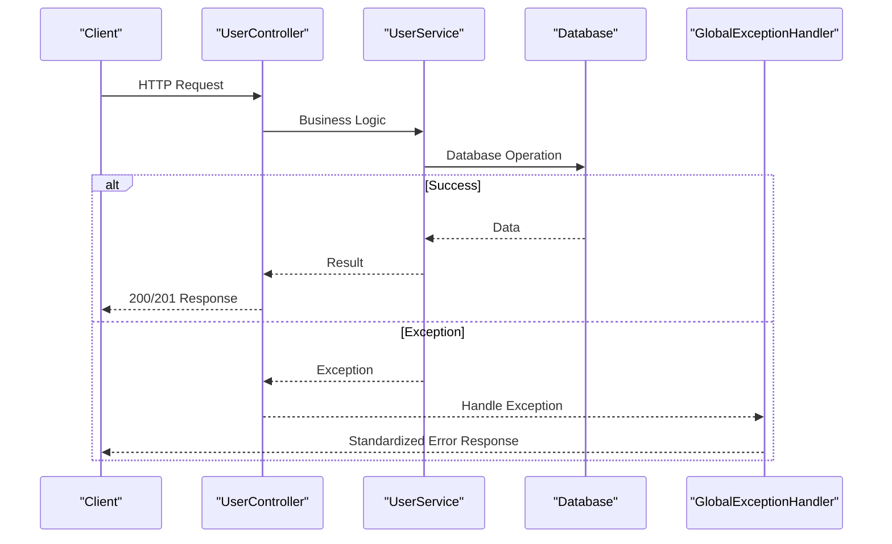

# User Endpoints

<cite>
**Referenced Files in This Document**
- [UserController.java](file://src/main/java/com/first/app/controller/UserController.java)
- [CreateUserRequest.java](file://src/main/java/com/first/app/dto/CreateUserRequest.java)
- [UpdateUserRequest.java](file://src/main/java/com/first/app/dto/UpdateUserRequest.java)
- [User.java](file://src/main/java/com/first/app/entity/User.java)
- [UserService.java](file://src/main/java/com/first/app/service/UserService.java)
- [DuplicateEmailException.java](file://src/main/java/com/first/app/exception/DuplicateEmailException.java)
- [ResourceNotFoundException.java](file://src/main/java/com/first/app/exception/ResourceNotFoundException.java)
- [GlobalExceptionHandler.java](file://src/main/java/com/first/app/exception/GlobalExceptionHandler.java)
</cite>

## Table of Contents
1. [Introduction](#introduction)
2. [API Overview](#api-overview)
3. [Authentication and Headers](#authentication-and-headers)
4. [Create User Endpoint](#create-user-endpoint)
5. [Update User Endpoint](#update-user-endpoint)
6. [Get User Endpoint](#get-user-endpoint)
7. [Error Handling](#error-handling)
8. [Validation Rules](#validation-rules)
9. [Response Formats](#response-formats)
10. [Common Error Scenarios](#common-error-scenarios)
11. [Testing Examples](#testing-examples)
12. [Best Practices](#best-practices)

## Introduction

This document provides comprehensive API documentation for the user management endpoints in the application. The API follows RESTful principles and implements standard HTTP methods for CRUD operations on user resources. All endpoints return JSON responses and handle errors consistently through a global exception handler.

The user management system supports:
- Creating new users with email validation and uniqueness constraints
- Updating existing users with partial update capabilities
- Retrieving user information by ID
- Comprehensive error handling for common scenarios like duplicate emails and missing resources

## API Overview

The user management API provides three main endpoints:

```mermaid
graph TB
subgraph "User Management API"
A[POST /api/users] --> B[Create New User]
C[PUT /api/users/{id}] --> D[Update Existing User]
E[GET /api/users/{id}] --> F[Get User by ID]
B --> G[Validation & Business Logic]
D --> G
F --> G
G --> H[Database Operations]
H --> I[Response Generation]
end
subgraph "Error Handling"
J[Duplicate Email] --> K[409 Conflict]
L[Not Found] --> M[404 Not Found]
N[Invalid Input] --> O[400 Bad Request]
end
```

**Diagram sources**
- [UserController.java](file://src/main/java/com/first/app/controller/UserController.java)
- [UserService.java](file://src/main/java/com/first/app/service/UserService.java)

All endpoints require:
- Content-Type: application/json header for POST and PUT requests
- Proper authentication headers (if implemented)
- Valid JSON request bodies where applicable

## Authentication and Headers

### Required Headers

| Header | Type | Description | Example |
|--------|------|-------------|---------|
| Content-Type | String | Must be set to application/json for POST/PUT requests | `application/json` |
| Authorization | String | Bearer token for authenticated requests (if enabled) | `Bearer eyJhbGciOiJIUzI1NiIs...` |
| Accept | String | Response format specification | `application/json` |

### Default Headers

Most HTTP clients will automatically set appropriate headers. For manual testing, ensure you include:

```bash
curl -H "Content-Type: application/json" \
     -H "Accept: application/json" \
     https://api.example.com/api/users
```

## Create User Endpoint

### HTTP Method Specification

- **Method**: POST
- **URL Pattern**: `/api/users`
- **Content-Type**: application/json
- **Authentication**: Required (if authentication is enabled)

### Request Body Schema

The CreateUserRequest DTO defines the following fields:

| Field | Type | Required | Validation Rules | Description |
|-------|------|----------|------------------|-------------|
| email | string | Yes | Valid email format, unique in database | User's email address |
| firstName | string | Yes | 1-50 characters, alphanumeric with spaces | User's first name |
| lastName | string | Yes | 1-50 characters, alphanumeric with spaces | User's last name |
| password | string | Yes | Minimum 8 characters, contains uppercase, lowercase, number | User's password |

### Request Examples

#### Successful Creation Request
```json
{
  "email": "john.doe@example.com",
  "firstName": "John",
  "lastName": "Doe",
  "password": "SecurePass123"
}
```

#### Invalid Request Examples
```json
// Missing required field
{
  "email": "john.doe@example.com",
  "firstName": "John"
}

// Invalid email format
{
  "email": "invalid-email",
  "firstName": "John",
  "lastName": "Doe",
  "password": "SecurePass123"
}

// Weak password
{
  "email": "john.doe@example.com",
  "firstName": "John",
  "lastName": "Doe",
  "password": "weak"
}
```

### Success Response

**Status Code**: 201 Created

**Response Body**:
```json
{
  "id": "550e8400-e29b-41d4-a716-446655440000",
  "email": "john.doe@example.com",
  "firstName": "John",
  "lastName": "Doe",
  "createdAt": "2024-01-15T10:30:00Z",
  "updatedAt": "2024-01-15T10:30:00Z"
}
```

### Error Responses

#### Duplicate Email (409 Conflict)
```json
{
  "timestamp": "2024-01-15T10:30:00Z",
  "status": 409,
  "error": "Conflict",
  "message": "Email already exists: john.doe@example.com",
  "path": "/api/users"
}
```

#### Validation Error (400 Bad Request)
```json
{
  "timestamp": "2024-01-15T10:30:00Z",
  "status": 400,
  "error": "Bad Request",
  "message": "Validation failed",
  "errors": [
    {
      "field": "email",
      "message": "must be a valid email address"
    },
    {
      "field": "password",
      "message": "must be at least 8 characters long"
    }
  ]
}
```

### cURL Examples

#### Successful User Creation
```bash
curl -X POST https://api.example.com/api/users \
  -H "Content-Type: application/json" \
  -H "Accept: application/json" \
  -d '{
    "email": "john.doe@example.com",
    "firstName": "John",
    "lastName": "Doe",
    "password": "SecurePass123"
  }'
```

#### Duplicate Email Scenario
```bash
curl -X POST https://api.example.com/api/users \
  -H "Content-Type: application/json" \
  -H "Accept: application/json" \
  -d '{
    "email": "existing.user@example.com",
    "firstName": "Jane",
    "lastName": "Smith",
    "password": "AnotherPass123"
  }'
```

## Update User Endpoint

### HTTP Method Specification

- **Method**: PUT
- **URL Pattern**: `/api/users/{id}`
- **Path Parameter**: id (UUID format)
- **Content-Type**: application/json
- **Authentication**: Required (user must own the resource or have admin privileges)

### Path Parameters

| Parameter | Type | Required | Format | Description |
|-----------|------|----------|--------|-------------|
| id | string | Yes | UUID | Unique identifier of the user to update |

### Request Body Schema

The UpdateUserRequest DTO supports partial updates. Only provided fields will be updated:

| Field | Type | Required | Validation Rules | Description |
|-------|------|----------|------------------|-------------|
| email | string | No | Valid email format, unique in database | User's email address |
| firstName | string | No | 1-50 characters, alphanumeric with spaces | User's first name |
| lastName | string | No | 1-50 characters, alphanumeric with spaces | User's last name |
| password | string | No | Minimum 8 characters, contains uppercase, lowercase, number | User's password |

### Request Examples

#### Partial Update (Only Email)
```json
{
  "email": "new.email@example.com"
}
```

#### Complete Update
```json
{
  "email": "john.new@example.com",
  "firstName": "Johnny",
  "lastName": "Doe-Smith",
  "password": "NewSecurePass456"
}
```

#### Empty Update (No Changes)
```json
{}
```

### Success Response

**Status Code**: 200 OK

**Response Body**:
```json
{
  "id": "550e8400-e29b-41d4-a716-446655440000",
  "email": "john.new@example.com",
  "firstName": "Johnny",
  "lastName": "Doe-Smith",
  "createdAt": "2024-01-15T10:30:00Z",
  "updatedAt": "2024-01-15T11:45:00Z"
}
```

### Error Responses

#### Resource Not Found (404 Not Found)
```json
{
  "timestamp": "2024-01-15T11:45:00Z",
  "status": 404,
  "error": "Not Found",
  "message": "User not found with id: 550e8400-e29b-41d4-a716-446655440000",
  "path": "/api/users/550e8400-e29b-41d4-a716-446655440000"
}
```

#### Validation Error (400 Bad Request)
```json
{
  "timestamp": "2024-01-15T11:45:00Z",
  "status": 400,
  "error": "Bad Request",
  "message": "Validation failed",
  "errors": [
    {
      "field": "email",
      "message": "must be a valid email address"
    }
  ]
}
```

#### Duplicate Email (409 Conflict)
```json
{
  "timestamp": "2024-01-15T11:45:00Z",
  "status": 409,
  "error": "Conflict",
  "message": "Email already exists: existing.user@example.com",
  "path": "/api/users/550e8400-e29b-41d4-a716-446655440000"
}
```

### cURL Examples

#### Successful User Update
```bash
curl -X PUT https://api.example.com/api/users/550e8400-e29b-41d4-a716-446655440000 \
  -H "Content-Type: application/json" \
  -H "Accept: application/json" \
  -d '{
    "firstName": "Johnny",
    "lastName": "Doe-Smith"
  }'
```

#### Non-existent User Update
```bash
curl -X PUT https://api.example.com/api/users/non-existent-id \
  -H "Content-Type: application/json" \
  -H "Accept: application/json" \
  -d '{
    "email": "new.email@example.com"
  }'
```

## Get User Endpoint

### HTTP Method Specification

- **Method**: GET
- **URL Pattern**: `/api/users/{id}`
- **Path Parameter**: id (UUID format)
- **Authentication**: Required (user must own the resource or have admin privileges)

### Path Parameters

| Parameter | Type | Required | Format | Description |
|-----------|------|----------|--------|-------------|
| id | string | Yes | UUID | Unique identifier of the user to retrieve |

### Success Response

**Status Code**: 200 OK

**Response Body**:
```json
{
  "id": "550e8400-e29b-41d4-a716-446655440000",
  "email": "john.doe@example.com",
  "firstName": "John",
  "lastName": "Doe",
  "createdAt": "2024-01-15T10:30:00Z",
  "updatedAt": "2024-01-15T10:30:00Z"
}
```

### Error Responses

#### Resource Not Found (404 Not Found)
```json
{
  "timestamp": "2024-01-15T10:30:00Z",
  "status": 404,
  "error": "Not Found",
  "message": "User not found with id: non-existent-id",
  "path": "/api/users/non-existent-id"
}
```

#### Invalid ID Format (400 Bad Request)
```json
{
  "timestamp": "2024-01-15T10:30:00Z",
  "status": 400,
  "error": "Bad Request",
  "message": "Invalid path variable: invalid-id",
  "path": "/api/users/invalid-id"
}
```

### cURL Examples

#### Successful User Retrieval
```bash
curl -X GET https://api.example.com/api/users/550e8400-e29b-41d4-a716-446655440000 \
  -H "Accept: application/json"
```

#### Non-existent User Retrieval
```bash
curl -X GET https://api.example.com/api/users/non-existent-id \
  -H "Accept: application/json"
```

## Error Handling

### Global Exception Handler

The application uses a centralized exception handler that provides consistent error responses across all endpoints:



**Diagram sources**
- [GlobalExceptionHandler.java](file://src/main/java/com/first/app/exception/GlobalExceptionHandler.java)
- [UserController.java](file://src/main/java/com/first/app/controller/UserController.java)

### Standard Error Response Format

All error responses follow this consistent structure:

| Field | Type | Description |
|-------|------|-------------|
| timestamp | string | ISO 8601 timestamp when the error occurred |
| status | integer | HTTP status code |
| error | string | Short error description |
| message | string | Detailed error message |
| path | string | The request path that caused the error |
| errors | array | Array of field-specific validation errors (for 400 errors) |

### Custom Exceptions

#### DuplicateEmailException
Thrown when attempting to create or update a user with an email that already exists in the database.

#### ResourceNotFoundException
Thrown when attempting to access a user resource that doesn't exist.

## Validation Rules

### Email Validation
- Must be a valid email format according to RFC 5322
- Must be unique across all users in the database
- Maximum length: 255 characters

### Name Validation
- First name and last name are required for user creation
- Length: 1-50 characters each
- Alphanumeric characters and spaces only
- Trimmed whitespace is allowed

### Password Validation
- Minimum length: 8 characters
- Must contain at least one uppercase letter
- Must contain at least one lowercase letter
- Must contain at least one digit
- Special characters are allowed but not required

### Date Validation
- All date fields use ISO 8601 format (YYYY-MM-DDTHH:mm:ssZ)
- Timestamps are automatically generated for createdAt and updatedAt fields

## Response Formats

### User Response Object

All successful responses return a User object with the following structure:

| Field | Type | Description |
|-------|------|-------------|
| id | string | UUID unique identifier |
| email | string | User's email address |
| firstName | string | User's first name |
| lastName | string | User's last name |
| createdAt | string | ISO 8601 timestamp when user was created |
| updatedAt | string | ISO 8601 timestamp when user was last updated |

### Pagination Support (Future Enhancement)

While current endpoints return single resources, future pagination support may be added for list endpoints:

```json
{
  "content": [/* array of user objects */],
  "page": 0,
  "size": 20,
  "totalElements": 100,
  "totalPages": 5,
  "last": false
}
```

## Common Error Scenarios

### Duplicate Email Conflicts

**Scenario**: Attempting to create a user with an email that already exists in the database.

**HTTP Status**: 409 Conflict

**Example Request**:
```bash
curl -X POST https://api.example.com/api/users \
  -H "Content-Type: application/json" \
  -d '{
    "email": "existing.user@example.com",
    "firstName": "New",
    "lastName": "User",
    "password": "SecurePass123"
  }'
```

**Example Response**:
```json
{
  "timestamp": "2024-01-15T10:30:00Z",
  "status": 409,
  "error": "Conflict",
  "message": "Email already exists: existing.user@example.com",
  "path": "/api/users"
}
```

### Resource Not Found

**Scenario**: Attempting to access a user with an ID that doesn't exist.

**HTTP Status**: 404 Not Found

**Example Request**:
```bash
curl -X GET https://api.example.com/api/users/non-existent-id \
  -H "Accept: application/json"
```

**Example Response**:
```json
{
  "timestamp": "2024-01-15T10:30:00Z",
  "status": 404,
  "error": "Not Found",
  "message": "User not found with id: non-existent-id",
  "path": "/api/users/non-existent-id"
}
```

### Validation Errors

**Scenario**: Submitting malformed data or missing required fields.

**HTTP Status**: 400 Bad Request

**Example Request**:
```bash
curl -X POST https://api.example.com/api/users \
  -H "Content-Type: application/json" \
  -d '{
    "email": "invalid-email",
    "firstName": ""
  }'
```

**Example Response**:
```json
{
  "timestamp": "2024-01-15T10:30:00Z",
  "status": 400,
  "error": "Bad Request",
  "message": "Validation failed",
  "errors": [
    {
      "field": "email",
      "message": "must be a valid email address"
    },
    {
      "field": "firstName",
      "message": "must not be blank"
    }
  ]
}
```

## Testing Examples

### Postman Collection Variables

For automated testing, consider using these variables:

| Variable | Value | Description |
|----------|-------|-------------|
| baseUrl | https://api.example.com | Base API URL |
| testEmail | test.user@example.com | Test user email |
| testPassword | SecurePass123 | Test user password |
| userId | 550e8400-e29b-41d4-a716-446655440000 | Test user ID |

### Automated Test Script

```bash
#!/bin/bash

BASE_URL="https://api.example.com"
TEST_EMAIL="test.user.$(date +%s)@example.com"

echo "Creating test user..."
CREATE_RESPONSE=$(curl -s -o /dev/null -w "%{http_code}" -X POST "$BASE_URL/api/users" \
  -H "Content-Type: application/json" \
  -d "{
    \"email\": \"$TEST_EMAIL\",
    \"firstName\": \"Test\",
    \"lastName\": \"User\",
    \"password\": \"SecurePass123\"
  }")

echo "Create response code: $CREATE_RESPONSE"

if [ "$CREATE_RESPONSE" = "201" ]; then
  echo "✓ User created successfully"
else
  echo "✗ User creation failed"
fi
```

## Best Practices

### Request Validation
- Always validate input data on the client side before sending requests
- Use proper HTTP status codes for different error scenarios
- Include meaningful error messages to help developers debug issues

### Security Considerations
- Never expose sensitive information like passwords in responses
- Implement proper authentication and authorization checks
- Use HTTPS for all API communications
- Sanitize and validate all user inputs

### Performance Optimization
- Use efficient database queries to avoid N+1 problems
- Implement caching strategies for frequently accessed user data
- Use pagination for list endpoints (when implemented)
- Optimize database indexes for commonly queried fields

### API Design Principles
- Follow RESTful conventions for resource naming and HTTP methods
- Use consistent error response formats across all endpoints
- Provide clear and descriptive error messages
- Version your API appropriately for future changes

### Documentation Maintenance
- Keep API documentation synchronized with code changes
- Use OpenAPI/Swagger specifications for automatic documentation generation
- Include comprehensive examples for all endpoints
- Test all documented examples regularly