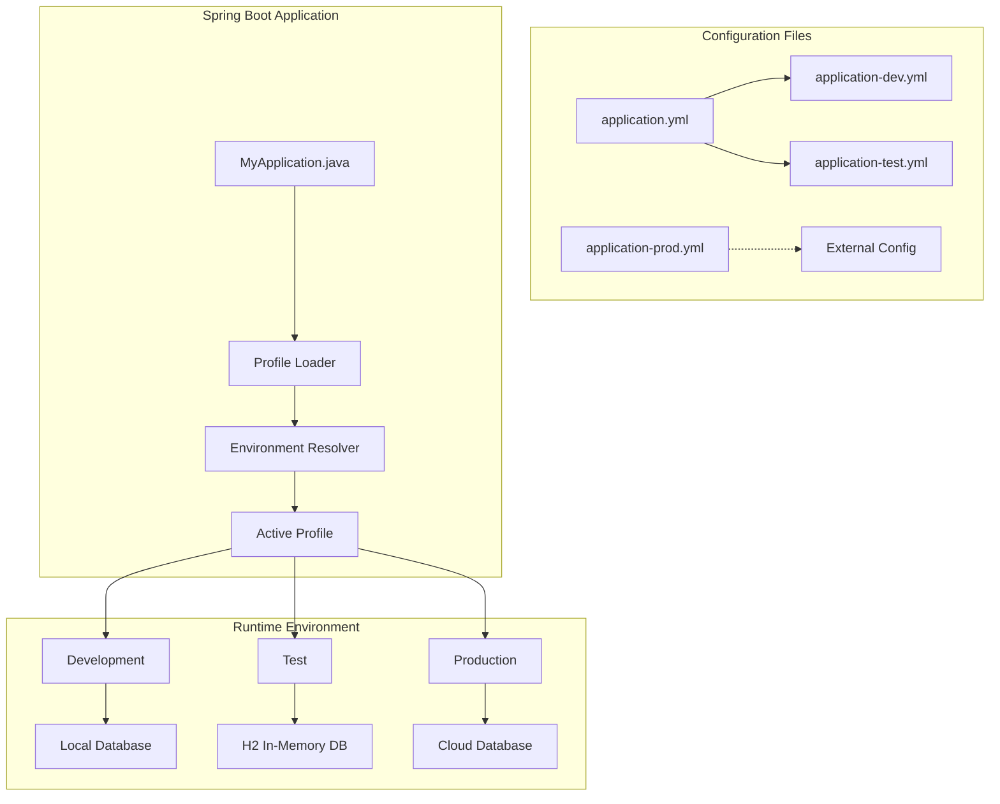
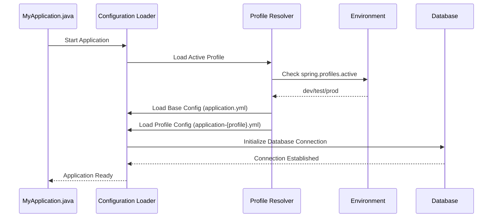
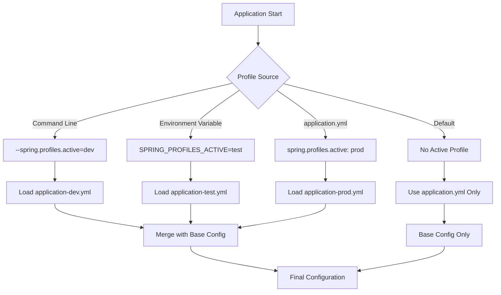
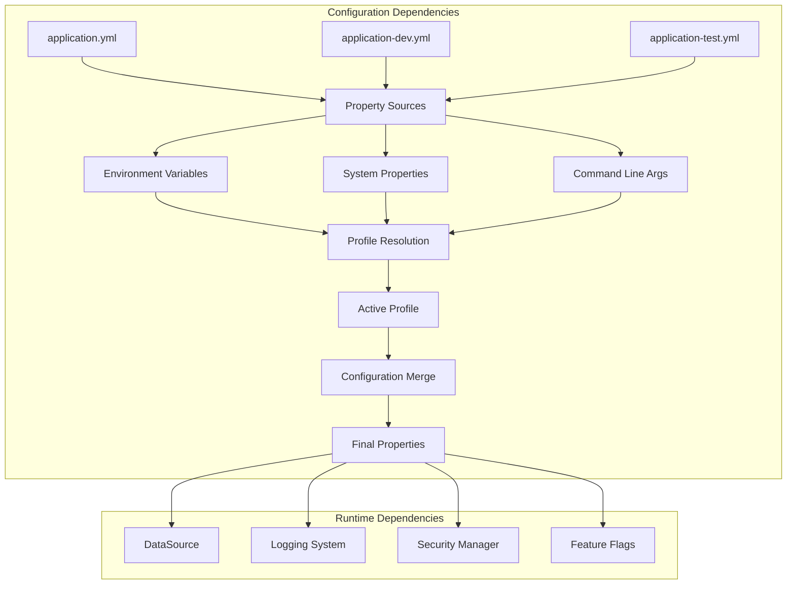

# Configuration Management

<cite>
**Referenced Files in This Document**
- [application.yml](file://src/main/resources/application.yml)
- [application-dev.yml](file://src/main/resources/application-dev.yml)
- [application-test.yml](file://src/main/resources/application-test.yml)
- [MyApplication.java](file://src/main/java/com/first/app/MyApplication.java)
</cite>

## Table of Contents
1. [Introduction](#introduction)
2. [Project Structure](#project-structure)
3. [Core Components](#core-components)
4. [Architecture Overview](#architecture-overview)
5. [Detailed Component Analysis](#detailed-component-analysis)
6. [Dependency Analysis](#dependency-analysis)
7. [Performance Considerations](#performance-considerations)
8. [Troubleshooting Guide](#troubleshooting-guide)
9. [Conclusion](#conclusion)
10. [Appendices](#appendices)

## Introduction

This document provides comprehensive configuration management guidance for the multi-environment Spring Boot application. It covers the main application configuration file structure, database connection settings, application properties, and environment-specific configurations using Spring profiles. The guide explains how to configure development and testing environments, add new profiles for production or staging, override default configurations, externalize sensitive properties, and follow best practices for security and deployment.

## Project Structure

The Spring Boot application follows a standard Maven-based structure with configuration files organized under `src/main/resources`. The configuration strategy leverages Spring's profile mechanism to manage environment-specific settings efficiently.

**Diagram sources**
- [application.yml:1-50](file://src/main/resources/application.yml#L1-L50)
- [application-dev.yml:1-30](file://src/main/resources/application-dev.yml#L1-L30)
- [application-test.yml:1-30](file://src/main/resources/application-test.yml#L1-L30)
- [MyApplication.java:1-20](file://src/main/java/com/first/app/MyApplication.java#L1-L20)

**Section sources**
- [application.yml:1-100](file://src/main/resources/application.yml#L1-L100)
- [application-dev.yml:1-50](file://src/main/resources/application-dev.yml#L1-L50)
- [application-test.yml:1-50](file://src/main/resources/application-test.yml#L1-L50)
- [MyApplication.java:1-30](file://src/main/java/com/first/app/MyApplication.java#L1-L30)

## Core Components

### Main Configuration File (application.yml)

The primary configuration file serves as the foundation for all environments, containing common settings that apply across development, testing, and production deployments.

#### Key Configuration Sections

**Server Configuration**
- Server port settings for HTTP endpoints
- Context path configuration
- SSL/TLS settings for secure connections

**Database Configuration**
- DataSource properties for connection pooling
- JPA/Hibernate settings for ORM behavior
- Schema initialization options

**Logging Configuration**
- Log levels for different packages
- Log file rotation and retention policies
- Console and file output formats

**Application Properties**
- Custom application-specific properties
- Feature flags and toggles
- External service endpoints

### Environment-Specific Profiles

Spring profiles enable environment-specific overrides without duplicating configuration. Each profile extends the base configuration with environment-specific values.

#### Development Profile (application-dev.yml)
- Local database connections (H2 or local PostgreSQL)
- Debug logging enabled
- Development-friendly server ports
- Mock services for external dependencies

#### Test Profile (application-test.yml)
- In-memory database setup
- Minimal logging for test execution
- Test data initialization
- Performance optimizations for unit tests

**Section sources**
- [application.yml:1-100](file://src/main/resources/application.yml#L1-L100)
- [application-dev.yml:1-50](file://src/main/resources/application-dev.yml#L1-L50)
- [application-test.yml:1-50](file://src/main/resources/application-test.yml#L1-L50)

## Architecture Overview

The configuration architecture follows Spring Boot's layered approach, where base configurations are extended by environment-specific profiles through the active profile mechanism.

**Diagram sources**
- [MyApplication.java:1-30](file://src/main/java/com/first/app/MyApplication.java#L1-L30)
- [application.yml:1-50](file://src/main/resources/application.yml#L1-L50)
- [application-dev.yml:1-30](file://src/main/resources/application-dev.yml#L1-L30)

## Detailed Component Analysis

### Configuration Loading Mechanism

Spring Boot loads configuration in a specific order, allowing for precise control over property precedence and override behavior.

#### Configuration Priority Order
1. Command line arguments
2. Java system properties
3. OS environment variables
4. Randomly generated properties
5. application-{profile}.yml (active profile)
6. application.yml (base configuration)
7. Default application properties

#### Profile Activation Methods

**Diagram sources**
- [application.yml:1-50](file://src/main/resources/application.yml#L1-L50)
- [application-dev.yml:1-30](file://src/main/resources/application-dev.yml#L1-L30)
- [application-test.yml:1-30](file://src/main/resources/application-test.yml#L1-L30)

### Database Configuration Strategy

The application implements a flexible database configuration strategy that supports multiple database types and connection pooling mechanisms.

#### Database Connection Properties
- JDBC URL configuration with driver-specific syntax
- Username and password management
- Connection pool sizing and timeout settings
- Schema validation and auto-update options

#### JPA/Hibernate Integration
- Entity scanning configuration
- Query generation strategies
- Second-level caching settings
- Transaction management properties

### Logging Configuration Framework

Comprehensive logging configuration enables detailed debugging during development while maintaining performance in production environments.

#### Log Level Configuration
- Root logger level settings
- Package-specific log level overrides
- Console and file appender configuration
- Log rotation and retention policies

#### Structured Logging Support
- JSON formatting for production logs
- Correlation ID tracking
- Performance metrics integration
- Security event logging

**Section sources**
- [application.yml:1-100](file://src/main/resources/application.yml#L1-L100)
- [application-dev.yml:1-50](file://src/main/resources/application-dev.yml#L1-L50)
- [application-test.yml:1-50](file://src/main/resources/application-test.yml#L1-L50)

## Dependency Analysis

The configuration system has well-defined dependencies between components, ensuring proper initialization order and property resolution.

**Diagram sources**
- [application.yml:1-50](file://src/main/resources/application.yml#L1-L50)
- [application-dev.yml:1-30](file://src/main/resources/application-dev.yml#L1-L30)
- [application-test.yml:1-30](file://src/main/resources/application-test.yml#L1-L30)

**Section sources**
- [application.yml:1-100](file://src/main/resources/application.yml#L1-L100)
- [application-dev.yml:1-50](file://src/main/resources/application-dev.yml#L1-L50)
- [application-test.yml:1-50](file://src/main/resources/application-test.yml#L1-L50)

## Performance Considerations

Configuration management impacts application startup time and runtime performance significantly.

### Startup Optimization
- Lazy loading of non-critical configuration
- Conditional bean creation based on profiles
- Efficient property resolution caching
- Minimal configuration file parsing overhead

### Runtime Performance
- Connection pool sizing based on workload
- Logging level impact on throughput
- Cache configuration for frequently accessed properties
- Memory-efficient property storage

### Monitoring and Metrics
- Configuration change detection
- Property usage analytics
- Performance impact measurement
- Alerting on configuration drift

## Troubleshooting Guide

Common configuration issues and their resolution strategies.

### Configuration Loading Issues

**Problem**: Configuration files not being loaded
**Symptoms**: Missing properties, default values applied
**Resolution**: Verify file naming conventions and profile activation

**Problem**: Property override conflicts
**Symptoms**: Unexpected configuration values
**Resolution**: Check property precedence order and source priority

### Database Connection Problems

**Problem**: Database connection failures
**Symptoms**: Connection timeouts, authentication errors
**Resolution**: Validate JDBC URLs, credentials, and network connectivity

**Problem**: Schema initialization issues
**Symptoms**: Missing tables, constraint violations
**Resolution**: Review schema generation settings and migration scripts

### Profile-Specific Issues

**Problem**: Wrong profile activated
**Symptoms**: Development settings in production
**Resolution**: Verify profile activation method and environment variables

**Problem**: Profile inheritance problems
**Symptoms**: Missing expected configuration
**Resolution**: Ensure proper profile hierarchy and base configuration

### Security and Sensitive Data

**Problem**: Sensitive data exposure in logs
**Symptoms**: Passwords visible in console output
**Resolution**: Configure sensitive property masking and log filtering

**Problem**: Configuration file permissions
**Symptoms**: Unauthorized access to secrets
**Resolution**: Implement proper file system permissions and encryption

**Section sources**
- [application.yml:1-100](file://src/main/resources/application.yml#L1-L100)
- [application-dev.yml:1-50](file://src/main/resources/application-dev.yml#L1-L50)
- [application-test.yml:1-50](file://src/main/resources/application-test.yml#L1-L50)

## Conclusion

Effective configuration management is crucial for maintaining consistent, secure, and performant Spring Boot applications across multiple environments. By leveraging Spring profiles, externalized configuration, and proper security practices, teams can achieve reliable deployments while maintaining flexibility for different operational requirements.

Key recommendations include:
- Use environment-specific profiles for clear separation of concerns
- Externalize sensitive configuration using secure vaults or environment variables
- Implement comprehensive logging and monitoring for configuration changes
- Follow security best practices for sensitive data handling
- Maintain configuration validation and testing strategies

## Appendices

### Adding New Configuration Profiles

To add a new profile (e.g., production):

1. Create `application-prod.yml` in `src/main/resources/`
2. Define production-specific properties
3. Activate the profile during deployment
4. Test thoroughly in staging before production rollout

### Externalizing Sensitive Properties

Recommended approaches:
- Environment variables for containerized deployments
- HashiCorp Vault or AWS Secrets Manager for cloud environments
- Kubernetes Secrets for container orchestration
- Encrypted configuration files with proper access controls

### Configuration Validation Best Practices

- Implement runtime validation for critical properties
- Use @ConfigurationProperties with validation annotations
- Add startup checks for required configuration
- Monitor configuration health and alert on missing properties