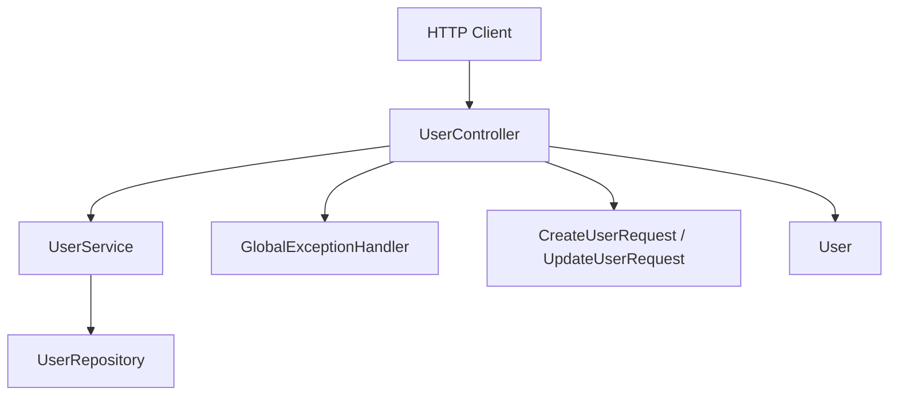
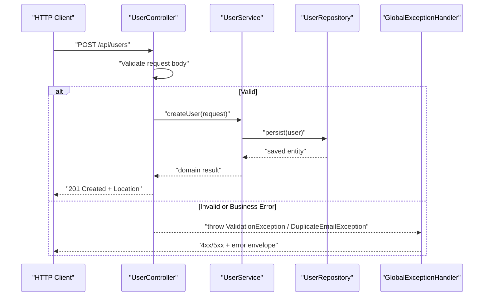
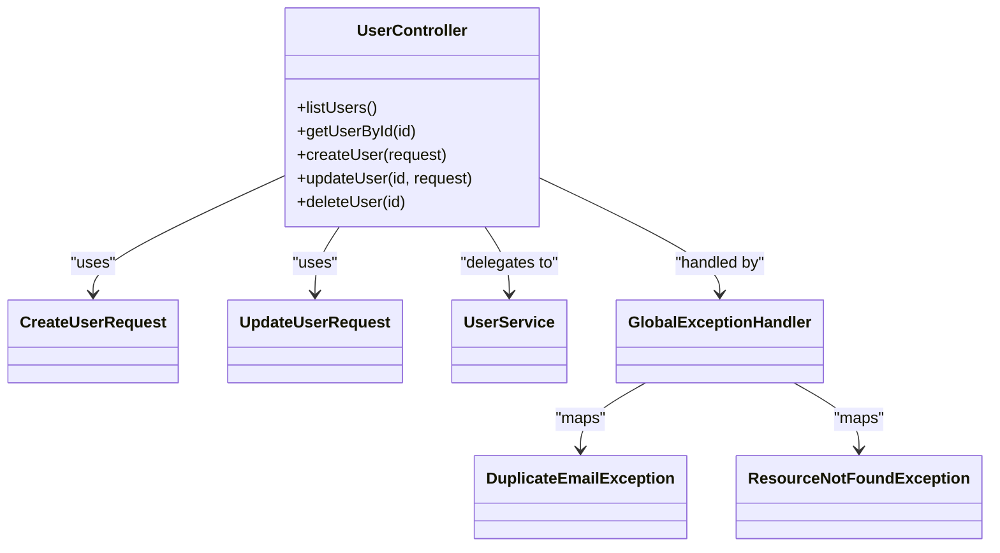

# Controller Layer

<cite>
**Referenced Files in This Document**
- [UserController.java](file://src/main/java/com/first/app/controller/UserController.java)
- [CreateUserRequest.java](file://src/main/java/com/first/app/dto/CreateUserRequest.java)
- [UpdateUserRequest.java](file://src/main/java/com/first/app/dto/UpdateUserRequest.java)
- [UserService.java](file://src/main/java/com/first/app/service/UserService.java)
- [GlobalExceptionHandler.java](file://src/main/java/com/first/app/exception/GlobalExceptionHandler.java)
- [DuplicateEmailException.java](file://src/main/java/com/first/app/exception/DuplicateEmailException.java)
- [ResourceNotFoundException.java](file://src/main/java/com/first/app/exception/ResourceNotFoundException.java)
- [User.java](file://src/main/java/com/first/app/entity/User.java)
- [UserRepository.java](file://src/main/java/com/first/app/repository/UserRepository.java)
</cite>

## Table of Contents
1. [Introduction](#introduction)
2. [Project Structure](#project-structure)
3. [Core Components](#core-components)
4. [Architecture Overview](#architecture-overview)
5. [Detailed Component Analysis](#detailed-component-analysis)
6. [Dependency Analysis](#dependency-analysis)
7. [Performance Considerations](#performance-considerations)
8. [Troubleshooting Guide](#troubleshooting-guide)
9. [Conclusion](#conclusion)

## Introduction
This document explains the Controller Layer as the presentation layer that receives HTTP requests, validates input, delegates business logic to the service layer, and returns structured responses. It focuses on how UserController implements RESTful endpoints using Spring MVC annotations, including method mappings, URL patterns, request/response handling, parameter binding, validation, error handling integration, and API contract definition.

## Project Structure
The controller layer is organized under a feature-based layout:
- Controllers handle HTTP concerns (routing, validation, response formatting).
- DTOs define request contracts and payload shapes.
- Services encapsulate business logic.
- Exceptions provide consistent error semantics.
- Repositories abstract persistence.

[No sources needed since this diagram shows conceptual workflow, not actual code structure]

## Core Components
- UserController: Presentation layer implementing REST endpoints for user resources.
- Request DTOs: CreateUserRequest and UpdateUserRequest define validated request payloads.
- Service Layer: UserService provides business operations invoked by the controller.
- Exception Handling: GlobalExceptionHandler centralizes error responses; domain exceptions model specific failure cases.

Key responsibilities of the controller:
- Map HTTP methods to handler methods using Spring MVC annotations.
- Bind and validate incoming request bodies and path/query parameters.
- Delegate to UserService for business processing.
- Return appropriate HTTP status codes and JSON responses.
- Integrate with global exception handling for consistent error responses.

**Section sources**
- [UserController.java](file://src/main/java/com/first/app/controller/UserController.java)
- [CreateUserRequest.java](file://src/main/java/com/first/app/dto/CreateUserRequest.java)
- [UpdateUserRequest.java](file://src/main/java/com/first/app/dto/UpdateUserRequest.java)
- [UserService.java](file://src/main/java/com/first/app/service/UserService.java)
- [GlobalExceptionHandler.java](file://src/main/java/com/first/app/exception/GlobalExceptionHandler.java)
- [DuplicateEmailException.java](file://src/main/java/com/first/app/exception/DuplicateEmailException.java)
- [ResourceNotFoundException.java](file://src/main/java/com/first/app/exception/ResourceNotFoundException.java)

## Architecture Overview
The controller sits at the boundary between clients and application services. It translates HTTP into domain calls and back into HTTP responses.

**Diagram sources**
- [UserController.java](file://src/main/java/com/first/app/controller/UserController.java)
- [UserService.java](file://src/main/java/com/first/app/service/UserService.java)
- [UserRepository.java](file://src/main/java/com/first/app/repository/UserRepository.java)
- [GlobalExceptionHandler.java](file://src/main/java/com/first/app/exception/GlobalExceptionHandler.java)
- [DuplicateEmailException.java](file://src/main/java/com/first/app/exception/DuplicateEmailException.java)
- [ResourceNotFoundException.java](file://src/main/java/com/first/app/exception/ResourceNotFoundException.java)

## Detailed Component Analysis

### UserController: REST Endpoints and Mappings
UserController exposes a resource-oriented API for users. Typical endpoint set includes:
- GET /api/users: List users (supports pagination/sorting via query parameters).
- GET /api/users/{id}: Retrieve a single user by ID.
- POST /api/users: Create a new user from CreateUserRequest.
- PUT /api/users/{id}: Update an existing user using UpdateUserRequest.
- DELETE /api/users/{id}: Delete a user by ID.

Annotations and mapping behavior:
- @RestController marks the class as a web controller returning data directly.
- @RequestMapping("/api/users") defines the base path for all endpoints.
- @GetMapping, @PostMapping, @PutMapping, @DeleteMapping map HTTP methods to handler methods.
- Path variables are bound using @PathVariable.
- Query parameters are bound using @RequestParam.
- Request bodies are deserialized and validated using @RequestBody and Bean Validation.

Parameter binding examples:
- Path variable: id in /api/users/{id} binds to a method parameter annotated with @PathVariable("id").
- Query parameters: page, size, sort bind to @RequestParam values with defaults and constraints.
- Request body: CreateUserRequest and UpdateUserRequest bind to @RequestBody fields with validation constraints.

Response formatting and status codes:
- Successful creation returns 201 Created with a Location header pointing to the new resource.
- Successful retrieval returns 200 OK with JSON body.
- Successful update returns 200 OK or 204 No Content depending on implementation.
- Deletion returns 204 No Content.
- Not found returns 404 Not Found.
- Conflict returns 409 Conflict for duplicate email scenarios.
- Validation errors return 400 Bad Request with a structured error envelope.

Input validation:
- Bean Validation annotations on DTO fields enforce presence, format, length, and range constraints.
- @Valid triggers validation before method execution; violations are handled by the global exception handler.

Error handling integration:
- Domain-specific exceptions (e.g., DuplicateEmailException, ResourceNotFoundException) are thrown by controllers/services and translated into standardized HTTP responses by GlobalExceptionHandler.
- GlobalExceptionHandler uses @RestControllerAdvice to intercept exceptions across controllers and produce consistent error responses.

API contract definition:
- The controller’s URL patterns, HTTP methods, and request/response shapes define the public API contract.
- DTOs serve as the stable interface for clients, decoupling internal entities from external consumers.

**Section sources**
- [UserController.java](file://src/main/java/com/first/app/controller/UserController.java)
- [CreateUserRequest.java](file://src/main/java/com/first/app/dto/CreateUserRequest.java)
- [UpdateUserRequest.java](file://src/main/java/com/first/app/dto/UpdateUserRequest.java)
- [GlobalExceptionHandler.java](file://src/main/java/com/first/app/exception/GlobalExceptionHandler.java)
- [DuplicateEmailException.java](file://src/main/java/com/first/app/exception/DuplicateEmailException.java)
- [ResourceNotFoundException.java](file://src/main/java/com/first/app/exception/ResourceNotFoundException.java)

### Request DTOs: CreateUserRequest and UpdateUserRequest
DTOs define the shape and constraints of client inputs:
- Field-level validation ensures required fields, formats, and ranges.
- Separate DTOs for create and update allow precise control over allowed updates.
- They isolate the controller from internal entity details and database schema changes.

Validation examples:
- Required fields enforced via presence constraints.
- Email format enforced via pattern constraints.
- Length limits enforced via size constraints.

These validations integrate with Spring’s validation framework and feed into the global error handling pipeline.

**Section sources**
- [CreateUserRequest.java](file://src/main/java/com/first/app/dto/CreateUserRequest.java)
- [UpdateUserRequest.java](file://src/main/java/com/first/app/dto/UpdateUserRequest.java)

### Service Layer Integration: UserService
UserController delegates business operations to UserService:
- Creation flow: validate DTO, invoke service to persist, return created resource metadata.
- Retrieval flow: call service to fetch by ID, handle not-found cases.
- Update flow: apply partial/full updates, enforce business rules, return updated state.
- Deletion flow: remove resource and confirm success.

The service layer may throw domain exceptions (e.g., DuplicateEmailException) which the controller allows to propagate to the global handler.

**Section sources**
- [UserService.java](file://src/main/java/com/first/app/service/UserService.java)
- [DuplicateEmailException.java](file://src/main/java/com/first/app/exception/DuplicateEmailException.java)

### Exception Handling: GlobalExceptionHandler
GlobalExceptionHandler centralizes error responses:
- Maps domain exceptions to HTTP status codes and error envelopes.
- Handles validation failures uniformly across controllers.
- Ensures consistent error structure for clients.

Integration points:
- @RestControllerAdvice applies advice to all controllers.
- Specific handlers for ResourceNotFoundException and DuplicateEmailException.
- Fallback handler for unexpected exceptions.

**Section sources**
- [GlobalExceptionHandler.java](file://src/main/java/com/first/app/exception/GlobalExceptionHandler.java)
- [ResourceNotFoundException.java](file://src/main/java/com/first/app/exception/ResourceNotFoundException.java)
- [DuplicateEmailException.java](file://src/main/java/com/first/app/exception/DuplicateEmailException.java)

### Data Model: User Entity and Repository
While the controller does not interact directly with persistence, it relies on the service to coordinate with UserRepository and the User entity. This separation maintains clean boundaries and testability.

**Section sources**
- [User.java](file://src/main/java/com/first/app/entity/User.java)
- [UserRepository.java](file://src/main/java/com/first/app/repository/UserRepository.java)

## Dependency Analysis
The controller depends on:
- Request DTOs for input contracts.
- Service interfaces for business logic.
- Exception classes for signaling error conditions.
- Spring MVC infrastructure for routing, validation, and serialization.

**Diagram sources**
- [UserController.java](file://src/main/java/com/first/app/controller/UserController.java)
- [CreateUserRequest.java](file://src/main/java/com/first/app/dto/CreateUserRequest.java)
- [UpdateUserRequest.java](file://src/main/java/com/first/app/dto/UpdateUserRequest.java)
- [UserService.java](file://src/main/java/com/first/app/service/UserService.java)
- [GlobalExceptionHandler.java](file://src/main/java/com/first/app/exception/GlobalExceptionHandler.java)
- [DuplicateEmailException.java](file://src/main/java/com/first/app/exception/DuplicateEmailException.java)
- [ResourceNotFoundException.java](file://src/main/java/com/first/app/exception/ResourceNotFoundException.java)

**Section sources**
- [UserController.java](file://src/main/java/com/first/app/controller/UserController.java)
- [UserService.java](file://src/main/java/com/first/app/service/UserService.java)
- [GlobalExceptionHandler.java](file://src/main/java/com/first/app/exception/GlobalExceptionHandler.java)

## Performance Considerations
- Use pagination and filtering on list endpoints to avoid large payloads.
- Prefer selective field updates to minimize unnecessary writes.
- Avoid N+1 queries by ensuring service-layer data access is efficient.
- Cache read-heavy endpoints where appropriate.
- Validate early to fail fast and reduce downstream work.

[No sources needed since this section provides general guidance]

## Troubleshooting Guide
Common issues and resolutions:
- 400 Bad Request due to validation errors: Ensure DTO fields match client payloads and constraints are correct. Check global error response for field-level details.
- 404 Not Found when retrieving or updating: Verify resource existence and ID correctness; ensure service throws ResourceNotFoundException appropriately.
- 409 Conflict on creation: Indicates duplicate email; adjust client input or server uniqueness enforcement.
- 500 Internal Server Error: Unexpected exceptions should be caught and mapped by GlobalExceptionHandler; review logs and exception types.

Operational tips:
- Inspect request payloads and headers during development.
- Enable detailed logging for controller entry/exit points.
- Use consistent error envelope structures to simplify client-side error handling.

**Section sources**
- [GlobalExceptionHandler.java](file://src/main/java/com/first/app/exception/GlobalExceptionHandler.java)
- [ResourceNotFoundException.java](file://src/main/java/com/first/app/exception/ResourceNotFoundException.java)
- [DuplicateEmailException.java](file://src/main/java/com/first/app/exception/DuplicateEmailException.java)

## Conclusion
UserController serves as the presentation layer, translating HTTP requests into service calls and producing well-formed responses. By leveraging Spring MVC annotations, DTOs, and global exception handling, it delivers a clear, consistent, and maintainable REST API contract while delegating business logic to the service layer.

[No sources needed since this section summarizes without analyzing specific files]