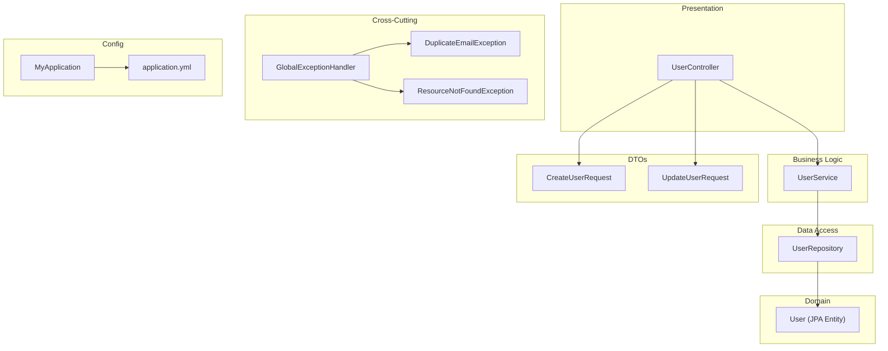
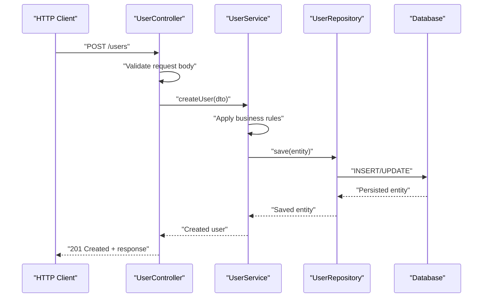
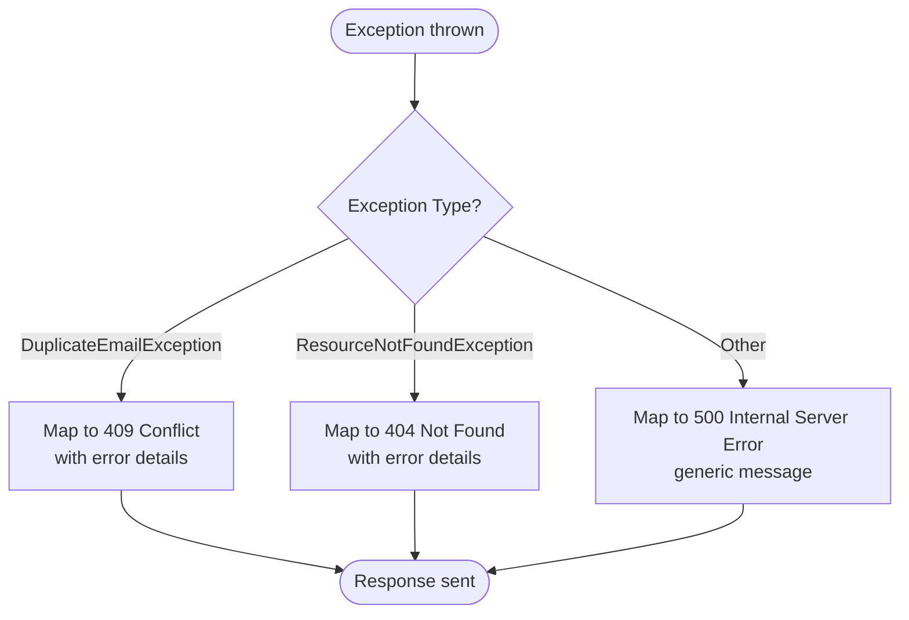

# Core Components

<cite>
**Referenced Files in This Document**
- [UserController.java](file://src/main/java/com/first/app/controller/UserController.java)
- [UserService.java](file://src/main/java/com/first/app/service/UserService.java)
- [UserRepository.java](file://src/main/java/com/first/app/repository/UserRepository.java)
- [User.java](file://src/main/java/com/first/app/entity/User.java)
- [CreateUserRequest.java](file://src/main/java/com/first/app/dto/CreateUserRequest.java)
- [UpdateUserRequest.java](file://src/main/java/com/first/app/dto/UpdateUserRequest.java)
- [GlobalExceptionHandler.java](file://src/main/java/com/first/app/exception/GlobalExceptionHandler.java)
- [DuplicateEmailException.java](file://src/main/java/com/first/app/exception/DuplicateEmailException.java)
- [ResourceNotFoundException.java](file://src/main/java/com/first/app/exception/ResourceNotFoundException.java)
- [MyApplication.java](file://src/main/java/com/first/app/MyApplication.java)
- [application.yml](file://src/main/resources/application.yml)
- [pom.xml](file://pom.xml)
</cite>

## Table of Contents
1. [Introduction](#introduction)
2. [Project Structure](#project-structure)
3. [Core Components](#core-components)
4. [Architecture Overview](#architecture-overview)
5. [Detailed Component Analysis](#detailed-component-analysis)
6. [Dependency Analysis](#dependency-analysis)
7. [Performance Considerations](#performance-considerations)
8. [Troubleshooting Guide](#troubleshooting-guide)
9. [Conclusion](#conclusion)

## Introduction
This document describes the core components and layered architecture of the user management system built with Spring Boot. It explains how HTTP requests flow through the presentation layer (controller), business logic (service), data access (repository), and domain models (JPA entity). It also documents cross-cutting concerns such as validation, exception handling, and transaction management, and highlights technology stack integration including Spring MVC, Spring Data JPA, and Bean Validation.

## Project Structure
The application follows a conventional Spring Boot layout organized by feature layers:
- Presentation: REST controllers handle HTTP requests and responses.
- Business Logic: Services encapsulate use cases and orchestrate repositories.
- Data Access: Repository interfaces extend Spring Data JPA to interact with the database.
- Domain Models: JPA entities represent persistent data structures.
- DTOs: Request/response objects decouple API contracts from internal models.
- Exceptions: Global exception handler centralizes error responses.
- Configuration: Application properties define runtime behavior.



[No sources needed since this diagram shows conceptual workflow, not actual code structure]

## Core Components
- UserController: Exposes REST endpoints for user operations, validates input via Bean Validation, maps DTOs to domain models, delegates to UserService, and returns standardized responses.
- UserService: Implements business rules, orchestrates repository calls, manages transactions, and converts between DTOs and entities.
- UserRepository: Spring Data JPA interface providing CRUD and custom queries over User entities without boilerplate implementation.
- User: JPA entity representing the persisted user record with field constraints and relationships.
- CreateUserRequest/UpdateUserRequest: DTOs carrying validated request payloads for creating and updating users.
- GlobalExceptionHandler: Centralized exception handling that translates domain exceptions into consistent HTTP responses.
- DuplicateEmailException/ResourceNotFoundException: Domain-specific exceptions used to signal business rule violations and missing resources.
- MyApplication: Spring Boot entry point enabling auto-configuration and component scanning.
- application.yml: Externalized configuration for datasource, JPA, logging, and profiles.

Key responsibilities and interactions:
- Controllers accept and validate requests, then delegate to services.
- Services enforce business logic, coordinate repositories, and manage transactions.
- Repositories abstract persistence using JPA; they operate on entities.
- DTOs ensure stable API contracts independent of internal models.
- Exception handling ensures predictable error responses across the application.

**Section sources**
- [UserController.java](file://src/main/java/com/first/app/controller/UserController.java)
- [UserService.java](file://src/main/java/com/first/app/service/UserService.java)
- [UserRepository.java](file://src/main/java/com/first/app/repository/UserRepository.java)
- [User.java](file://src/main/java/com/first/app/entity/User.java)
- [CreateUserRequest.java](file://src/main/java/com/first/app/dto/CreateUserRequest.java)
- [UpdateUserRequest.java](file://src/main/java/com/first/app/dto/UpdateUserRequest.java)
- [GlobalExceptionHandler.java](file://src/main/java/com/first/app/exception/GlobalExceptionHandler.java)
- [DuplicateEmailException.java](file://src/main/java/com/first/app/exception/DuplicateEmailException.java)
- [ResourceNotFoundException.java](file://src/main/java/com/first/app/exception/ResourceNotFoundException.java)
- [MyApplication.java](file://src/main/java/com/first/app/MyApplication.java)
- [application.yml](file://src/main/resources/application.yml)

## Architecture Overview
The system implements a layered architecture with clear separation of concerns:
- Presentation Layer (Spring MVC): Controllers parse requests, apply Bean Validation, and return JSON responses.
- Service Layer (Business Logic): Encapsulates use cases, enforces business rules, and coordinates data access.
- Data Access Layer (Spring Data JPA): Repository interfaces provide type-safe persistence operations backed by JPA.
- Domain Layer (Entities): JPA entities model the database schema and constraints.



**Diagram sources**
- [UserController.java](file://src/main/java/com/first/app/controller/UserController.java)
- [UserService.java](file://src/main/java/com/first/app/service/UserService.java)
- [UserRepository.java](file://src/main/java/com/first/app/repository/UserRepository.java)
- [User.java](file://src/main/java/com/first/app/entity/User.java)

## Detailed Component Analysis

### Presentation Layer: UserController
Responsibilities:
- Define REST endpoints for user operations.
- Validate incoming requests using Bean Validation annotations on DTOs.
- Map DTOs to domain models or service inputs.
- Delegate processing to UserService.
- Return appropriate HTTP status codes and response bodies.

Interactions:
- Depends on UserService for business logic.
- Consumes CreateUserRequest and UpdateUserRequest DTOs.
- Relies on GlobalExceptionHandler for centralized error mapping.

Validation and error handling:
- Uses Bean Validation on DTO fields to reject invalid input early.
- Returns 4xx responses for validation failures.
- Delegates domain errors (e.g., duplicate email) to GlobalExceptionHandler.

**Section sources**
- [UserController.java](file://src/main/java/com/first/app/controller/UserController.java)
- [CreateUserRequest.java](file://src/main/java/com/first/app/dto/CreateUserRequest.java)
- [UpdateUserRequest.java](file://src/main/java/com/first/app/dto/UpdateUserRequest.java)
- [GlobalExceptionHandler.java](file://src/main/java/com/first/app/exception/GlobalExceptionHandler.java)

### Business Logic Layer: UserService
Responsibilities:
- Implement business rules for user creation, updates, retrieval, and deletion.
- Convert between DTOs and domain entities.
- Orchestrate repository calls and manage transactions.
- Enforce uniqueness constraints and other domain invariants.

Transaction management:
- Methods performing writes are typically annotated to run within a transactional boundary.
- Read-only methods may be marked for optimized read semantics.

Error signaling:
- Throws domain-specific exceptions (e.g., DuplicateEmailException, ResourceNotFoundException) to indicate business rule violations or missing resources.

**Section sources**
- [UserService.java](file://src/main/java/com/first/app/service/UserService.java)
- [DuplicateEmailException.java](file://src/main/java/com/first/app/exception/DuplicateEmailException.java)
- [ResourceNotFoundException.java](file://src/main/java/com/first/app/exception/ResourceNotFoundException.java)

### Data Access Layer: UserRepository
Responsibilities:
- Provide type-safe persistence operations over User entities.
- Extend Spring Data JPA to inherit CRUD methods and support query derivation.
- Optionally define custom queries for complex lookups.

Integration with JPA:
- Operates on User entities mapped to database tables.
- Benefits from Spring Data JPA’s automatic implementation at runtime.

**Section sources**
- [UserRepository.java](file://src/main/java/com/first/app/repository/UserRepository.java)
- [User.java](file://src/main/java/com/first/app/entity/User.java)

### Domain Model: User Entity
Responsibilities:
- Represent the persistent user record.
- Define table mapping, primary keys, and column constraints.
- Include field-level validations where appropriate.

Relationships and constraints:
- May include unique constraints (e.g., email) enforced at both application and database levels.
- Provides getters/setters or accessor methods consumed by JPA.

**Section sources**
- [User.java](file://src/main/java/com/first/app/entity/User.java)

### DTOs: CreateUserRequest and UpdateUserRequest
Responsibilities:
- Carry validated request payloads for creating and updating users.
- Decouple API contracts from internal models.
- Use Bean Validation annotations to enforce input constraints.

Benefits:
- Stable API surface even when internal models evolve.
- Clear separation between transport and domain concerns.

**Section sources**
- [CreateUserRequest.java](file://src/main/java/com/first/app/dto/CreateUserRequest.java)
- [UpdateUserRequest.java](file://src/main/java/com/first/app/dto/UpdateUserRequest.java)

### Cross-Cutting Concerns: Exception Handling
GlobalExceptionHandler:
- Centralizes exception-to-HTTP mapping.
- Converts domain exceptions into consistent error responses with appropriate status codes.
- Improves client experience by providing structured error information.

Domain Exceptions:
- DuplicateEmailException signals business rule violation during user creation/update.
- ResourceNotFoundException indicates requested resource does not exist.



**Diagram sources**
- [GlobalExceptionHandler.java](file://src/main/java/com/first/app/exception/GlobalExceptionHandler.java)
- [DuplicateEmailException.java](file://src/main/java/com/first/app/exception/DuplicateEmailException.java)
- [ResourceNotFoundException.java](file://src/main/java/com/first/app/exception/ResourceNotFoundException.java)

**Section sources**
- [GlobalExceptionHandler.java](file://src/main/java/com/first/app/exception/GlobalExceptionHandler.java)
- [DuplicateEmailException.java](file://src/main/java/com/first/app/exception/DuplicateEmailException.java)
- [ResourceNotFoundException.java](file://src/main/java/com/first/app/exception/ResourceNotFoundException.java)

### Technology Stack Integration
- Spring MVC: Powers controller endpoints, request parsing, and response serialization.
- Spring Data JPA: Provides repository abstraction and automatic persistence implementation.
- Bean Validation: Validates DTOs and entities declaratively.
- Spring Boot Auto-Configuration: Enables rapid setup of web, data, and validation features with minimal configuration.
- Application Properties: Externalized configuration for datasource, JPA, and logging via application.yml.

Auto-configuration highlights:
- Web layer auto-configured by Spring Boot starter dependencies.
- JPA and datasource auto-configured based on application.yml settings.
- Validation auto-configured to process Bean Validation annotations on DTOs.

**Section sources**
- [MyApplication.java](file://src/main/java/com/first/app/MyApplication.java)
- [application.yml](file://src/main/resources/application.yml)
- [pom.xml](file://pom.xml)

## Dependency Analysis
High-level dependency relationships:
- UserController depends on UserService.
- UserService depends on UserRepository and domain exceptions.
- UserRepository depends on User entity and Spring Data JPA runtime.
- GlobalExceptionHandler depends on domain exceptions.

```mermaid
classDiagram
class UserController {
"+REST endpoints"
"+validate input"
"+delegate to service"
}
class UserService {
"+business logic"
"+orchestrate repositories"
"+manage transactions"
}
class UserRepository {
"+CRUD operations"
"+custom queries"
}
class User {
"+JPA entity"
"+constraints"
}
class GlobalExceptionHandler {
"+map exceptions to HTTP"
}
class DuplicateEmailException
class ResourceNotFoundException
UserController --> UserService : "delegates"
UserService --> UserRepository : "uses"
UserRepository --> User : "persists"
GlobalExceptionHandler --> DuplicateEmailException : "handles"
GlobalExceptionHandler --> ResourceNotFoundException : "handles"
```

**Diagram sources**
- [UserController.java](file://src/main/java/com/first/app/controller/UserController.java)
- [UserService.java](file://src/main/java/com/first/app/service/UserService.java)
- [UserRepository.java](file://src/main/java/com/first/app/repository/UserRepository.java)
- [User.java](file://src/main/java/com/first/app/entity/User.java)
- [GlobalExceptionHandler.java](file://src/main/java/com/first/app/exception/GlobalExceptionHandler.java)
- [DuplicateEmailException.java](file://src/main/java/com/first/app/exception/DuplicateEmailException.java)
- [ResourceNotFoundException.java](file://src/main/java/com/first/app/exception/ResourceNotFoundException.java)

**Section sources**
- [UserController.java](file://src/main/java/com/first/app/controller/UserController.java)
- [UserService.java](file://src/main/java/com/first/app/service/UserService.java)
- [UserRepository.java](file://src/main/java/com/first/app/repository/UserRepository.java)
- [User.java](file://src/main/java/com/first/app/entity/User.java)
- [GlobalExceptionHandler.java](file://src/main/java/com/first/app/exception/GlobalExceptionHandler.java)
- [DuplicateEmailException.java](file://src/main/java/com/first/app/exception/DuplicateEmailException.java)
- [ResourceNotFoundException.java](file://src/main/java/com/first/app/exception/ResourceNotFoundException.java)

## Performance Considerations
- Use read-only transaction semantics for queries to optimize performance.
- Leverage Spring Data JPA’s derived queries and pagination to avoid loading large datasets.
- Apply Bean Validation early to fail fast and reduce unnecessary processing.
- Configure connection pooling and JPA batch settings via application.yml for throughput.
- Avoid N+1 query problems by using fetch joins or projections where necessary.

[No sources needed since this section provides general guidance]

## Troubleshooting Guide
Common issues and resolutions:
- Validation failures: Ensure DTOs have correct Bean Validation annotations and clients send valid payloads.
- Duplicate email errors: Check business rules and database unique constraints; verify exception mapping returns 409 Conflict.
- Resource not found: Confirm IDs exist and repository queries return expected results; expect 404 responses.
- Transaction rollback: Verify write operations are properly annotated for transactions and exceptions propagate correctly.
- Configuration problems: Validate application.yml entries for datasource and JPA properties.

**Section sources**
- [GlobalExceptionHandler.java](file://src/main/java/com/first/app/exception/GlobalExceptionHandler.java)
- [DuplicateEmailException.java](file://src/main/java/com/first/app/exception/DuplicateEmailException.java)
- [ResourceNotFoundException.java](file://src/main/java/com/first/app/exception/ResourceNotFoundException.java)
- [application.yml](file://src/main/resources/application.yml)

## Conclusion
The user management system follows a clean layered architecture with clear separation between presentation, business logic, data access, and domain models. The repository pattern simplifies persistence, dependency injection enables loose coupling, and Spring Boot auto-configuration accelerates development. Cross-cutting concerns like validation and exception handling are centralized to improve consistency and maintainability. This design supports scalability, testability, and long-term evolution of the application.