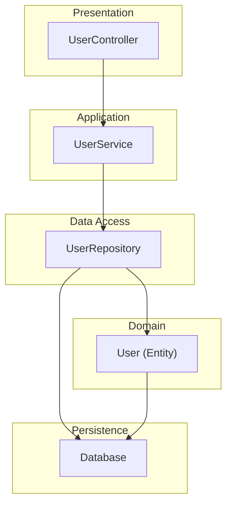
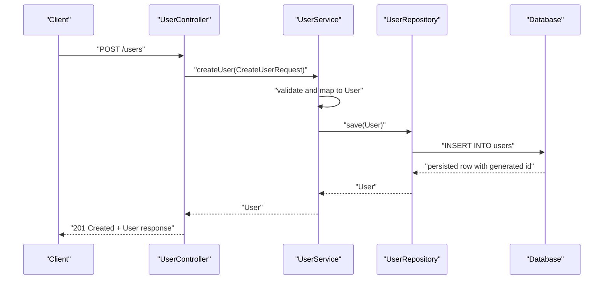
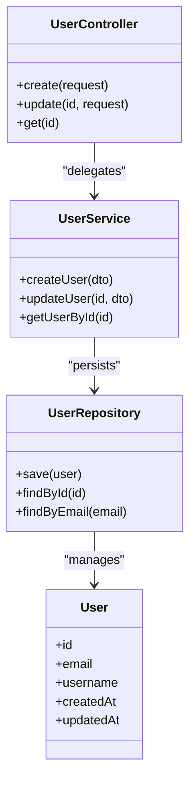
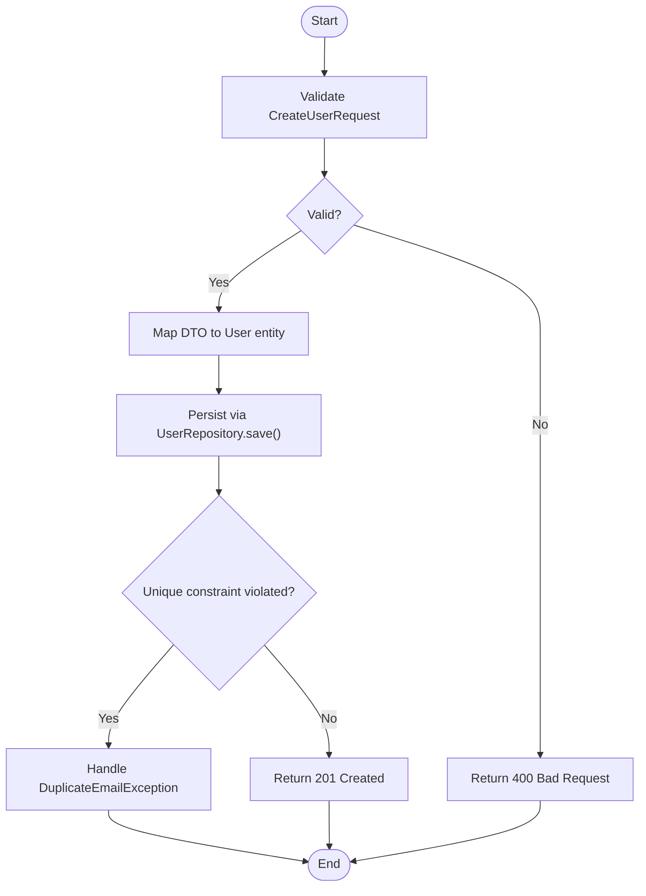
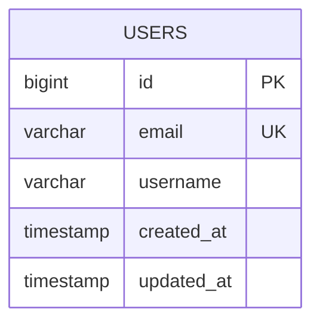
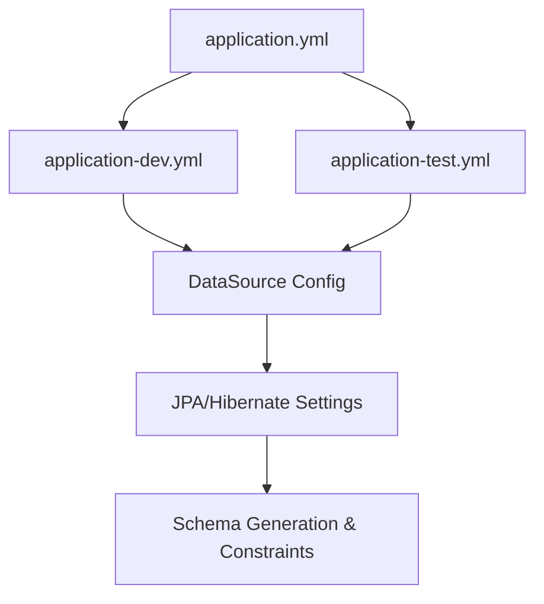
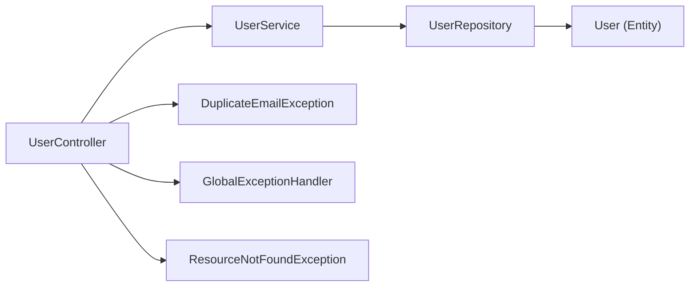

# Entity Model

<cite>
**Referenced Files in This Document**
- [User.java](file://src/main/java/com/first/app/entity/User.java)
- [UserRepository.java](file://src/main/java/com/first/app/repository/UserRepository.java)
- [UserService.java](file://src/main/java/com/first/app/service/UserService.java)
- [UserController.java](file://src/main/java/com/first/app/controller/UserController.java)
- [CreateUserRequest.java](file://src/main/java/com/first/app/dto/CreateUserRequest.java)
- [UpdateUserRequest.java](file://src/main/java/com/first/app/dto/UpdateUserRequest.java)
- [DuplicateEmailException.java](file://src/main/java/com/first/app/exception/DuplicateEmailException.java)
- [GlobalExceptionHandler.java](file://src/main/java/com/first/app/exception/GlobalExceptionHandler.java)
- [ResourceNotFoundException.java](file://src/main/java/com/first/app/exception/ResourceNotFoundException.java)
- [application.yml](file://src/main/resources/application.yml)
- [application-dev.yml](file://src/main/resources/application-dev.yml)
- [application-test.yml](file://src/main/resources/application-test.yml)
</cite>

## Table of Contents
1. [Introduction](#introduction)
2. [Project Structure](#project-structure)
3. [Core Components](#core-components)
4. [Architecture Overview](#architecture-overview)
5. [Detailed Component Analysis](#detailed-component-analysis)
6. [Dependency Analysis](#dependency-analysis)
7. [Performance Considerations](#performance-considerations)
8. [Troubleshooting Guide](#troubleshooting-guide)
9. [Conclusion](#conclusion)
10. [Appendices](#appendices)

## Introduction
This document explains the Entity Model component with a focus on the User entity and its role as the domain model. It covers JPA annotations, field definitions, data types, constraints (including email uniqueness and length validation), database schema mapping, primary key strategies, auto-generated fields, lifecycle behavior, persistence semantics, and validation constraints. It also provides best practices for entity design and common pitfalls to avoid.

## Project Structure
The project follows a layered architecture:
- Controller layer handles HTTP requests and responses.
- Service layer encapsulates business logic and orchestrates repository calls.
- Repository layer provides Spring Data JPA interfaces for persistence operations.
- Entity layer defines domain models mapped to database tables via JPA.
- DTOs define request/response contracts used by controllers.
- Exceptions and global exception handling manage error scenarios.
- Configuration files define application settings including database connectivity.

[No sources needed since this diagram shows conceptual workflow, not actual code structure]

## Core Components
- User entity represents the persistent domain model for users.
- UserRepository provides CRUD and query methods backed by Spring Data JPA.
- UserService implements business logic around user creation, updates, and retrieval.
- UserController exposes REST endpoints that operate on User entities through DTOs.
- DTOs (CreateUserRequest, UpdateUserRequest) carry validated input from clients.
- Exception classes and GlobalExceptionHandler manage error responses consistently.

Key responsibilities:
- User: Define persistent fields, constraints, and mappings.
- UserRepository: Provide typed access to User records.
- UserService: Enforce business rules and coordinate persistence.
- UserController: Translate between HTTP requests/responses and domain objects.

**Section sources**
- [User.java](file://src/main/java/com/first/app/entity/User.java)
- [UserRepository.java](file://src/main/java/com/first/app/repository/UserRepository.java)
- [UserService.java](file://src/main/java/com/first/app/service/UserService.java)
- [UserController.java](file://src/main/java/com/first/app/controller/UserController.java)
- [CreateUserRequest.java](file://src/main/java/com/first/app/dto/CreateUserRequest.java)
- [UpdateUserRequest.java](file://src/main/java/com/first/app/dto/UpdateUserRequest.java)
- [DuplicateEmailException.java](file://src/main/java/com/first/app/exception/DuplicateEmailException.java)
- [GlobalExceptionHandler.java](file://src/main/java/com/first/app/exception/GlobalExceptionHandler.java)
- [ResourceNotFoundException.java](file://src/main/java/com/first/app/exception/ResourceNotFoundException.java)

## Architecture Overview
The User entity is managed by Spring Data JPA and persisted to a relational database. The controller accepts DTOs, the service validates and transforms them into entities, and the repository persists changes.

**Diagram sources**
- [UserController.java](file://src/main/java/com/first/app/controller/UserController.java)
- [UserService.java](file://src/main/java/com/first/app/service/UserService.java)
- [UserRepository.java](file://src/main/java/com/first/app/repository/UserRepository.java)
- [User.java](file://src/main/java/com/first/app/entity/User.java)

## Detailed Component Analysis

### User Entity Design
The User entity maps to a database table and uses JPA annotations to define persistence behavior:
- @Entity marks the class as a JPA-managed entity.
- @Table specifies the target table name and constraints such as unique constraints if defined.
- @Id identifies the primary key field.
- @GeneratedValue configures the primary key generation strategy.
- @Column defines column names, nullability, length, and other attributes.

Field definitions and constraints typically include:
- Identifier field (primary key) with an auto-generation strategy.
- Email field with uniqueness enforced at the database level and optional length validation.
- Additional fields such as username or timestamps depending on requirements.

Primary key strategy:
- Auto-generated identifiers are configured using @GeneratedValue with a strategy appropriate for the underlying database (e.g., sequence, identity, or table).

Constraints:
- Uniqueness: Enforced via @Table(uniqueConstraints = ...) or @Column(unique = true) to prevent duplicate emails.
- Length validation: Enforced via @Column(length = ...) and/or Bean Validation annotations on the entity or DTOs.

Lifecycle and persistence behavior:
- New instances become managed when persisted via the repository.
- Changes to managed entities are automatically detected and flushed according to transaction boundaries.
- Detached entities require explicit merge or update operations.

Best practices:
- Keep entities focused on persistence concerns; avoid heavy business logic.
- Use immutable identifiers where possible.
- Prefer explicit column definitions for clarity and portability.
- Validate inputs at the boundary (DTOs) and enforce integrity at the database level.

Common pitfalls:
- Overusing lazy loading on frequently accessed associations can cause N+1 queries.
- Mixing presentation concerns into entities leads to tight coupling.
- Missing unique constraints can allow duplicates despite application-level checks.

**Section sources**
- [User.java](file://src/main/java/com/first/app/entity/User.java)

#### Class Diagram

**Diagram sources**
- [User.java](file://src/main/java/com/first/app/entity/User.java)
- [UserRepository.java](file://src/main/java/com/first/app/repository/UserRepository.java)
- [UserService.java](file://src/main/java/com/first/app/service/UserService.java)
- [UserController.java](file://src/main/java/com/first/app/controller/UserController.java)

### Persistence Flow and Validation
The typical flow for creating a user involves:
- Receiving a CreateUserRequest DTO at the controller.
- Validating the DTO (e.g., required fields, email format, length limits).
- Mapping the DTO to a new User entity.
- Persisting the entity via UserRepository.
- Returning the persisted User as a response.

**Diagram sources**
- [UserController.java](file://src/main/java/com/first/app/controller/UserController.java)
- [UserService.java](file://src/main/java/com/first/app/service/UserService.java)
- [UserRepository.java](file://src/main/java/com/first/app/repository/UserRepository.java)
- [DuplicateEmailException.java](file://src/main/java/com/first/app/exception/DuplicateEmailException.java)
- [GlobalExceptionHandler.java](file://src/main/java/com/first/app/exception/GlobalExceptionHandler.java)

**Section sources**
- [UserController.java](file://src/main/java/com/first/app/controller/UserController.java)
- [UserService.java](file://src/main/java/com/first/app/service/UserService.java)
- [UserRepository.java](file://src/main/java/com/first/app/repository/UserRepository.java)
- [CreateUserRequest.java](file://src/main/java/com/first/app/dto/CreateUserRequest.java)
- [DuplicateEmailException.java](file://src/main/java/com/first/app/exception/DuplicateEmailException.java)
- [GlobalExceptionHandler.java](file://src/main/java/com/first/app/exception/GlobalExceptionHandler.java)

### Database Schema Mapping
The User entity maps to a database table with columns corresponding to entity fields. Primary keys are auto-generated, and unique constraints ensure data integrity (e.g., email uniqueness). Column lengths and nullability are defined by annotations and configuration.

**Diagram sources**
- [User.java](file://src/main/java/com/first/app/entity/User.java)

**Section sources**
- [User.java](file://src/main/java/com/first/app/entity/User.java)

### Configuration and Environment
Application properties define database connectivity and JPA behavior. Profiles allow different configurations for development and testing environments.

**Diagram sources**
- [application.yml](file://src/main/resources/application.yml)
- [application-dev.yml](file://src/main/resources/application-dev.yml)
- [application-test.yml](file://src/main/resources/application-test.yml)

**Section sources**
- [application.yml](file://src/main/resources/application.yml)
- [application-dev.yml](file://src/main/resources/application-dev.yml)
- [application-test.yml](file://src/main/resources/application-test.yml)

## Dependency Analysis
The following diagram illustrates dependencies among core components involved in user persistence.

**Diagram sources**
- [UserController.java](file://src/main/java/com/first/app/controller/UserController.java)
- [UserService.java](file://src/main/java/com/first/app/service/UserService.java)
- [UserRepository.java](file://src/main/java/com/first/app/repository/UserRepository.java)
- [User.java](file://src/main/java/com/first/app/entity/User.java)
- [DuplicateEmailException.java](file://src/main/java/com/first/app/exception/DuplicateEmailException.java)
- [GlobalExceptionHandler.java](file://src/main/java/com/first/app/exception/GlobalExceptionHandler.java)
- [ResourceNotFoundException.java](file://src/main/java/com/first/app/exception/ResourceNotFoundException.java)

**Section sources**
- [UserController.java](file://src/main/java/com/first/app/controller/UserController.java)
- [UserService.java](file://src/main/java/com/first/app/service/UserService.java)
- [UserRepository.java](file://src/main/java/com/first/app/repository/UserRepository.java)
- [User.java](file://src/main/java/com/first/app/entity/User.java)
- [DuplicateEmailException.java](file://src/main/java/com/first/app/exception/DuplicateEmailException.java)
- [GlobalExceptionHandler.java](file://src/main/java/com/first/app/exception/GlobalExceptionHandler.java)
- [ResourceNotFoundException.java](file://src/main/java/com/first/app/exception/ResourceNotFoundException.java)

## Performance Considerations
- Avoid unnecessary fetching of large datasets; use pagination and projections where appropriate.
- Be mindful of N+1 query problems when accessing collections; consider JOIN FETCH or batch fetching.
- Keep transactions short and focused on persistence operations.
- Use appropriate indexes on frequently queried columns (e.g., email) to improve lookup performance.
- Prefer DTOs for API responses to reduce payload size and avoid serializing sensitive fields.

[No sources needed since this section provides general guidance]

## Troubleshooting Guide
Common issues and resolutions:
- Duplicate email errors: Ensure unique constraints exist at the database level and handle DuplicateEmailException appropriately in GlobalExceptionHandler.
- Not found errors: Use ResourceNotFoundException for missing resources and return consistent 404 responses.
- Validation failures: Validate DTOs before mapping to entities; provide clear error messages.
- Transaction rollback issues: Verify that exceptions thrown within transactions are properly handled to trigger rollbacks.

Operational tips:
- Enable SQL logging during development to inspect generated statements.
- Use test profiles to validate schema generation and constraints against an embedded database.

**Section sources**
- [DuplicateEmailException.java](file://src/main/java/com/first/app/exception/DuplicateEmailException.java)
- [GlobalExceptionHandler.java](file://src/main/java/com/first/app/exception/GlobalExceptionHandler.java)
- [ResourceNotFoundException.java](file://src/main/java/com/first/app/exception/ResourceNotFoundException.java)

## Conclusion
The User entity serves as the foundation for user-related persistence, leveraging JPA annotations to define mappings, constraints, and lifecycle behavior. Proper design ensures data integrity, predictable persistence semantics, and maintainable code. Adhering to best practices and avoiding common pitfalls helps build robust applications with reliable data management.

[No sources needed since this section summarizes without analyzing specific files]

## Appendices

### Best Practices Checklist
- Define explicit @Table and @Column attributes for clarity and portability.
- Enforce uniqueness at the database level to complement application validations.
- Use appropriate primary key generation strategies aligned with the database.
- Keep entities lean; move business logic to services.
- Validate inputs at the boundary using DTOs and Bean Validation.
- Handle exceptions consistently with GlobalExceptionHandler.

[No sources needed since this section provides general guidance]