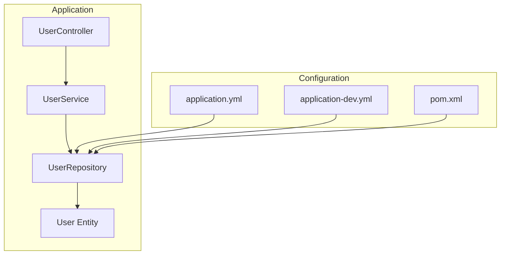
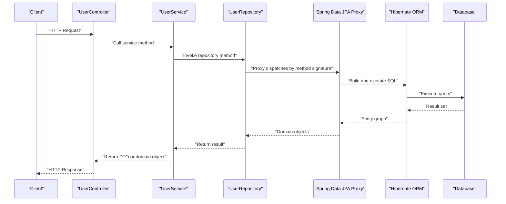
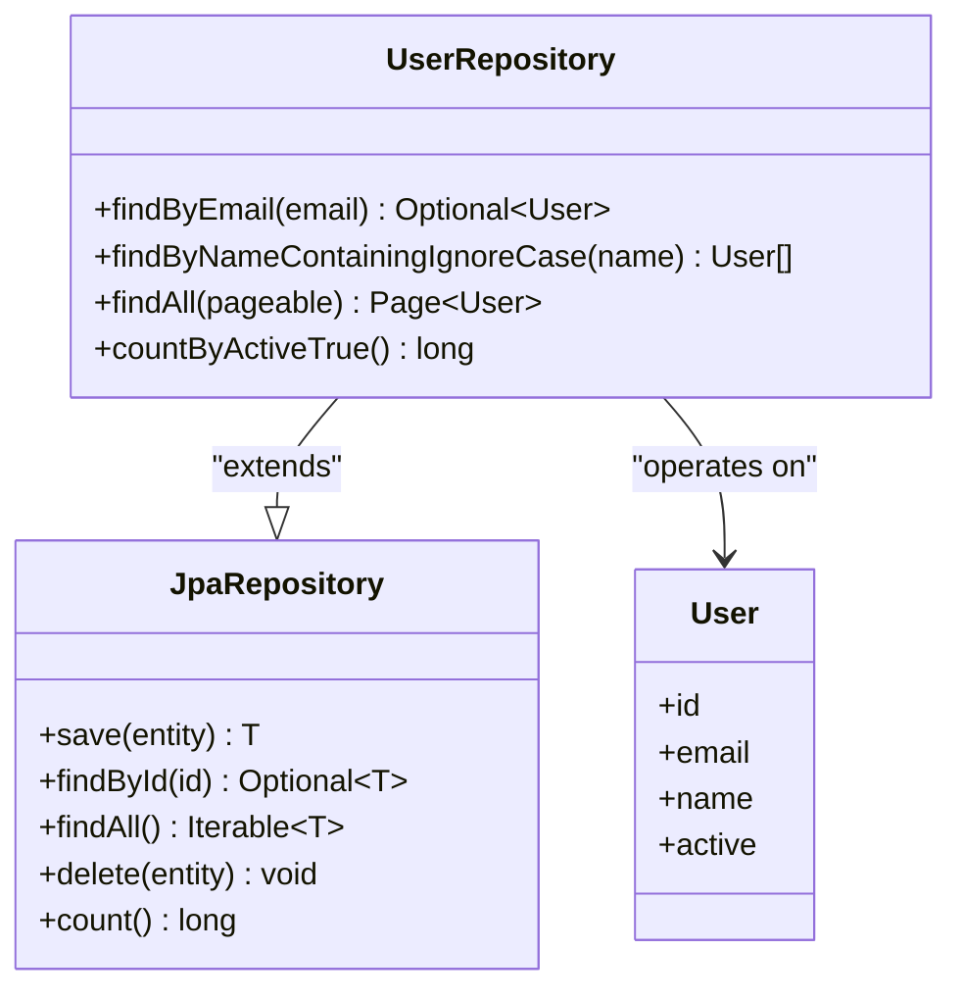
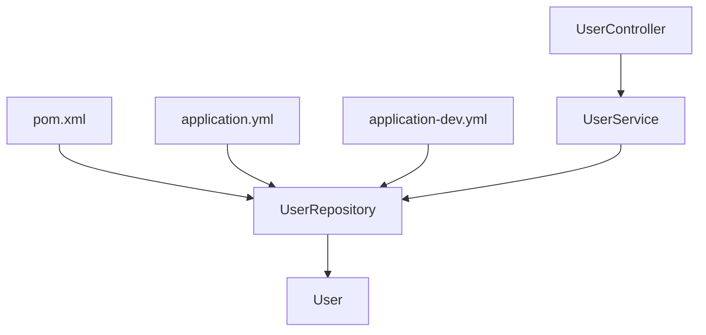

# Repository Layer

<cite>
**Referenced Files in This Document**
- [UserRepository.java](file://src/main/java/com/first/app/repository/UserRepository.java)
- [User.java](file://src/main/java/com/first/app/entity/User.java)
- [UserService.java](file://src/main/java/com/first/app/service/UserService.java)
- [UserController.java](file://src/main/java/com/first/app/controller/UserController.java)
- [application.yml](file://src/main/resources/application.yml)
- [application-dev.yml](file://src/main/resources/application-dev.yml)
- [pom.xml](file://pom.xml)
</cite>

## Table of Contents
1. [Introduction](#introduction)
2. [Project Structure](#project-structure)
3. [Core Components](#core-components)
4. [Architecture Overview](#architecture-overview)
5. [Detailed Component Analysis](#detailed-component-analysis)
6. [Dependency Analysis](#dependency-analysis)
7. [Performance Considerations](#performance-considerations)
8. [Troubleshooting Guide](#troubleshooting-guide)
9. [Conclusion](#conclusion)

## Introduction
This document explains the Repository Layer component with a focus on how UserRepository extends JpaRepository to provide database abstraction and CRUD operations. It covers Spring Data JPA features used (automatic query generation, custom query methods, entity relationships), the repository pattern implementation, interface-based design, and integration with Hibernate ORM. It also includes examples of query methods, pagination support, performance considerations, database connection configuration, and transaction boundaries.

## Project Structure
The repository layer is implemented under the repository package and integrates with the entity, service, and controller layers. Configuration for data access resides under resources, and dependencies are declared in the build file.

**Diagram sources**
- [UserRepository.java](file://src/main/java/com/first/app/repository/UserRepository.java)
- [User.java](file://src/main/java/com/first/app/entity/User.java)
- [UserService.java](file://src/main/java/com/first/app/service/UserService.java)
- [UserController.java](file://src/main/java/com/first/app/controller/UserController.java)
- [application.yml](file://src/main/resources/application.yml)
- [application-dev.yml](file://src/main/resources/application-dev.yml)
- [pom.xml](file://pom.xml)

**Section sources**
- [UserRepository.java](file://src/main/java/com/first/app/repository/UserRepository.java)
- [User.java](file://src/main/java/com/first/app/entity/User.java)
- [UserService.java](file://src/main/java/com/first/app/service/UserService.java)
- [UserController.java](file://src/main/java/com/first/app/controller/UserController.java)
- [application.yml](file://src/main/resources/application.yml)
- [application-dev.yml](file://src/main/resources/application-dev.yml)
- [pom.xml](file://pom.xml)

## Core Components
- UserRepository: The primary repository interface that extends JpaRepository to expose CRUD operations and custom queries.
- User: The JPA entity mapped to the underlying database table.
- UserService: The service layer that orchestrates business logic and delegates persistence operations to UserRepository.
- UserController: The web layer that exposes HTTP endpoints and uses UserService.

Key responsibilities:
- UserRepository provides an interface-based abstraction over the persistence mechanism, enabling automatic query derivation and pagination without boilerplate implementations.
- User defines the persistent model and relationships via JPA annotations.
- UserService coordinates transactions and business rules while delegating data access to UserRepository.
- UserController handles request/response mapping and invokes UserService.

**Section sources**
- [UserRepository.java](file://src/main/java/com/first/app/repository/UserRepository.java)
- [User.java](file://src/main/java/com/first/app/entity/User.java)
- [UserService.java](file://src/main/java/com/first/app/service/UserService.java)
- [UserController.java](file://src/main/java/com/first/app/controller/UserController.java)

## Architecture Overview
The repository layer sits between the service layer and the persistence provider (Hibernate). Spring Data JPA generates proxy implementations at runtime based on method signatures and JPA metadata.

**Diagram sources**
- [UserController.java](file://src/main/java/com/first/app/controller/UserController.java)
- [UserService.java](file://src/main/java/com/first/app/service/UserService.java)
- [UserRepository.java](file://src/main/java/com/first/app/repository/UserRepository.java)

## Detailed Component Analysis

### UserRepository Interface Design
- Extends JpaRepository to inherit standard CRUD operations such as save, findById, findAll, delete, and count.
- Uses Spring Data JPA’s query derivation from method names to generate SQL automatically.
- Supports pagination and sorting through Pageable and Sort parameters.
- Can define custom queries using @Query with JPQL or native SQL when needed.

Examples of typical repository methods:
- Find by email: findByEmail(String email)
- Find by name containing: findByNameContainingIgnoreCase(String name)
- Paginated users: findAll(Pageable pageable)
- Count active users: countByActiveTrue()

These patterns demonstrate interface-based design where no implementation class is required; Spring Data JPA creates the implementation at runtime.

**Section sources**
- [UserRepository.java](file://src/main/java/com/first/app/repository/UserRepository.java)

#### Class Diagram

**Diagram sources**
- [UserRepository.java](file://src/main/java/com/first/app/repository/UserRepository.java)
- [User.java](file://src/main/java/com/first/app/entity/User.java)

### Entity Relationships and Mapping
- The User entity is annotated for JPA mapping, defining fields, constraints, and relationships if any.
- Common annotations include table and column mappings, unique constraints, and relationship definitions (e.g., OneToMany, ManyToOne) depending on domain requirements.
- Field naming conventions influence derived query methods (e.g., findByEmail).

Best practices:
- Keep entities focused on persistence concerns.
- Use appropriate constraints to enforce data integrity at the database level.
- Avoid heavy business logic in entities.

**Section sources**
- [User.java](file://src/main/java/com/first/app/entity/User.java)

### Integration with Hibernate ORM
- Spring Boot auto-configures Hibernate as the JPA provider based on dependencies.
- EntityManagerFactory and DataSource are configured via application properties.
- Transaction management is handled by Spring’s declarative transaction support.

Integration points:
- DataSource configuration in application files.
- JPA/Hibernate settings (dialect, show-sql, ddl-auto) controlled via properties.
- Transactions scoped around service methods.

**Section sources**
- [application.yml](file://src/main/resources/application.yml)
- [application-dev.yml](file://src/main/resources/application-dev.yml)
- [pom.xml](file://pom.xml)

### Query Methods and Custom Queries
- Derived queries: Method names like findByEmail or findByNameStartingWith are translated into JPQL/SQL automatically.
- Custom queries: Use @Query with JPQL or native SQL for complex scenarios.
- Pagination: Accept Pageable to return Page<T>, which includes content and metadata.
- Sorting: Accept Sort to order results.

Example patterns:
- findByEmail(String email)
- findByNameContainingIgnoreCase(String name)
- findAll(Pageable pageable)
- countByActiveTrue()

**Section sources**
- [UserRepository.java](file://src/main/java/com/first/app/repository/UserRepository.java)

### Pagination Support
- Use Pageable to retrieve paginated results efficiently.
- Combine with Sort for ordering.
- Return Page<User> to access total elements and page metadata.

Typical usage flow:
- Controller receives page and size parameters.
- Service constructs Pageable and calls repository.
- Repository returns Page<User>.

**Section sources**
- [UserRepository.java](file://src/main/java/com/first/app/repository/UserRepository.java)
- [UserService.java](file://src/main/java/com/first/app/service/UserService.java)

### Transaction Boundaries
- Service methods should be annotated with @Transactional to manage transaction boundaries.
- Read-only operations can use @Transactional(readOnly = true) for optimization.
- Ensure exceptions are handled appropriately to avoid partial commits.

Transaction flow:
- Controller calls service method.
- Service begins transaction.
- Service calls repository methods within the same transaction.
- On success, commit; on exception, rollback.

**Section sources**
- [UserService.java](file://src/main/java/com/first/app/service/UserService.java)

### Database Connection Configuration
- Configure DataSource URL, username, password, and driver in application properties.
- Set JPA/Hibernate properties such as dialect, show-sql, and ddl-auto for development and testing.
- Environment-specific profiles allow different configurations per environment.

Key configuration areas:
- spring.datasource.*
- spring.jpa.*

**Section sources**
- [application.yml](file://src/main/resources/application.yml)
- [application-dev.yml](file://src/main/resources/application-dev.yml)

## Dependency Analysis
The repository layer depends on Spring Data JPA and Hibernate, configured via Maven dependencies and application properties.

**Diagram sources**
- [pom.xml](file://pom.xml)
- [application.yml](file://src/main/resources/application.yml)
- [application-dev.yml](file://src/main/resources/application-dev.yml)
- [UserRepository.java](file://src/main/java/com/first/app/repository/UserRepository.java)
- [User.java](file://src/main/java/com/first/app/entity/User.java)
- [UserService.java](file://src/main/java/com/first/app/service/UserService.java)
- [UserController.java](file://src/main/java/com/first/app/controller/UserController.java)

**Section sources**
- [pom.xml](file://pom.xml)
- [application.yml](file://src/main/resources/application.yml)
- [application-dev.yml](file://src/main/resources/application-dev.yml)
- [UserRepository.java](file://src/main/java/com/first/app/repository/UserRepository.java)
- [User.java](file://src/main/java/com/first/app/entity/User.java)
- [UserService.java](file://src/main/java/com/first/app/service/UserService.java)
- [UserController.java](file://src/main/java/com/first/app/controller/UserController.java)

## Performance Considerations
- Indexing: Add database indexes on frequently queried columns (e.g., email, name prefixes).
- Projections: Use DTO projections to fetch only necessary fields and reduce payload size.
- Batch operations: Use batched saves or updates for bulk processing.
- N+1 problem: Use JOIN FETCH or entity graphs to avoid additional queries when loading associations.
- Pagination: Always paginate large result sets to limit memory usage and improve response times.
- Read-only transactions: Mark read-heavy service methods as read-only to enable optimizations.
- Connection pooling: Tune pool size and timeouts according to workload.

[No sources needed since this section provides general guidance]

## Troubleshooting Guide
Common issues and resolutions:
- Missing dependencies: Ensure Spring Data JPA and JDBC driver are present in pom.xml.
- Incorrect datasource configuration: Verify URL, credentials, and driver class in application properties.
- Dialect mismatch: Set the correct Hibernate dialect for your database.
- Schema validation errors: Adjust ddl-auto settings during development and disable in production.
- Transaction anomalies: Ensure @Transactional is applied at the service layer and not overridden unexpectedly.
- Slow queries: Enable show-sql and analyze execution plans; add indexes or optimize queries.

**Section sources**
- [application.yml](file://src/main/resources/application.yml)
- [application-dev.yml](file://src/main/resources/application-dev.yml)
- [pom.xml](file://pom.xml)

## Conclusion
The Repository Layer leverages Spring Data JPA and Hibernate to provide a clean, interface-based abstraction over persistence. UserRepository extends JpaRepository to gain automatic CRUD capabilities, derived query methods, and pagination support. Proper configuration of DataSource and JPA/Hibernate properties ensures reliable connectivity and behavior across environments. Applying transaction boundaries at the service layer and following performance best practices yields efficient and maintainable data access.