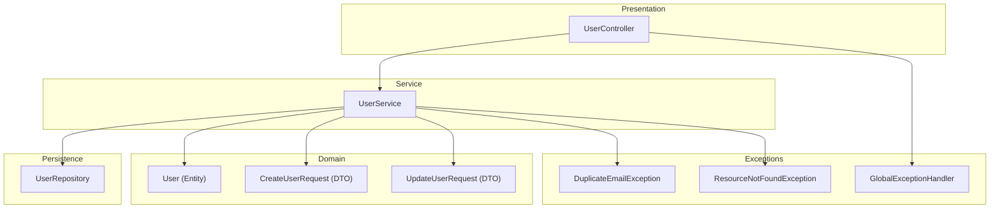
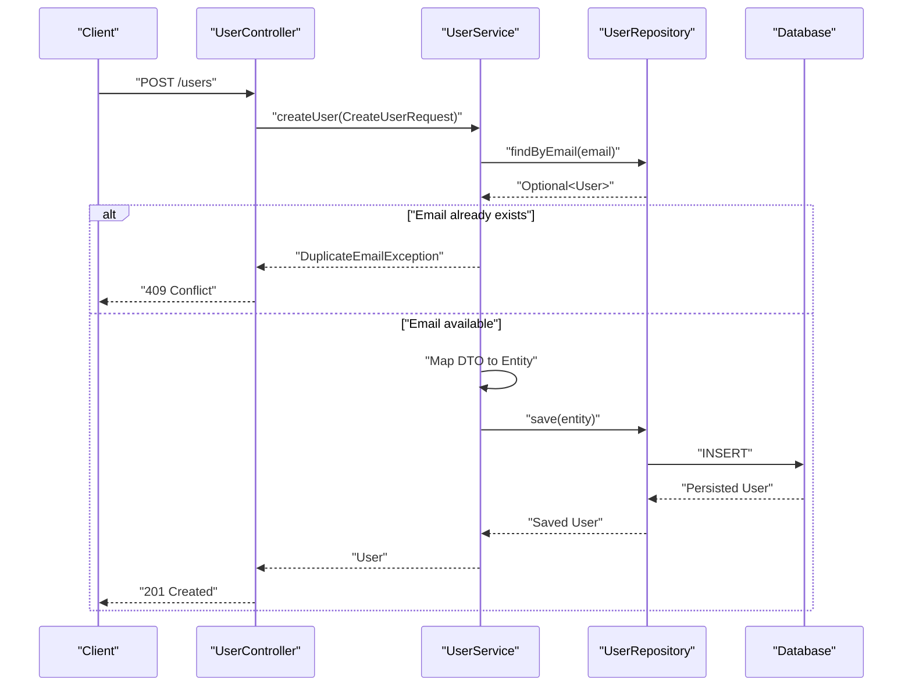
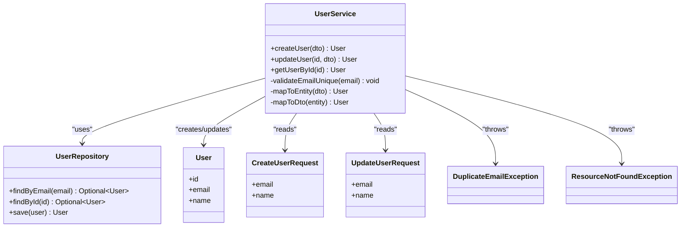
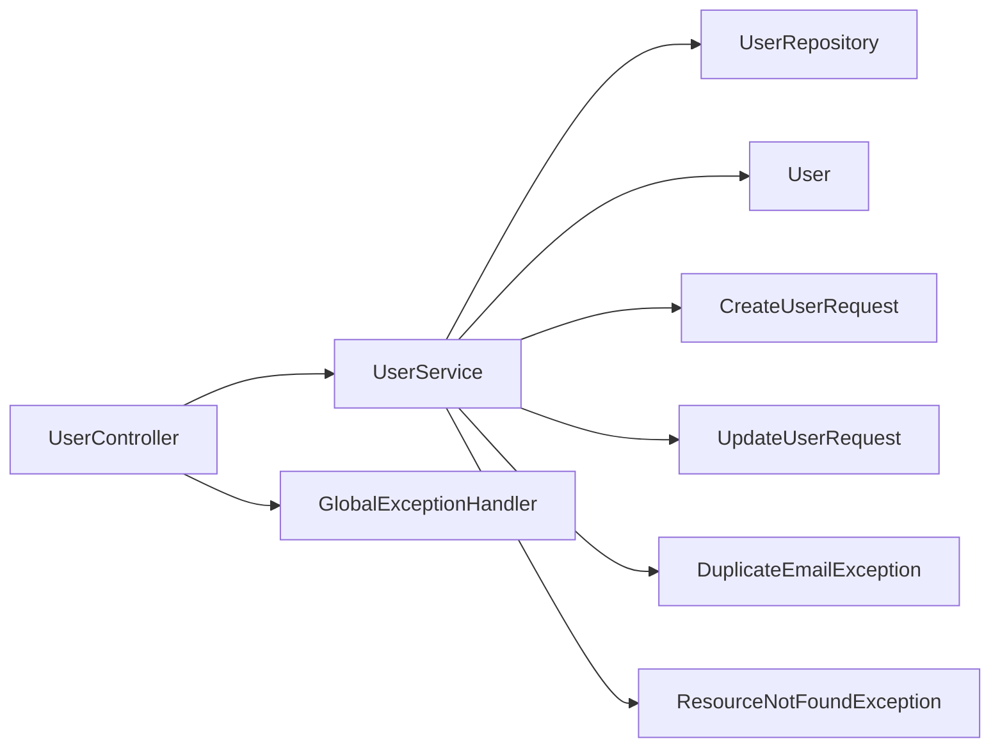

# Service Layer

<cite>
**Referenced Files in This Document**
- [UserService.java](file://src/main/java/com/first/app/service/UserService.java)
- [UserRepository.java](file://src/main/java/com/first/app/repository/UserRepository.java)
- [User.java](file://src/main/java/com/first/app/entity/User.java)
- [CreateUserRequest.java](file://src/main/java/com/first/app/dto/CreateUserRequest.java)
- [UpdateUserRequest.java](file://src/main/java/com/first/app/dto/UpdateUserRequest.java)
- [UserController.java](file://src/main/java/com/first/app/controller/UserController.java)
- [DuplicateEmailException.java](file://src/main/java/com/first/app/exception/DuplicateEmailException.java)
- [ResourceNotFoundException.java](file://src/main/java/com/first/app/exception/ResourceNotFoundException.java)
- [GlobalExceptionHandler.java](file://src/main/java/com/first/app/exception/GlobalExceptionHandler.java)
- [UserServiceTest.java](file://src/test/java/com/first/app/service/UserServiceTest.java)
</cite>

## Table of Contents
1. [Introduction](#introduction)
2. [Project Structure](#project-structure)
3. [Core Components](#core-components)
4. [Architecture Overview](#architecture-overview)
5. [Detailed Component Analysis](#detailed-component-analysis)
6. [Dependency Analysis](#dependency-analysis)
7. [Performance Considerations](#performance-considerations)
8. [Troubleshooting Guide](#troubleshooting-guide)
9. [Conclusion](#conclusion)

## Introduction
This document provides comprehensive documentation for the Service Layer component, focusing on how UserService implements core business logic for user management. It explains user creation, updates, and retrieval operations; method responsibilities; business rule enforcement; data transformation between DTOs and entities; transactional behavior; orchestration of repository calls; validation; state management; exception handling; error propagation; integration with the repository layer; dependency injection patterns; and testability considerations.

## Project Structure
The project follows a layered architecture:
- Controller layer handles HTTP requests and delegates to services.
- Service layer encapsulates business logic, orchestrates repositories, enforces constraints, and manages transactions.
- Repository layer abstracts persistence operations.
- Entity and DTO layers model domain data and API contracts.
- Exception classes define application-specific errors and global handling.

**Diagram sources**
- [UserController.java](file://src/main/java/com/first/app/controller/UserController.java)
- [UserService.java](file://src/main/java/com/first/app/service/UserService.java)
- [UserRepository.java](file://src/main/java/com/first/app/repository/UserRepository.java)
- [User.java](file://src/main/java/com/first/app/entity/User.java)
- [CreateUserRequest.java](file://src/main/java/com/first/app/dto/CreateUserRequest.java)
- [UpdateUserRequest.java](file://src/main/java/com/first/app/dto/UpdateUserRequest.java)
- [DuplicateEmailException.java](file://src/main/java/com/first/app/exception/DuplicateEmailException.java)
- [ResourceNotFoundException.java](file://src/main/java/com/first/app/exception/ResourceNotFoundException.java)
- [GlobalExceptionHandler.java](file://src/main/java/com/first/app/exception/GlobalExceptionHandler.java)

**Section sources**
- [UserController.java](file://src/main/java/com/first/app/controller/UserController.java)
- [UserService.java](file://src/main/java/com/first/app/service/UserService.java)
- [UserRepository.java](file://src/main/java/com/first/app/repository/UserRepository.java)
- [User.java](file://src/main/java/com/first/app/entity/User.java)
- [CreateUserRequest.java](file://src/main/java/com/first/app/dto/CreateUserRequest.java)
- [UpdateUserRequest.java](file://src/main/java/com/first/app/dto/UpdateUserRequest.java)
- [DuplicateEmailException.java](file://src/main/java/com/first/app/exception/DuplicateEmailException.java)
- [ResourceNotFoundException.java](file://src/main/java/com/first/app/exception/ResourceNotFoundException.java)
- [GlobalExceptionHandler.java](file://src/main/java/com/first/app/exception/GlobalExceptionHandler.java)

## Core Components
- UserService: Central business logic for user operations. Orchestrates repository interactions, validates inputs, transforms DTOs to entities and vice versa, enforces business rules, and manages transactions.
- UserRepository: Persistence abstraction for User entities.
- User: Domain entity representing a user.
- CreateUserRequest and UpdateUserRequest: DTOs for input payloads.
- Exceptions: Application-specific exceptions for duplicate email and not found scenarios, handled globally.

Key responsibilities of UserService include:
- Creating users from CreateUserRequest DTOs.
- Updating existing users using UpdateUserRequest DTOs.
- Retrieving users by ID or other criteria.
- Enforcing uniqueness constraints (e.g., email).
- Transforming between DTOs and entities.
- Managing transaction boundaries for write operations.
- Throwing well-defined exceptions for invalid states.

**Section sources**
- [UserService.java](file://src/main/java/com/first/app/service/UserService.java)
- [UserRepository.java](file://src/main/java/com/first/app/repository/UserRepository.java)
- [User.java](file://src/main/java/com/first/app/entity/User.java)
- [CreateUserRequest.java](file://src/main/java/com/first/app/dto/CreateUserRequest.java)
- [UpdateUserRequest.java](file://src/main/java/com/first/app/dto/UpdateUserRequest.java)
- [DuplicateEmailException.java](file://src/main/java/com/first/app/exception/DuplicateEmailException.java)
- [ResourceNotFoundException.java](file://src/main/java/com/first/app/exception/ResourceNotFoundException.java)

## Architecture Overview
The service layer sits between controllers and repositories, ensuring separation of concerns and maintainable business logic.

**Diagram sources**
- [UserController.java](file://src/main/java/com/first/app/controller/UserController.java)
- [UserService.java](file://src/main/java/com/first/app/service/UserService.java)
- [UserRepository.java](file://src/main/java/com/first/app/repository/UserRepository.java)
- [DuplicateEmailException.java](file://src/main/java/com/first/app/exception/DuplicateEmailException.java)

## Detailed Component Analysis

### UserService Analysis
UserService is the primary orchestrator for user-related business operations. It:
- Accepts DTOs from the controller layer.
- Validates business constraints (e.g., email uniqueness).
- Transforms DTOs into entities before persistence.
- Delegates persistence to UserRepository.
- Throws application-specific exceptions when constraints are violated or resources are missing.
- Manages transaction boundaries for write operations.

#### Class Diagram

**Diagram sources**
- [UserService.java](file://src/main/java/com/first/app/service/UserService.java)
- [UserRepository.java](file://src/main/java/com/first/app/repository/UserRepository.java)
- [User.java](file://src/main/java/com/first/app/entity/User.java)
- [CreateUserRequest.java](file://src/main/java/com/first/app/dto/CreateUserRequest.java)
- [UpdateUserRequest.java](file://src/main/java/com/first/app/dto/UpdateUserRequest.java)
- [DuplicateEmailException.java](file://src/main/java/com/first/app/exception/DuplicateEmailException.java)
- [ResourceNotFoundException.java](file://src/main/java/com/first/app/exception/ResourceNotFoundException.java)

#### Method Responsibilities and Business Rules
- createUser(CreateUserRequest):
  - Validates that the email is unique.
  - Maps DTO to entity.
  - Persists via repository.
  - Returns persisted user.
  - Throws DuplicateEmailException if constraint violated.
- updateUser(id, UpdateUserRequest):
  - Retrieves existing user by id.
  - If not found, throws ResourceNotFoundException.
  - Applies allowed field updates.
  - Re-validates uniqueness if email changed.
  - Persists changes.
  - Returns updated user.
- getUserById(id):
  - Retrieves user by id.
  - If not found, throws ResourceNotFoundException.
  - Returns user.

#### Data Transformation
- DTO to Entity mapping occurs before persistence.
- Entity to DTO mapping may occur when returning responses to the controller.

#### Transaction Management
- Write operations (create/update) should be executed within a transaction boundary to ensure consistency.
- Read operations can operate outside explicit transactions depending on configuration.

#### Error Handling and Propagation
- DuplicateEmailException indicates a violation of email uniqueness.
- ResourceNotFoundException indicates a missing resource by identifier.
- GlobalExceptionHandler translates these exceptions into appropriate HTTP responses.

**Section sources**
- [UserService.java](file://src/main/java/com/first/app/service/UserService.java)
- [DuplicateEmailException.java](file://src/main/java/com/first/app/exception/DuplicateEmailException.java)
- [ResourceNotFoundException.java](file://src/main/java/com/first/app/exception/ResourceNotFoundException.java)
- [GlobalExceptionHandler.java](file://src/main/java/com/first/app/exception/GlobalExceptionHandler.java)

### Integration with Repository Layer
UserService depends on UserRepository for all persistence operations. The service ensures:
- Correct queries are used (e.g., findByEmail for uniqueness checks).
- Proper error propagation from repository failures.
- Clear separation between business logic and data access.

**Section sources**
- [UserService.java](file://src/main/java/com/first/app/service/UserService.java)
- [UserRepository.java](file://src/main/java/com/first/app/repository/UserRepository.java)

### Dependency Injection and Testability
- UserService typically receives UserRepository via constructor injection, enabling easy mocking in tests.
- Tests can verify:
  - Happy paths for create/update/retrieve.
  - Constraint violations (duplicate email).
  - Not found scenarios.
  - Mapping correctness.
  - Transactional behavior expectations (if annotated).

**Section sources**
- [UserService.java](file://src/main/java/com/first/app/service/UserService.java)
- [UserServiceTest.java](file://src/test/java/com/first/app/service/UserServiceTest.java)

## Dependency Analysis
The following diagram shows key dependencies among components involved in user operations.

**Diagram sources**
- [UserController.java](file://src/main/java/com/first/app/controller/UserController.java)
- [UserService.java](file://src/main/java/com/first/app/service/UserService.java)
- [UserRepository.java](file://src/main/java/com/first/app/repository/UserRepository.java)
- [User.java](file://src/main/java/com/first/app/entity/User.java)
- [CreateUserRequest.java](file://src/main/java/com/first/app/dto/CreateUserRequest.java)
- [UpdateUserRequest.java](file://src/main/java/com/first/app/dto/UpdateUserRequest.java)
- [DuplicateEmailException.java](file://src/main/java/com/first/app/exception/DuplicateEmailException.java)
- [ResourceNotFoundException.java](file://src/main/java/com/first/app/exception/ResourceNotFoundException.java)
- [GlobalExceptionHandler.java](file://src/main/java/com/first/app/exception/GlobalExceptionHandler.java)

**Section sources**
- [UserController.java](file://src/main/java/com/first/app/controller/UserController.java)
- [UserService.java](file://src/main/java/com/first/app/service/UserService.java)
- [UserRepository.java](file://src/main/java/com/first/app/repository/UserRepository.java)
- [User.java](file://src/main/java/com/first/app/entity/User.java)
- [CreateUserRequest.java](file://src/main/java/com/first/app/dto/CreateUserRequest.java)
- [UpdateUserRequest.java](file://src/main/java/com/first/app/dto/UpdateUserRequest.java)
- [DuplicateEmailException.java](file://src/main/java/com/first/app/exception/DuplicateEmailException.java)
- [ResourceNotFoundException.java](file://src/main/java/com/first/app/exception/ResourceNotFoundException.java)
- [GlobalExceptionHandler.java](file://src/main/java/com/first/app/exception/GlobalExceptionHandler.java)

## Performance Considerations
- Minimize N+1 queries by fetching only necessary fields.
- Use efficient indexes on frequently queried columns (e.g., email).
- Avoid unnecessary object copying during DTO-entity mapping.
- Keep transaction scopes tight to reduce lock contention.
- Consider caching read-heavy operations if appropriate.

## Troubleshooting Guide
Common issues and resolutions:
- Duplicate email on create:
  - Symptom: DuplicateEmailException thrown.
  - Resolution: Ensure email uniqueness at both application and database levels; handle conflict response appropriately.
- Resource not found on update/retrieve:
  - Symptom: ResourceNotFoundException thrown.
  - Resolution: Validate identifiers before calling service; return proper 404 responses.
- Unexpected persistence failures:
  - Symptom: Database exceptions propagated.
  - Resolution: Add robust logging; wrap low-level exceptions in application-specific ones; ensure transaction rollback semantics.

**Section sources**
- [DuplicateEmailException.java](file://src/main/java/com/first/app/exception/DuplicateEmailException.java)
- [ResourceNotFoundException.java](file://src/main/java/com/first/app/exception/ResourceNotFoundException.java)
- [GlobalExceptionHandler.java](file://src/main/java/com/first/app/exception/GlobalExceptionHandler.java)

## Conclusion
UserService centralizes user-related business logic, enforcing constraints, transforming data, and coordinating repository interactions. Its design promotes clear separation of concerns, predictable error handling, and strong testability through dependency injection. By adhering to these patterns, the service layer maintains application integrity and supports scalable evolution.