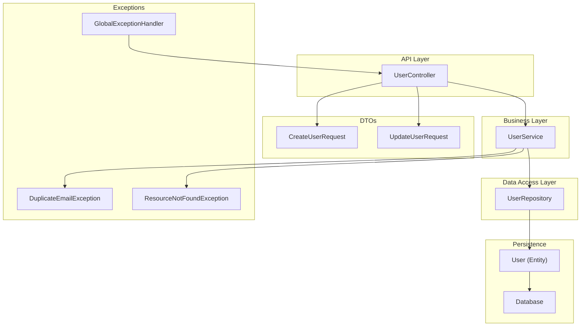
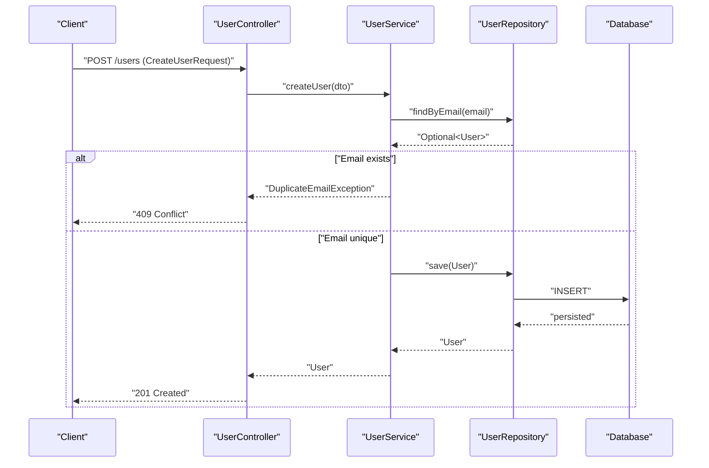
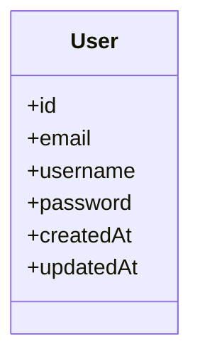
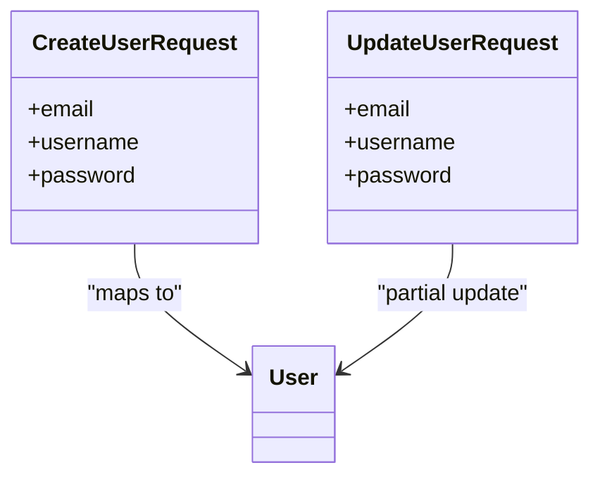
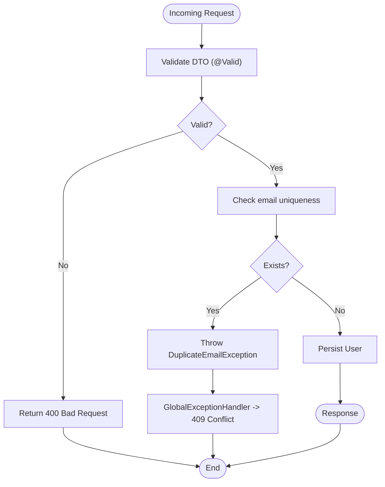
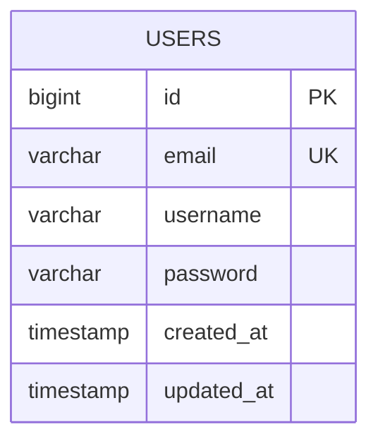
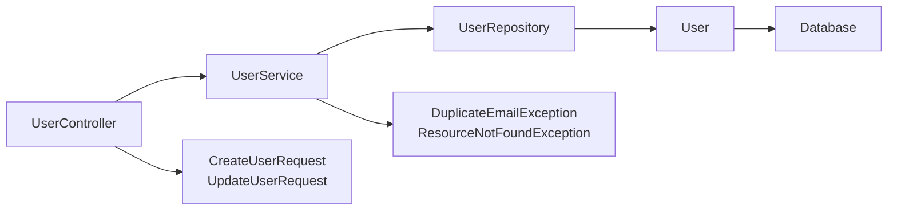

# Data Models

<cite>
**Referenced Files in This Document**
- [User.java](file://src/main/java/com/first/app/entity/User.java)
- [CreateUserRequest.java](file://src/main/java/com/first/app/dto/CreateUserRequest.java)
- [UpdateUserRequest.java](file://src/main/java/com/first/app/dto/UpdateUserRequest.java)
- [UserRepository.java](file://src/main/java/com/first/app/repository/UserRepository.java)
- [UserService.java](file://src/main/java/com/first/app/service/UserService.java)
- [UserController.java](file://src/main/java/com/first/app/controller/UserController.java)
- [DuplicateEmailException.java](file://src/main/java/com/first/app/exception/DuplicateEmailException.java)
- [GlobalExceptionHandler.java](file://src/main/java/com/first/app/exception/GlobalExceptionHandler.java)
- [ResourceNotFoundException.java](file://src/main/java/com/first/app/exception/ResourceNotFoundException.java)
</cite>

## Table of Contents
1. [Introduction](#introduction)
2. [Project Structure](#project-structure)
3. [Core Components](#core-components)
4. [Architecture Overview](#architecture-overview)
5. [Detailed Component Analysis](#detailed-component-analysis)
6. [Dependency Analysis](#dependency-analysis)
7. [Performance Considerations](#performance-considerations)
8. [Troubleshooting Guide](#troubleshooting-guide)
9. [Conclusion](#conclusion)
10. [Appendices](#appendices)

## Introduction
This document describes the data models for the user management system, focusing on the User entity, DTOs (CreateUserRequest, UpdateUserRequest), database mapping, validation rules, constraints, and lifecycle management. It also covers data access patterns, caching considerations, security aspects, and migration strategies for schema evolution.

## Project Structure
The data-related components are organized by layer:
- Entity: domain model mapped to the database
- DTOs: request contracts decoupled from the domain model
- Repository: data access interface
- Service: business logic orchestrating repository operations
- Controller: API endpoints using DTOs
- Exceptions: error types and global handling

[No sources needed since this diagram shows conceptual workflow, not actual code structure]

## Core Components
- User entity: represents the persisted user record with JPA annotations and constraints.
- CreateUserRequest: input contract for creating a new user; includes validation annotations to enforce required fields and format rules.
- UpdateUserRequest: input contract for updating an existing user; supports partial updates and field-level validation.
- UserRepository: Spring Data JPA interface providing CRUD and custom queries for users.
- UserService: business logic that validates inputs, enforces constraints (e.g., email uniqueness), and coordinates persistence.
- UserController: exposes REST endpoints that accept DTOs and return responses.
- Exception classes: DuplicateEmailException, ResourceNotFoundException, and GlobalExceptionHandler manage error signaling and consistent error responses.

Key responsibilities:
- Enforce data integrity at multiple layers (DTO validation, service checks, database constraints).
- Decouple API contracts from domain models via DTOs.
- Provide clear error semantics for common failure cases.

**Section sources**
- [User.java](file://src/main/java/com/first/app/entity/User.java)
- [CreateUserRequest.java](file://src/main/java/com/first/app/dto/CreateUserRequest.java)
- [UpdateUserRequest.java](file://src/main/java/com/first/app/dto/UpdateUserRequest.java)
- [UserRepository.java](file://src/main/java/com/first/app/repository/UserRepository.java)
- [UserService.java](file://src/main/java/com/first/app/service/UserService.java)
- [UserController.java](file://src/main/java/com/first/app/controller/UserController.java)
- [DuplicateEmailException.java](file://src/main/java/com/first/app/exception/DuplicateEmailException.java)
- [ResourceNotFoundException.java](file://src/main/java/com/first/app/exception/ResourceNotFoundException.java)
- [GlobalExceptionHandler.java](file://src/main/java/com/first/app/exception/GlobalExceptionHandler.java)

## Architecture Overview
The data flow follows a layered architecture:
- Controller receives DTOs, delegates to service.
- Service performs validation and business checks (e.g., uniqueness).
- Repository persists or retrieves entities through JPA.
- Database stores normalized user records.

**Diagram sources**
- [UserController.java](file://src/main/java/com/first/app/controller/UserController.java)
- [UserService.java](file://src/main/java/com/first/app/service/UserService.java)
- [UserRepository.java](file://src/main/java/com/first/app/repository/UserRepository.java)
- [DuplicateEmailException.java](file://src/main/java/com/first/app/exception/DuplicateEmailException.java)

## Detailed Component Analysis

### User Entity
Purpose:
- Represents the user domain object and maps to a database table via JPA.
- Defines primary key, column mappings, and constraints.

Key characteristics:
- Primary key: typically a generated identifier.
- Columns: map to fields such as email, username, password, timestamps, etc.
- Constraints:
  - Email uniqueness enforced at the database level (unique constraint).
  - Not-null constraints for required fields.
  - Optional length/format constraints depending on annotations.

Validation and constraints:
- Field-level annotations ensure non-null and format correctness where applicable.
- Unique email constraint prevents duplicate emails at the persistence layer.

Lifecycle:
- Creation: constructed from CreateUserRequest after validation.
- Update: updated via UpdateUserRequest with selective field changes.
- Deletion: removed via repository delete methods.

**Diagram sources**
- [User.java](file://src/main/java/com/first/app/entity/User.java)

**Section sources**
- [User.java](file://src/main/java/com/first/app/entity/User.java)

### DTOs: CreateUserRequest and UpdateUserRequest
Purpose:
- Decouple API contracts from domain models.
- Centralize input validation rules for create and update operations.

CreateUserRequest:
- Fields correspond to required creation attributes (e.g., email, username, password).
- Validation rules include non-null checks and format constraints (e.g., valid email pattern).
- Used exclusively for POST /users.

UpdateUserRequest:
- Supports partial updates; only provided fields are applied.
- Validation rules apply to present fields; absent fields are ignored.
- Used for PATCH/PUT /users/{id}.

Mapping:
- Controller or service maps DTOs to User entities before persistence.
- Responses may convert User back to DTOs or response objects to avoid leaking internal details.

**Diagram sources**
- [CreateUserRequest.java](file://src/main/java/com/first/app/dto/CreateUserRequest.java)
- [UpdateUserRequest.java](file://src/main/java/com/first/app/dto/UpdateUserRequest.java)
- [User.java](file://src/main/java/com/first/app/entity/User.java)

**Section sources**
- [CreateUserRequest.java](file://src/main/java/com/first/app/dto/CreateUserRequest.java)
- [UpdateUserRequest.java](file://src/main/java/com/first/app/dto/UpdateUserRequest.java)

### Data Access Patterns
Repository:
- Extends Spring Data JPA interfaces to provide standard CRUD operations.
- Custom query methods (if any) are defined declaratively.
- Typical operations: findByEmail, save, findById, deleteById.

Service:
- Orchestrates validation and business rules.
- Ensures email uniqueness before persisting.
- Handles exceptions and translates them into appropriate HTTP responses.

Controller:
- Accepts DTOs, invokes service methods, returns standardized responses.
- Uses @Valid to trigger Bean Validation on incoming requests.

**Diagram sources**
- [UserController.java](file://src/main/java/com/first/app/controller/UserController.java)
- [UserService.java](file://src/main/java/com/first/app/service/UserService.java)
- [UserRepository.java](file://src/main/java/com/first/app/repository/UserRepository.java)
- [DuplicateEmailException.java](file://src/main/java/com/first/app/exception/DuplicateEmailException.java)
- [GlobalExceptionHandler.java](file://src/main/java/com/first/app/exception/GlobalExceptionHandler.java)

**Section sources**
- [UserRepository.java](file://src/main/java/com/first/app/repository/UserRepository.java)
- [UserService.java](file://src/main/java/com/first/app/service/UserService.java)
- [UserController.java](file://src/main/java/com/first/app/controller/UserController.java)
- [DuplicateEmailException.java](file://src/main/java/com/first/app/exception/DuplicateEmailException.java)
- [GlobalExceptionHandler.java](file://src/main/java/com/first/app/exception/GlobalExceptionHandler.java)

### Database Schema
Conceptual table structure for users:
- id: primary key, auto-generated.
- email: unique, not null.
- username: not null.
- password: not null.
- created_at: timestamp.
- updated_at: timestamp.

[No sources needed since this diagram shows conceptual schema derived from entity analysis]

## Dependency Analysis
Layer dependencies:
- Controller depends on Service and DTOs.
- Service depends on Repository and Exception types.
- Repository depends on JPA and the User entity.
- Entity depends on JPA annotations and constraints.

**Diagram sources**
- [UserController.java](file://src/main/java/com/first/app/controller/UserController.java)
- [UserService.java](file://src/main/java/com/first/app/service/UserService.java)
- [UserRepository.java](file://src/main/java/com/first/app/repository/UserRepository.java)
- [User.java](file://src/main/java/com/first/app/entity/User.java)
- [DuplicateEmailException.java](file://src/main/java/com/first/app/exception/DuplicateEmailException.java)
- [ResourceNotFoundException.java](file://src/main/java/com/first/app/exception/ResourceNotFoundException.java)

**Section sources**
- [UserController.java](file://src/main/java/com/first/app/controller/UserController.java)
- [UserService.java](file://src/main/java/com/first/app/service/UserService.java)
- [UserRepository.java](file://src/main/java/com/first/app/repository/UserRepository.java)
- [User.java](file://src/main/java/com/first/app/entity/User.java)
- [DuplicateEmailException.java](file://src/main/java/com/first/app/exception/DuplicateEmailException.java)
- [ResourceNotFoundException.java](file://src/main/java/com/first/app/exception/ResourceNotFoundException.java)

## Performance Considerations
- Indexing: Ensure email is indexed due to frequent lookups and uniqueness checks.
- Query efficiency: Use specific finder methods (e.g., findByEmail) to minimize overhead.
- N+1 avoidance: If fetching related data later, use JOIN FETCH or batch fetching.
- Pagination: For list endpoints, paginate results to limit memory usage.
- Connection pooling: Configure HikariCP appropriately for expected load.
- Caching strategy:
  - Read cache: Consider caching frequently accessed user profiles by ID if read-heavy.
  - Cache invalidation: Invalidate on user updates/deletes.
  - TTL: Set reasonable time-to-live to balance freshness and performance.
- Transaction boundaries: Keep transactions short; perform uniqueness checks within the same transaction as persistence to prevent race conditions.

[No sources needed since this section provides general guidance]

## Troubleshooting Guide
Common issues and resolutions:
- Duplicate email on create:
  - Symptom: 409 Conflict or duplicate key error.
  - Cause: Email already exists.
  - Resolution: Check existence before insert; throw DuplicateEmailException; handle via GlobalExceptionHandler.
- Resource not found on update/delete:
  - Symptom: 404 Not Found.
  - Cause: User does not exist.
  - Resolution: Throw ResourceNotFoundException when lookup fails; handle globally.
- Validation failures:
  - Symptom: 400 Bad Request.
  - Cause: Invalid or missing fields in DTO.
  - Resolution: Use Bean Validation annotations on DTOs; return structured error messages.

Operational tips:
- Enable SQL logging during development to verify generated queries.
- Inspect exception payloads returned by GlobalExceptionHandler for client-friendly errors.
- Verify unique constraints in the database schema match application expectations.

**Section sources**
- [DuplicateEmailException.java](file://src/main/java/com/first/app/exception/DuplicateEmailException.java)
- [ResourceNotFoundException.java](file://src/main/java/com/first/app/exception/ResourceNotFoundException.java)
- [GlobalExceptionHandler.java](file://src/main/java/com/first/app/exception/GlobalExceptionHandler.java)

## Conclusion
The user management data model uses a clean separation between DTOs and domain entities, with robust validation and constraint enforcement across layers. The design ensures data integrity (especially email uniqueness), clear error semantics, and maintainable APIs. Performance and security best practices should be applied consistently, and schema evolution should be managed via migrations to preserve backward compatibility.

[No sources needed since this section summarizes without analyzing specific files]

## Appendices

### Data Validation Rules Summary
- CreateUserRequest:
  - Required fields: email, username, password.
  - Format: email must be a valid email address.
  - Uniqueness: email must not already exist.
- UpdateUserRequest:
  - Optional fields: email, username, password.
  - Format: validated only if provided.
  - Uniqueness: if email is provided, it must be unique among existing users.

**Section sources**
- [CreateUserRequest.java](file://src/main/java/com/first/app/dto/CreateUserRequest.java)
- [UpdateUserRequest.java](file://src/main/java/com/first/app/dto/UpdateUserRequest.java)
- [UserService.java](file://src/main/java/com/first/app/service/UserService.java)

### Security Aspects
- Input sanitization: Apply validation annotations on DTOs to reject malformed inputs early.
- Password handling: Store hashed passwords; never log or expose raw values.
- Error messages: Avoid leaking sensitive information in error responses.
- Transport security: Enforce HTTPS in production.

**Section sources**
- [GlobalExceptionHandler.java](file://src/main/java/com/first/app/exception/GlobalExceptionHandler.java)

### Migration Paths and Version Management
- Use a migration tool (e.g., Flyway or Liquibase) to manage schema changes.
- Add unique indexes and constraints incrementally; ensure rollback scripts.
- Backward-compatible changes:
  - Add nullable columns with defaults.
  - Rename columns via migration steps.
- Forward-compatible changes:
  - Introduce new fields in DTOs while keeping old ones optional.
  - Gracefully ignore unknown fields in clients.

[No sources needed since this section provides general guidance]