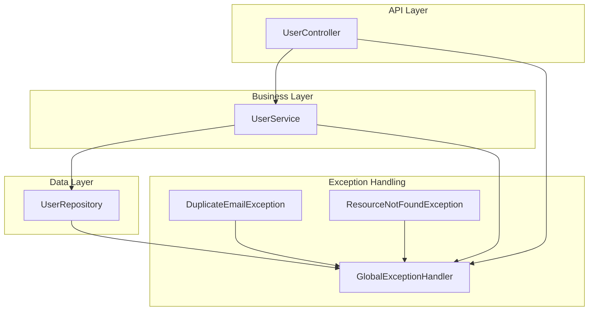
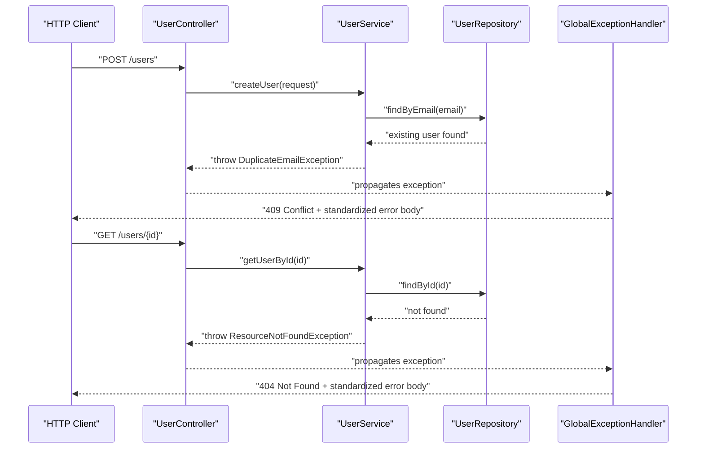
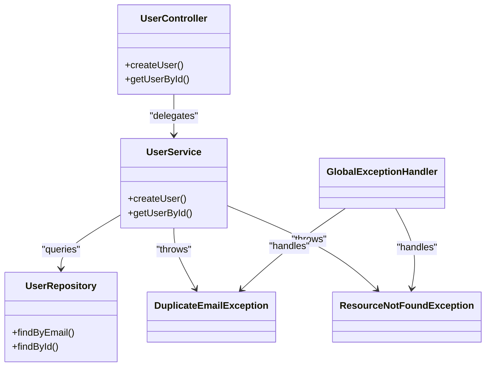

# Exception Handling

<cite>
**Referenced Files in This Document**
- [DuplicateEmailException.java](file://src/main/java/com/first/app/exception/DuplicateEmailException.java)
- [ResourceNotFoundException.java](file://src/main/java/com/first/app/exception/ResourceNotFoundException.java)
- [GlobalExceptionHandler.java](file://src/main/java/com/first/app/exception/GlobalExceptionHandler.java)
- [UserController.java](file://src/main/java/com/first/app/controller/UserController.java)
- [UserService.java](file://src/main/java/com/first/app/service/UserService.java)
- [UserRepository.java](file://src/main/java/com/first/app/repository/UserRepository.java)
</cite>

## Table of Contents
1. [Introduction](#introduction)
2. [Project Structure](#project-structure)
3. [Core Components](#core-components)
4. [Architecture Overview](#architecture-overview)
5. [Detailed Component Analysis](#detailed-component-analysis)
6. [Dependency Analysis](#dependency-analysis)
7. [Performance Considerations](#performance-considerations)
8. [Troubleshooting Guide](#troubleshooting-guide)
9. [Conclusion](#conclusion)

## Introduction
This document explains the centralized exception handling strategy used by the user management system. It focuses on custom exceptions for domain-specific errors, a global handler that standardizes error responses across all API endpoints, and how exceptions flow through the layered architecture from controllers to services and repositories. The goal is to help both beginners and experienced developers understand how to throw, catch, and transform exceptions into consistent HTTP responses, and how to extend the mechanism with new exception types.

## Project Structure
The exception handling strategy spans three main areas:
- Custom exceptions under the exception package
- A global exception handler that centralizes response formatting
- Controllers and services that throw or rely on these exceptions

**Diagram sources**
- [UserController.java](file://src/main/java/com/first/app/controller/UserController.java)
- [UserService.java](file://src/main/java/com/first/app/service/UserService.java)
- [UserRepository.java](file://src/main/java/com/first/app/repository/UserRepository.java)
- [DuplicateEmailException.java](file://src/main/java/com/first/app/exception/DuplicateEmailException.java)
- [ResourceNotFoundException.java](file://src/main/java/com/first/app/exception/ResourceNotFoundException.java)
- [GlobalExceptionHandler.java](file://src/main/java/com/first/app/exception/GlobalExceptionHandler.java)

**Section sources**
- [UserController.java](file://src/main/java/com/first/app/controller/UserController.java)
- [UserService.java](file://src/main/java/com/first/app/service/UserService.java)
- [UserRepository.java](file://src/main/java/com/first/app/repository/UserRepository.java)
- [DuplicateEmailException.java](file://src/main/java/com/first/app/exception/DuplicateEmailException.java)
- [ResourceNotFoundException.java](file://src/main/java/com/first/app/exception/ResourceNotFoundException.java)
- [GlobalExceptionHandler.java](file://src/main/java/com/first/app/exception/GlobalExceptionHandler.java)

## Core Components
- DuplicateEmailException: Represents email conflict scenarios when attempting to create or update a user with an existing email address.
- ResourceNotFoundException: Represents missing user resources (for example, when a requested user ID does not exist).
- GlobalExceptionHandler: Centralized controller advice that catches application exceptions and converts them into standardized HTTP responses with consistent structure and status codes.

Key responsibilities:
- Domain exceptions encapsulate business rules violations and missing resource conditions.
- GlobalExceptionHandler maps each exception type to a specific HTTP status code and a uniform JSON payload.
- Controllers and services throw domain exceptions; the global handler ensures consistent client-facing responses without try/catch clutter in business logic.

**Section sources**
- [DuplicateEmailException.java](file://src/main/java/com/first/app/exception/DuplicateEmailException.java)
- [ResourceNotFoundException.java](file://src/main/java/com/first/app/exception/ResourceNotFoundException.java)
- [GlobalExceptionHandler.java](file://src/main/java/com/first/app/exception/GlobalExceptionHandler.java)

## Architecture Overview
The exception handling follows a layered approach:
- Controllers expose REST endpoints and delegate to services.
- Services enforce business rules and data access contracts, throwing domain exceptions as needed.
- Repositories perform persistence operations and may propagate lower-level exceptions.
- GlobalExceptionHandler intercepts uncaught exceptions and returns structured error responses.

**Diagram sources**
- [UserController.java](file://src/main/java/com/first/app/controller/UserController.java)
- [UserService.java](file://src/main/java/com/first/app/service/UserService.java)
- [UserRepository.java](file://src/main/java/com/first/app/repository/UserRepository.java)
- [GlobalExceptionHandler.java](file://src/main/java/com/first/app/exception/GlobalExceptionHandler.java)
- [DuplicateEmailException.java](file://src/main/java/com/first/app/exception/DuplicateEmailException.java)
- [ResourceNotFoundException.java](file://src/main/java/com/first/app/exception/ResourceNotFoundException.java)

## Detailed Component Analysis

### Custom Exceptions

#### DuplicateEmailException
Purpose:
- Signals that a user creation or update would violate uniqueness constraints on the email field.

Typical usage:
- Thrown by service layer when repository queries reveal an existing record with the same email.
- Mapped by the global handler to a conflict status code.

Error scenario:
- Attempting to register a user whose email already exists.

Best practices:
- Include contextual details such as the conflicting email value in the exception message.
- Keep the exception lightweight; avoid heavy computations in constructors.

**Section sources**
- [DuplicateEmailException.java](file://src/main/java/com/first/app/exception/DuplicateEmailException.java)
- [UserService.java](file://src/main/java/com/first/app/service/UserService.java)

#### ResourceNotFoundException
Purpose:
- Indicates that a requested resource (e.g., a user by ID) does not exist.

Typical usage:
- Thrown by service layer when repository lookups return no result.
- Mapped by the global handler to a not found status code.

Error scenario:
- Fetching a user with an invalid or non-existent identifier.

Best practices:
- Provide clear identifiers in the exception message to aid debugging.
- Avoid exposing sensitive internal details in messages.

**Section sources**
- [ResourceNotFoundException.java](file://src/main/java/com/first/app/exception/ResourceNotFoundException.java)
- [UserService.java](file://src/main/java/com/first/app/service/UserService.java)

### GlobalExceptionHandler
Responsibilities:
- Intercepts application exceptions thrown by controllers and services.
- Converts exceptions into consistent HTTP responses with appropriate status codes and a uniform JSON structure.
- Centralizes logging and error metadata formatting.

Response format:
- Consistent fields include at least:
  - Status code derived from the exception mapping
  - Error message describing the issue
  - Optional timestamp and path for context
- All endpoints return this unified shape for predictable client-side handling.

Common mappings:
- DuplicateEmailException -> Conflict (409)
- ResourceNotFoundException -> Not Found (404)

Extensibility:
- Add new @ExceptionHandler methods for additional exception types.
- Maintain a single error response model to keep clients simple.

**Section sources**
- [GlobalExceptionHandler.java](file://src/main/java/com/first/app/exception/GlobalExceptionHandler.java)

### Controller Integration
Role:
- Exposes REST endpoints for user operations.
- Delegates to services and lets exceptions bubble up to the global handler.
- Keeps endpoint methods clean by avoiding explicit try/catch blocks for known domain exceptions.

Example flows:
- Creating a user triggers duplicate email checks in the service; if violated, the global handler returns a conflict response.
- Reading a user by ID triggers a not found check; if missing, the global handler returns a not found response.

**Section sources**
- [UserController.java](file://src/main/java/com/first/app/controller/UserController.java)
- [GlobalExceptionHandler.java](file://src/main/java/com/first/app/exception/GlobalExceptionHandler.java)

### Service Integration
Role:
- Enforces business rules and orchestrates repository calls.
- Throws domain exceptions based on repository results or validation outcomes.
- Remains free of HTTP concerns; it only throws exceptions.

Example flows:
- On user creation, query for existing email; if found, throw DuplicateEmailException.
- On user retrieval by ID, if repository returns empty, throw ResourceNotFoundException.

**Section sources**
- [UserService.java](file://src/main/java/com/first/app/service/UserService.java)
- [UserRepository.java](file://src/main/java/com/first/app/repository/UserRepository.java)

### Repository Integration
Role:
- Performs persistence operations and returns results or emptiness indicators.
- May wrap low-level persistence exceptions; higher layers should translate these into domain exceptions where appropriate.

Integration notes:
- Ensure repository methods are consistent in returning optional-like results or throwing well-defined exceptions so services can decide whether to raise domain exceptions.

**Section sources**
- [UserRepository.java](file://src/main/java/com/first/app/repository/UserRepository.java)

## Dependency Analysis
The following diagram shows how components depend on each other and how exceptions propagate upward to be handled centrally.

**Diagram sources**
- [UserController.java](file://src/main/java/com/first/app/controller/UserController.java)
- [UserService.java](file://src/main/java/com/first/app/service/UserService.java)
- [UserRepository.java](file://src/main/java/com/first/app/repository/UserRepository.java)
- [DuplicateEmailException.java](file://src/main/java/com/first/app/exception/DuplicateEmailException.java)
- [ResourceNotFoundException.java](file://src/main/java/com/first/app/exception/ResourceNotFoundException.java)
- [GlobalExceptionHandler.java](file://src/main/java/com/first/app/exception/GlobalExceptionHandler.java)

**Section sources**
- [UserController.java](file://src/main/java/com/first/app/controller/UserController.java)
- [UserService.java](file://src/main/java/com/first/app/service/UserService.java)
- [UserRepository.java](file://src/main/java/com/first/app/repository/UserRepository.java)
- [DuplicateEmailException.java](file://src/main/java/com/first/app/exception/DuplicateEmailException.java)
- [ResourceNotFoundException.java](file://src/main/java/com/first/app/exception/ResourceNotFoundException.java)
- [GlobalExceptionHandler.java](file://src/main/java/com/first/app/exception/GlobalExceptionHandler.java)

## Performance Considerations
- Keep exception objects lightweight; avoid expensive computations in constructors.
- Use exceptions for exceptional cases, not for normal control flow.
- Prefer early validation in services to reduce unnecessary repository calls.
- Centralize logging in the global handler to avoid redundant logs in multiple layers.

## Troubleshooting Guide
Common issues and strategies:
- Missing exception mapping: If a new exception type is introduced but not handled, ensure a corresponding @ExceptionHandler method exists in the global handler.
- Inconsistent response shapes: Verify that the global handler returns the same JSON structure for all mapped exceptions.
- Incorrect status codes: Confirm that each exception maps to the correct HTTP status (e.g., 409 for conflicts, 404 for not found).
- Overly verbose messages: Review exception messages to ensure they are informative but do not leak sensitive information.

Operational tips:
- Log request context (path, parameters) in the global handler for easier debugging.
- Include timestamps and correlation IDs in error responses to aid tracing.

**Section sources**
- [GlobalExceptionHandler.java](file://src/main/java/com/first/app/exception/GlobalExceptionHandler.java)

## Conclusion
The user management system uses a clear, layered exception handling strategy:
- Domain exceptions capture business rule violations and resource absence.
- The global handler centralizes response formatting and status code mapping.
- Controllers and services remain focused on their responsibilities while relying on the global handler for consistent error responses.

To extend the system:
- Define a new domain exception for the specific scenario.
- Throw it from the appropriate service method.
- Add a handler method in the global exception handler to map it to a proper HTTP status and response body.