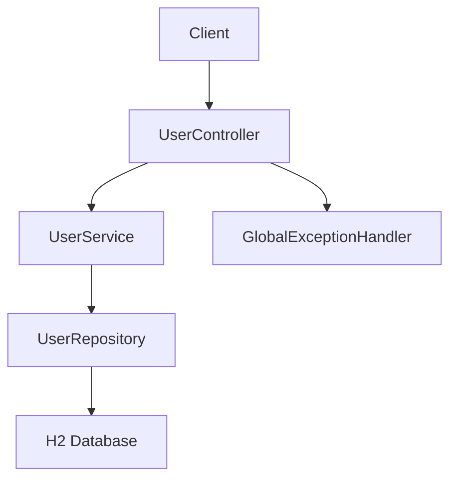
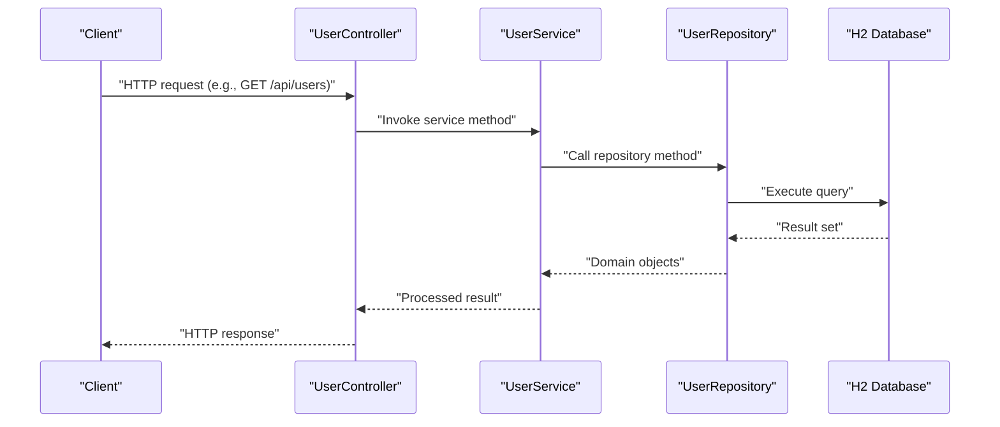

# Getting Started

<cite>
**Referenced Files in This Document**
- [pom.xml](file://pom.xml)
- [MyApplication.java](file://src/main/java/com/first/app/MyApplication.java)
- [application.yml](file://src/main/resources/application.yml)
- [application-dev.yml](file://src/main/resources/application-dev.yml)
- [application-test.yml](file://src/main/resources/application-test.yml)
- [UserController.java](file://src/main/java/com/first/app/controller/UserController.java)
- [UserRepository.java](file://src/main/java/com/first/app/repository/UserRepository.java)
- [UserService.java](file://src/main/java/com/first/app/service/UserService.java)
- [User.java](file://src/main/java/com/first/app/entity/User.java)
- [GlobalExceptionHandler.java](file://src/main/java/com/first/app/exception/GlobalExceptionHandler.java)
</cite>

## Table of Contents
1. Introduction
2. Prerequisites
3. Installation and Initial Setup
4. Running the Application (Development Mode)
5. Database Configuration (H2 In-Memory)
6. Verifying the Application
7. Troubleshooting Common Issues
8. Architecture Overview
9. Conclusion

## Introduction
This guide helps you set up and run the my-first-project-backend application locally. It covers prerequisites, installation, configuration for development profiles, database setup using H2 in-memory mode, verification steps, and troubleshooting tips. The project is a Spring Boot application with layered architecture including controllers, services, repositories, entities, and exception handling.

## Prerequisites
- Java Development Kit (JDK): Use JDK 17 or later. Verify your installation by running a version check command in your terminal.
- Maven: The project includes a Maven Wrapper; you can use it to avoid manual Maven installation. If you prefer installing Maven directly, ensure it is available on PATH.
- IDE (optional but recommended): IntelliJ IDEA, Eclipse, or VS Code with appropriate Java extensions. Configure your IDE to use JDK 17+.
- Git: Required to clone the repository.

Notes:
- The build file defines the Java version and dependencies. Refer to the build configuration for exact versions.
- The application uses Spring Boot and Spring Data JPA with an embedded H2 database for development.

**Section sources**
- [pom.xml](file://pom.xml)

## Installation and Initial Setup
Follow these steps to get the project running locally:

1. Clone the repository
   - Use Git to clone the project into a local directory.

2. Build and resolve dependencies
   - On Unix/macOS: ./mvnw clean install
   - On Windows: mvnw.cmd clean install
   - Alternatively, if you installed Maven globally: mvn clean install

3. Optional: Generate IDE files
   - Run the Maven wrapper to generate IDE metadata if needed: ./mvnw idea or ./mvnw eclipse

4. Verify the build succeeds
   - Ensure there are no compilation errors and all tests pass.

What happens during build:
- The Maven Wrapper resolves dependencies declared in the build file.
- Tests are executed as part of the standard lifecycle.

**Section sources**
- [pom.xml](file://pom.xml)

## Running the Application (Development Mode)
You can start the application using different Spring profiles:

- Default profile (no explicit profile)
  - Command: ./mvnw spring-boot:run
  - Uses configuration from the default application properties.

- Development profile (dev)
  - Command: ./mvnw spring-boot:run -Dspring.profiles.active=dev
  - Loads additional settings from the dev-specific configuration file.

- Test profile (test)
  - Command: ./mvnw spring-boot:run -Dspring.profiles.active=test
  - Loads test-specific configuration.

Where configuration lives:
- Default configuration: application.yml
- Dev profile overrides: application-dev.yml
- Test profile overrides: application-test.yml

Spring Boot automatically merges active profile configurations with the base configuration.

**Section sources**
- [MyApplication.java](file://src/main/java/com/first/app/MyApplication.java)
- [application.yml](file://src/main/resources/application.yml)
- [application-dev.yml](file://src/main/resources/application-dev.yml)
- [application-test.yml](file://src/main/resources/application-test.yml)

## Database Configuration (H2 In-Memory)
The application uses an embedded H2 database suitable for development and testing. Key points:

- Embedded H2 is enabled by default when the H2 dependency is present and no external datasource is configured.
- For development, you can enable the H2 console to inspect data via a web UI.
- Profile-specific settings allow you to customize behavior per environment (dev/test).

Typical configuration aspects to review:
- Datasource URL, username, password
- Hibernate/JPA dialect and schema generation strategy
- H2 console access path and enabled flag

Profile-specific overrides:
- application-dev.yml: Customize dev-only settings such as logging level or H2 console.
- application-test.yml: Configure test-only settings like schema initialization or test data.

If you need to switch to another database later, update the datasource configuration accordingly.

**Section sources**
- [application.yml](file://src/main/resources/application.yml)
- [application-dev.yml](file://src/main/resources/application-dev.yml)
- [application-test.yml](file://src/main/resources/application-test.yml)
- [pom.xml](file://pom.xml)

## Verifying the Application
After starting the application, verify it is running correctly:

- Health endpoint
  - Open http://localhost:8080/actuator/health in your browser or call it via curl.
  - A successful response indicates the application is healthy.

- Basic API calls
  - Explore endpoints exposed by the user controller. Typical operations include listing users, creating a new user, updating an existing user, and deleting a user.
  - Example patterns:
    - GET /api/users
    - POST /api/users
    - PUT /api/users/{id}
    - DELETE /api/users/{id}
  - Adjust the base path if your controller mapping differs.

- H2 Console (if enabled)
  - Access the H2 console at the configured path (commonly http://localhost:8080/h2-console).
  - Use the JDBC URL provided by your configuration to connect.

- Logs
  - Check the console output for startup logs and any errors.

**Section sources**
- [UserController.java](file://src/main/java/com/first/app/controller/UserController.java)
- [application.yml](file://src/main/resources/application.yml)
- [application-dev.yml](file://src/main/resources/application-dev.yml)

## Troubleshooting Common Issues
- Port already in use (e.g., 8080)
  - Change the server port in configuration or stop the process occupying the port.
  - Reference: server port property in application configuration.

- Java version mismatch
  - Ensure your JDK matches the version defined in the build file.
  - Update JAVA_HOME or IDE JDK settings accordingly.

- Dependency resolution failures
  - Clear local Maven cache for failed artifacts and retry.
  - Check network/proxy settings if behind a corporate firewall.

- H2 console not accessible
  - Confirm that the H2 console is enabled in the active profile configuration.
  - Verify the console URL path and that the application started successfully.

- Database connection issues
  - Validate datasource URL, username, and password.
  - Ensure schema generation strategy aligns with your needs.

- Tests failing after changes
  - Re-run tests with the Maven wrapper to isolate environment differences.
  - Review test configuration in the test profile.

**Section sources**
- [application.yml](file://src/main/resources/application.yml)
- [application-dev.yml](file://src/main/resources/application-dev.yml)
- [application-test.yml](file://src/main/resources/application-test.yml)
- [pom.xml](file://pom.xml)

## Architecture Overview
High-level components involved in typical requests:

**Diagram sources**
- [UserController.java](file://src/main/java/com/first/app/controller/UserController.java)
- [UserService.java](file://src/main/java/com/first/app/service/UserService.java)
- [UserRepository.java](file://src/main/java/com/first/app/repository/UserRepository.java)
- [User.java](file://src/main/java/com/first/app/entity/User.java)
- [GlobalExceptionHandler.java](file://src/main/java/com/first/app/exception/GlobalExceptionHandler.java)

### Request Flow Sequence

**Diagram sources**
- [UserController.java](file://src/main/java/com/first/app/controller/UserController.java)
- [UserService.java](file://src/main/java/com/first/app/service/UserService.java)
- [UserRepository.java](file://src/main/java/com/first/app/repository/UserRepository.java)
- [User.java](file://src/main/java/com/first/app/entity/User.java)

## Conclusion
You now have everything needed to set up, configure, and run the application locally. Start with the dev profile to explore APIs and the H2 console, then adjust configurations as needed. If you encounter issues, consult the troubleshooting section and verify your environment against the documented prerequisites.