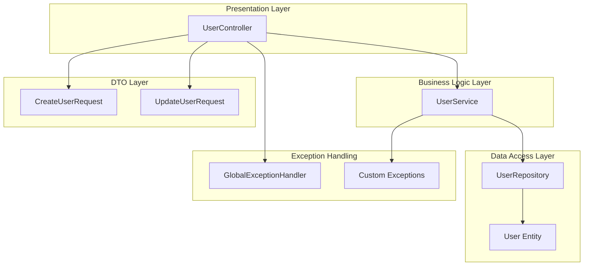
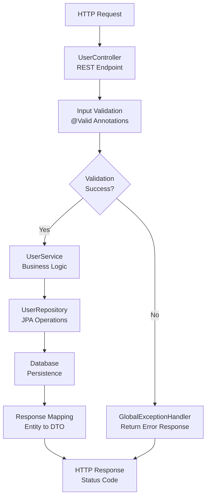
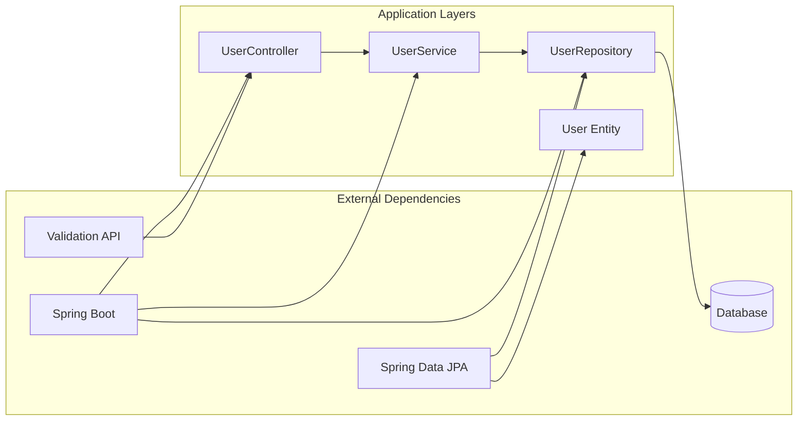

# Project Overview

<cite>
**Referenced Files in This Document**
- [MyApplication.java](file://src/main/java/com/first/app/MyApplication.java)
- [UserController.java](file://src/main/java/com/first/app/controller/UserController.java)
- [UserService.java](file://src/main/java/com/first/app/service/UserService.java)
- [UserRepository.java](file://src/main/java/com/first/app/repository/UserRepository.java)
- [User.java](file://src/main/java/com/first/app/entity/User.java)
- [CreateUserRequest.java](file://src/main/java/com/first/app/dto/CreateUserRequest.java)
- [UpdateUserRequest.java](file://src/main/java/com/first/app/dto/UpdateUserRequest.java)
- [GlobalExceptionHandler.java](file://src/main/java/com/first/app/exception/GlobalExceptionHandler.java)
- [DuplicateEmailException.java](file://src/main/java/com/first/app/exception/DuplicateEmailException.java)
- [ResourceNotFoundException.java](file://src/main/java/com/first/app/exception/ResourceNotFoundException.java)
- [application.yml](file://src/main/resources/application.yml)
- [pom.xml](file://pom.xml)
</cite>

## Table of Contents
1. [Introduction](#introduction)
2. [Project Structure](#project-structure)
3. [Core Components](#core-components)
4. [Architecture Overview](#architecture-overview)
5. [Detailed Component Analysis](#detailed-component-analysis)
6. [Dependency Analysis](#dependency-analysis)
7. [Performance Considerations](#performance-considerations)
8. [Troubleshooting Guide](#troubleshooting-guide)
9. [Conclusion](#conclusion)

## Introduction

This Spring Boot application serves as a comprehensive **User Management** system designed to provide robust REST API endpoints for managing user data. The application follows industry-standard architectural patterns and leverages modern Java enterprise technologies to deliver a scalable, maintainable, and efficient backend solution.

### What is Spring Boot?

Spring Boot is an open-source Java-based framework that simplifies the development of production-ready applications. It eliminates much of the boilerplate configuration typically required in traditional Spring applications by providing sensible defaults and auto-configuration capabilities. For beginners, think of Spring Boot as a "convention over configuration" approach that allows developers to focus on business logic rather than infrastructure setup.

### Key Features

- **Auto-Configuration**: Automatically configures Spring and third-party libraries based on dependencies
- **Standalone Applications**: Runs as standalone applications without requiring external web servers
- **Production Ready**: Includes built-in monitoring, metrics, and health checks
- **Microservices Friendly**: Ideal for building microservices architectures
- **Rich Ecosystem**: Integrates seamlessly with Spring ecosystem components

## Project Structure

The application follows a clean, layered architecture pattern that promotes separation of concerns and maintainability. The project structure is organized by functional layers:

**Diagram sources**
- [UserController.java](file://src/main/java/com/first/app/controller/UserController.java)
- [UserService.java](file://src/main/java/com/first/app/service/UserService.java)
- [UserRepository.java](file://src/main/java/com/first/app/repository/UserRepository.java)
- [User.java](file://src/main/java/com/first/app/entity/User.java)

### Directory Organization

The application uses a package-based organization following these conventions:

- **controller/**: HTTP request handlers and REST API endpoints
- **service/**: Business logic and service layer implementations
- **repository/**: Data access layer using JPA repositories
- **entity/**: Database entities and domain models
- **dto/**: Data Transfer Objects for API requests/responses
- **exception/**: Custom exception classes and global error handling

## Core Components

### Application Entry Point

The main application class serves as the entry point for the Spring Boot application. It contains the `@SpringBootApplication` annotation which enables auto-configuration, component scanning, and bean definition.

**Section sources**
- [MyApplication.java](file://src/main/java/com/first/app/MyApplication.java)

### REST API Layer

The controller layer handles HTTP requests and responses, providing RESTful endpoints for user management operations. The `UserController` exposes CRUD operations through standard HTTP methods (GET, POST, PUT, DELETE).

**Section sources**
- [UserController.java](file://src/main/java/com/first/app/controller/UserController.java)

### Business Logic Layer

The service layer encapsulates business logic and coordinates between controllers and repositories. The `UserService` implements core user management functionality including validation, transformation, and business rule enforcement.

**Section sources**
- [UserService.java](file://src/main/java/com/first/app/service/UserService.java)

### Data Access Layer

The repository layer provides database abstraction using Spring Data JPA. The `UserRepository` interface extends `JpaRepository` to inherit common CRUD operations and custom query methods.

**Section sources**
- [UserRepository.java](file://src/main/java/com/first/app/repository/UserRepository.java)

### Domain Entities

The entity layer defines the data model using JPA annotations. The `User` entity represents the database table structure and relationships.

**Section sources**
- [User.java](file://src/main/java/com/first/app/entity/User.java)

### Data Transfer Objects

DTOs facilitate data exchange between client and server while maintaining loose coupling. Separate DTOs handle creation (`CreateUserRequest`) and update (`UpdateUserRequest`) operations.

**Section sources**
- [CreateUserRequest.java](file://src/main/java/com/first/app/dto/CreateUserRequest.java)
- [UpdateUserRequest.java](file://src/main/java/com/first/app/dto/UpdateUserRequest.java)

## Architecture Overview

The application implements a classic three-tier architecture with clear separation of responsibilities:

```mermaid
sequenceDiagram
participant Client as "HTTP Client"
participant Controller as "UserController"
participant Service as "UserService"
participant Repository as "UserRepository"
participant Database as "Database"
Client->>Controller : HTTP Request (POST /api/users)
Controller->>Controller : Validate Request
Controller->>Service : createUser(request)
Service->>Service : Business Logic Validation
Service->>Repository : save(userEntity)
Repository->>Database : INSERT INTO users
Database-->>Repository : Success/Failure
Repository-->>Service : User Entity
Service-->>Controller : User DTO
Controller-->>Client : HTTP Response (201 Created)
```

**Diagram sources**
- [UserController.java](file://src/main/java/com/first/app/controller/UserController.java)
- [UserService.java](file://src/main/java/com/first/app/service/UserService.java)
- [UserRepository.java](file://src/main/java/com/first/app/repository/UserRepository.java)

### Technology Stack

The application leverages modern Java enterprise technologies:

- **Spring Boot 3.x**: Application framework and dependency injection
- **Spring Data JPA**: Database abstraction and ORM
- **Hibernate**: JPA implementation
- **Spring Web MVC**: REST API development
- **Validation API**: Request validation and constraints
- **Lombok**: Boilerplate code reduction (optional)
- **H2/MySQL**: Database options (configurable via profiles)

**Section sources**
- [pom.xml](file://pom.xml)
- [application.yml](file://src/main/resources/application.yml)

## Detailed Component Analysis

### User Management System

The core functionality revolves around user CRUD operations with comprehensive validation and error handling.

#### REST API Endpoints

| Method | Endpoint | Description | Request Body | Response |
|--------|----------|-------------|--------------|----------|
| GET | `/api/users` | Get all users | None | List<User> |
| GET | `/api/users/{id}` | Get user by ID | None | User |
| POST | `/api/users` | Create new user | CreateUserRequest | User |
| PUT | `/api/users/{id}` | Update existing user | UpdateUserRequest | User |
| DELETE | `/api/users/{id}` | Delete user | None | 204 No Content |

#### Data Flow Architecture

**Diagram sources**
- [UserController.java](file://src/main/java/com/first/app/controller/UserController.java)
- [UserService.java](file://src/main/java/com/first/app/service/UserService.java)
- [GlobalExceptionHandler.java](file://src/main/java/com/first/app/exception/GlobalExceptionHandler.java)

### Exception Handling Strategy

The application implements centralized exception handling using `@RestControllerAdvice` and custom exception classes for consistent error responses across all endpoints.

**Section sources**
- [GlobalExceptionHandler.java](file://src/main/java/com/first/app/exception/GlobalExceptionHandler.java)
- [DuplicateEmailException.java](file://src/main/java/com/first/app/exception/DuplicateEmailException.java)
- [ResourceNotFoundException.java](file://src/main/java/com/first/app/exception/ResourceNotFoundException.java)

### Configuration Management

Environment-specific configurations are managed through Spring Boot profiles, allowing different settings for development, testing, and production environments.

**Section sources**
- [application.yml](file://src/main/resources/application.yml)
- [application-dev.yml](file://src/main/resources/application-dev.yml)
- [application-test.yml](file://src/main/resources/application-test.yml)

## Dependency Analysis

The application maintains loose coupling through proper dependency injection and interface-based design patterns.

**Diagram sources**
- [pom.xml](file://pom.xml)
- [UserController.java](file://src/main/java/com/first/app/controller/UserController.java)
- [UserService.java](file://src/main/java/com/first/app/service/UserService.java)
- [UserRepository.java](file://src/main/java/com/first/app/repository/UserRepository.java)

### Maven Dependencies

Key dependencies include Spring Boot starters, JPA support, validation libraries, and testing frameworks. The dependency management ensures compatibility and provides sensible defaults.

**Section sources**
- [pom.xml](file://pom.xml)

## Performance Considerations

### Database Optimization

- **Connection Pooling**: Configured HikariCP for optimal database connection management
- **Lazy Loading**: JPA lazy loading for related entities to prevent N+1 queries
- **Query Optimization**: Custom JPQL queries for complex operations
- **Caching Strategy**: Optional second-level caching for frequently accessed data

### API Performance

- **Pagination Support**: Built-in pagination for large result sets
- **Response Compression**: Gzip compression for API responses
- **Async Processing**: Asynchronous operations for long-running tasks
- **Rate Limiting**: Request throttling to prevent abuse

## Troubleshooting Guide

### Common Issues and Solutions

#### Database Connection Problems
- Verify database credentials in environment-specific configuration files
- Check database server availability and network connectivity
- Ensure proper JDBC driver version compatibility

#### Validation Errors
- Review `@Valid` annotations on DTO classes
- Check constraint definitions and custom validators
- Examine validation error messages in global exception handler

#### Dependency Injection Failures
- Verify `@Component`, `@Service`, `@Repository` annotations
- Check constructor injection vs field injection consistency
- Ensure proper package scanning configuration

### Debugging Techniques

Enable detailed logging for development:
- Set logging level to DEBUG for Spring components
- Enable SQL query logging for performance analysis
- Use Spring Boot Actuator for health checks and metrics

**Section sources**
- [GlobalExceptionHandler.java](file://src/main/java/com/first/app/exception/GlobalExceptionHandler.java)
- [application.yml](file://src/main/resources/application.yml)

## Conclusion

This Spring Boot User Management application demonstrates best practices in modern Java enterprise development. The layered architecture ensures maintainability and testability, while the use of established frameworks like Spring Boot and JPA provides robustness and scalability. The comprehensive error handling, validation, and configuration management make it suitable for production deployment.

The application serves as an excellent foundation for learning Spring Boot concepts and can be extended with additional features such as authentication, authorization, advanced search capabilities, and integration with external services.