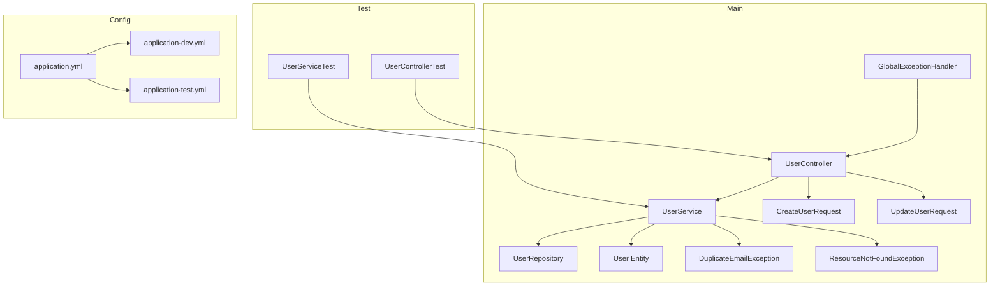
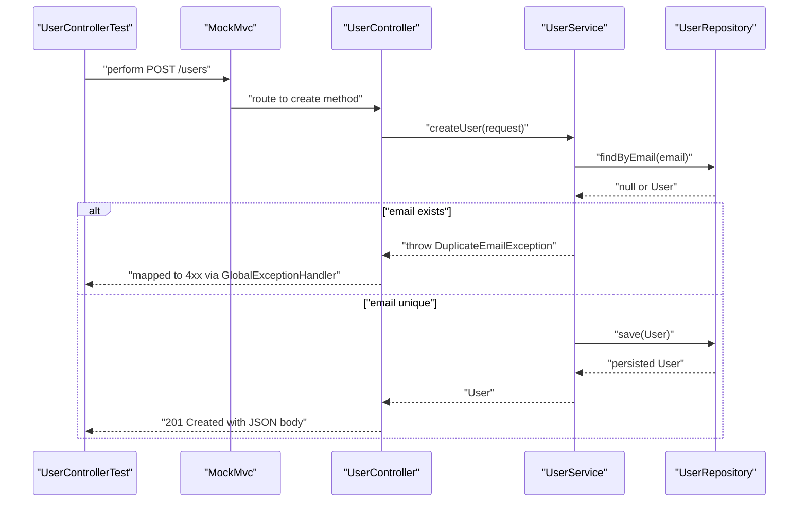
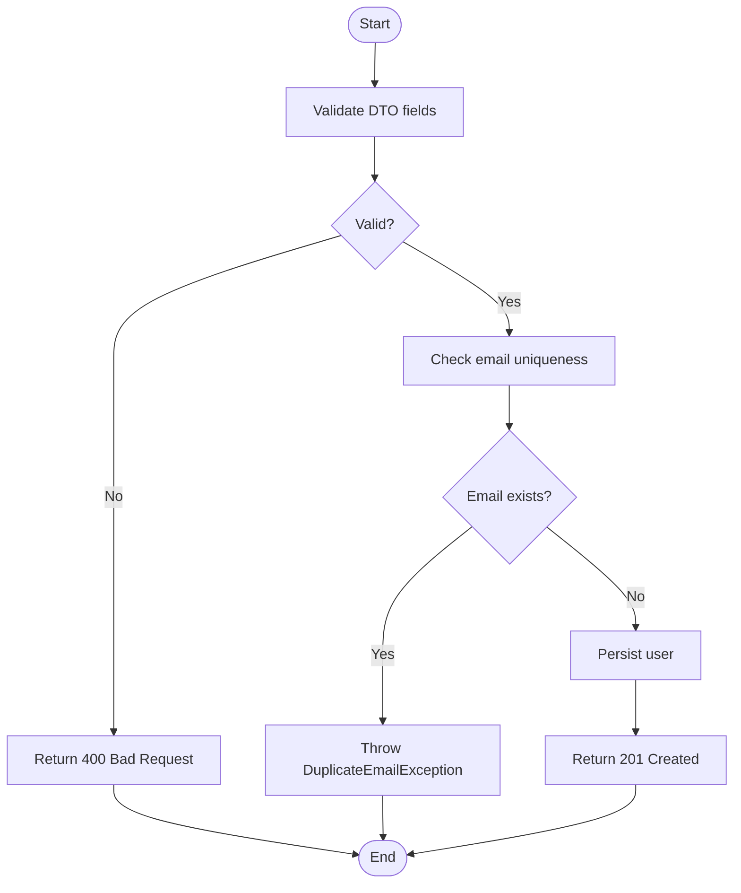
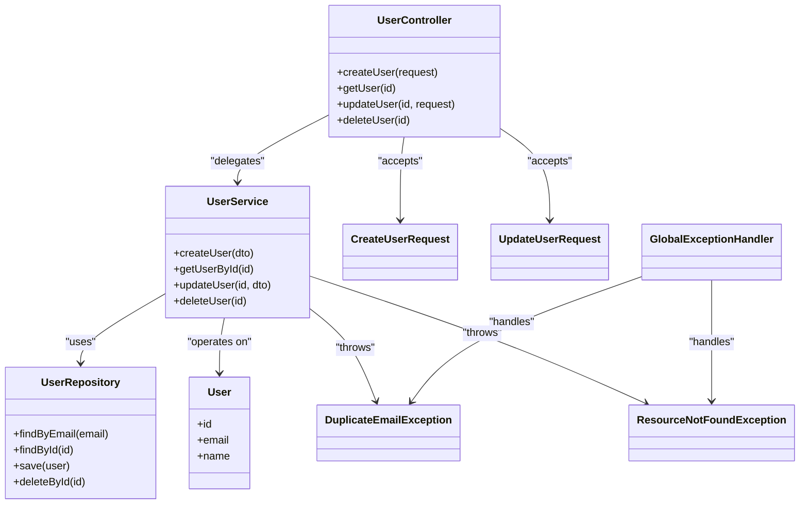

# Testing Strategy

<cite>
**Referenced Files in This Document**
- [UserController.java](file://src/main/java/com/first/app/controller/UserController.java)
- [UserService.java](file://src/main/java/com/first/app/service/UserService.java)
- [UserRepository.java](file://src/main/java/com/first/app/repository/UserRepository.java)
- [User.java](file://src/main/java/com/first/app/entity/User.java)
- [CreateUserRequest.java](file://src/main/java/com/first/app/dto/CreateUserRequest.java)
- [UpdateUserRequest.java](file://src/main/java/com/first/app/dto/UpdateUserRequest.java)
- [DuplicateEmailException.java](file://src/main/java/com/first/app/exception/DuplicateEmailException.java)
- [ResourceNotFoundException.java](file://src/main/java/com/first/app/exception/ResourceNotFoundException.java)
- [GlobalExceptionHandler.java](file://src/main/java/com/first/app/exception/GlobalExceptionHandler.java)
- [application.yml](file://src/main/resources/application.yml)
- [application-dev.yml](file://src/main/resources/application-dev.yml)
- [application-test.yml](file://src/main/resources/application-test.yml)
- [pom.xml](file://pom.xml)
- [UserControllerTest.java](file://src/test/java/com/first/app/controller/UserControllerTest.java)
- [UserServiceTest.java](file://src/test/java/com/first/app/service/UserServiceTest.java)
</cite>

## Table of Contents
1. [Introduction](#introduction)
2. [Project Structure](#project-structure)
3. [Core Components](#core-components)
4. [Architecture Overview](#architecture-overview)
5. [Detailed Component Analysis](#detailed-component-analysis)
6. [Dependency Analysis](#dependency-analysis)
7. [Performance Considerations](#performance-considerations)
8. [Troubleshooting Guide](#troubleshooting-guide)
9. [Conclusion](#conclusion)
10. [Appendices](#appendices)

## Introduction
This document defines the testing strategy for the user management system, focusing on unit tests and isolated integration-style controller tests. It explains how to test controllers using Spring MVC test patterns with Mockito, how to validate business logic in services, and how to configure a lightweight test environment. The guidance includes mock strategies, test data setup, assertion patterns, exception and validation coverage, and best practices for maintainable tests.

## Project Structure
The project follows a layered architecture:
- Controller layer exposes REST endpoints for user operations.
- Service layer encapsulates business logic and orchestrates repository calls.
- Repository layer abstracts persistence (Spring Data JPA).
- DTOs model request payloads; entities represent domain data.
- Exceptions define error types handled by a global handler.
- Test sources mirror main sources under src/test/java.
- Test configuration is provided via application-test.yml.

**Diagram sources**
- [UserController.java](file://src/main/java/com/first/app/controller/UserController.java)
- [UserService.java](file://src/main/java/com/first/app/service/UserService.java)
- [UserRepository.java](file://src/main/java/com/first/app/repository/UserRepository.java)
- [User.java](file://src/main/java/com/first/app/entity/User.java)
- [CreateUserRequest.java](file://src/main/java/com/first/app/dto/CreateUserRequest.java)
- [UpdateUserRequest.java](file://src/main/java/com/first/app/dto/UpdateUserRequest.java)
- [DuplicateEmailException.java](file://src/main/java/com/first/app/exception/DuplicateEmailException.java)
- [ResourceNotFoundException.java](file://src/main/java/com/first/app/exception/ResourceNotFoundException.java)
- [GlobalExceptionHandler.java](file://src/main/java/com/first/app/exception/GlobalExceptionHandler.java)
- [application.yml](file://src/main/resources/application.yml)
- [application-dev.yml](file://src/main/resources/application-dev.yml)
- [application-test.yml](file://src/main/resources/application-test.yml)

**Section sources**
- [UserController.java](file://src/main/java/com/first/app/controller/UserController.java)
- [UserService.java](file://src/main/java/com/first/app/service/UserService.java)
- [UserRepository.java](file://src/main/java/com/first/app/repository/UserRepository.java)
- [User.java](file://src/main/java/com/first/app/entity/User.java)
- [CreateUserRequest.java](file://src/main/java/com/first/app/dto/CreateUserRequest.java)
- [UpdateUserRequest.java](file://src/main/java/com/first/app/dto/UpdateUserRequest.java)
- [DuplicateEmailException.java](file://src/main/java/com/first/app/exception/DuplicateEmailException.java)
- [ResourceNotFoundException.java](file://src/main/java/com/first/app/exception/ResourceNotFoundException.java)
- [GlobalExceptionHandler.java](file://src/main/java/com/first/app/exception/GlobalExceptionHandler.java)
- [application.yml](file://src/main/resources/application.yml)
- [application-dev.yml](file://src/main/resources/application-dev.yml)
- [application-test.yml](file://src/main/resources/application-test.yml)

## Core Components
- UserController: Exposes REST endpoints for creating, retrieving, updating, and deleting users. It validates input via DTO annotations and delegates to UserService.
- UserService: Implements business rules such as email uniqueness and existence checks. It interacts with UserRepository and throws domain-specific exceptions.
- UserRepository: Spring Data JPA interface providing persistence methods.
- GlobalExceptionHandler: Centralized handling of exceptions to produce consistent HTTP responses.
- Test classes:
  - UserControllerTest: Uses Spring’s MockMvc to simulate HTTP requests and assert responses without starting a real server.
  - UserServiceTest: Uses Mockito to isolate service behavior and verify interactions with UserRepository.

Key testing objectives:
- Validate controller contracts (status codes, headers, body structure).
- Verify service logic (rules, branching, exceptions).
- Ensure repository interactions are mocked to avoid database dependencies.
- Use application-test.yml to provide minimal, fast configuration.

**Section sources**
- [UserController.java](file://src/main/java/com/first/app/controller/UserController.java)
- [UserService.java](file://src/main/java/com/first/app/service/UserService.java)
- [UserRepository.java](file://src/main/java/com/first/app/repository/UserRepository.java)
- [GlobalExceptionHandler.java](file://src/main/java/com/first/app/exception/GlobalExceptionHandler.java)
- [UserControllerTest.java](file://src/test/java/com/first/app/controller/UserControllerTest.java)
- [UserServiceTest.java](file://src/test/java/com/first/app/service/UserServiceTest.java)

## Architecture Overview
The testing architecture isolates layers:
- Controller tests use MockMvc to send HTTP-like requests and assert responses.
- Service tests use Mockito to stub repository calls and assert service outcomes.
- Exception scenarios are verified through both controller-level response mapping and service-level exception throwing.

**Diagram sources**
- [UserControllerTest.java](file://src/test/java/com/first/app/controller/UserControllerTest.java)
- [UserController.java](file://src/main/java/com/first/app/controller/UserController.java)
- [UserService.java](file://src/main/java/com/first/app/service/UserService.java)
- [UserRepository.java](file://src/main/java/com/first/app/repository/UserRepository.java)
- [GlobalExceptionHandler.java](file://src/main/java/com/first/app/exception/GlobalExceptionHandler.java)

## Detailed Component Analysis

### UserControllerTest: REST Endpoint Testing
Testing approach:
- Use @WebMvcTest to load only web-layer components.
- Inject a mocked UserService to isolate controller logic.
- Use MockMvc to perform GET/POST/PUT/DELETE requests against mapped endpoints.
- Assert HTTP status, content type, and JSON payload shape.
- Validate that controller delegates to service and maps exceptions correctly.

Patterns:
- Request setup: build JSON bodies from DTOs and set appropriate headers.
- Response assertions: check status codes, header presence, and body fields.
- Exception mapping: ensure invalid inputs or business violations return expected error responses.

Example scenarios:
- Create user with valid payload returns 201 and persisted user representation.
- Create user with duplicate email returns 4xx via GlobalExceptionHandler.
- Get user by ID returns 200 when present, 404 when missing.
- Update user returns updated representation or 404 if not found.
- Delete user returns 204 No Content or 404 if not found.

Best practices:
- Keep test names descriptive of scenario and expectation.
- Separate positive and negative cases into distinct tests.
- Avoid over-asserting internal state; focus on observable contract.

**Section sources**
- [UserControllerTest.java](file://src/test/java/com/first/app/controller/UserControllerTest.java)
- [UserController.java](file://src/main/java/com/first/app/controller/UserController.java)
- [GlobalExceptionHandler.java](file://src/main/java/com/first/app/exception/GlobalExceptionHandler.java)

### UserServiceTest: Business Logic Validation
Testing approach:
- Use @ExtendWith(MockitoExtension.class) to enable Mockito features.
- Annotate UserRepository dependency with @Mock.
- Instantiate UserService directly with injected mocks.
- Stub repository methods to return controlled data or throw exceptions.
- Assert service return values, side effects, and thrown exceptions.

Patterns:
- Given-When-Then structure for readability.
- Argument captors to verify passed objects.
- Verification of exact call counts and parameter equality.

Example scenarios:
- Creating a user:
  - When email is unique, save is called once and returned entity is produced.
  - When email exists, DuplicateEmailException is thrown.
- Retrieving a user:
  - When present, returns entity.
  - When absent, ResourceNotFoundException is thrown.
- Updating a user:
  - When present, updates fields and returns updated entity.
  - When absent, ResourceNotFoundException is thrown.
- Deleting a user:
  - When present, delete is invoked exactly once.
  - When absent, ResourceNotFoundException is thrown.

Validation and edge cases:
- Null or empty email handling.
- Boundary conditions for IDs.
- Concurrency assumptions (single-threaded tests).

**Section sources**
- [UserServiceTest.java](file://src/test/java/com/first/app/service/UserServiceTest.java)
- [UserService.java](file://src/main/java/com/first/app/service/UserService.java)
- [UserRepository.java](file://src/main/java/com/first/app/repository/UserRepository.java)
- [DuplicateEmailException.java](file://src/main/java/com/first/app/exception/DuplicateEmailException.java)
- [ResourceNotFoundException.java](file://src/main/java/com/first/app/exception/ResourceNotFoundException.java)

### Test Configuration: application-test.yml vs Development
Purpose:
- Provide a minimal, fast, and deterministic environment for tests.
- Avoid external dependencies where possible.

Typical differences:
- Database: In-memory database (e.g., H2) with schema initialization disabled or simplified.
- Logging: Reduced log level to minimize noise.
- Feature flags: Disable non-essential features like async jobs or caching.
- Security: Minimal security configuration for test convenience.

How it differs from development:
- Development uses application-dev.yml with full stack settings (real DB, verbose logs, external services).
- Tests use application-test.yml to keep execution fast and isolated.

Usage:
- Ensure tests run with the active profile set to test so application-test.yml is loaded.
- Do not rely on dev-only beans in tests; prefer @MockBean or @Mock where applicable.

**Section sources**
- [application.yml](file://src/main/resources/application.yml)
- [application-dev.yml](file://src/main/resources/application-dev.yml)
- [application-test.yml](file://src/main/resources/application-test.yml)

### Exception Handling and Validation Scenarios
Controller-level:
- Map domain exceptions to consistent HTTP responses via GlobalExceptionHandler.
- Assert status codes and error message shapes in controller tests.

Service-level:
- Throw specific exceptions for business rule violations.
- Verify exception types and messages in service tests.

Validation rules:
- Leverage DTO validation annotations to reject malformed inputs early.
- Cover null, empty, too long, and format-invalid inputs.

Flowchart of typical create flow with validations:

**Diagram sources**
- [UserController.java](file://src/main/java/com/first/app/controller/UserController.java)
- [UserService.java](file://src/main/java/com/first/app/service/UserService.java)
- [GlobalExceptionHandler.java](file://src/main/java/com/first/app/exception/GlobalExceptionHandler.java)

**Section sources**
- [GlobalExceptionHandler.java](file://src/main/java/com/first/app/exception/GlobalExceptionHandler.java)
- [UserController.java](file://src/main/java/com/first/app/controller/UserController.java)
- [UserService.java](file://src/main/java/com/first/app/service/UserService.java)
- [DuplicateEmailException.java](file://src/main/java/com/first/app/exception/DuplicateEmailException.java)
- [ResourceNotFoundException.java](file://src/main/java/com/first/app/exception/ResourceNotFoundException.java)

### Class Relationships Relevant to Testing

**Diagram sources**
- [UserController.java](file://src/main/java/com/first/app/controller/UserController.java)
- [UserService.java](file://src/main/java/com/first/app/service/UserService.java)
- [UserRepository.java](file://src/main/java/com/first/app/repository/UserRepository.java)
- [User.java](file://src/main/java/com/first/app/entity/User.java)
- [CreateUserRequest.java](file://src/main/java/com/first/app/dto/CreateUserRequest.java)
- [UpdateUserRequest.java](file://src/main/java/com/first/app/dto/UpdateUserRequest.java)
- [DuplicateEmailException.java](file://src/main/java/com/first/app/exception/DuplicateEmailException.java)
- [ResourceNotFoundException.java](file://src/main/java/com/first/app/exception/ResourceNotFoundException.java)
- [GlobalExceptionHandler.java](file://src/main/java/com/first/app/exception/GlobalExceptionHandler.java)

## Dependency Analysis
External testing dependencies are declared in the build file. Typical entries include:
- JUnit 5 platform and engine.
- Mockito for mocking and verification.
- Spring Boot Test and MockMvc for controller tests.
- Optional JSON assertion libraries for readable response checks.

Ensure these are present in pom.xml to support the described testing strategy.

**Section sources**
- [pom.xml](file://pom.xml)

## Performance Considerations
- Prefer unit tests over integration tests for speed and isolation.
- Use in-memory databases and disable heavy features in test profiles.
- Keep test datasets small and focused on the scenario under test.
- Avoid I/O-bound operations in unit tests; mock them instead.
- Parallelize tests at the JVM level when safe to reduce CI time.

[No sources needed since this section provides general guidance]

## Troubleshooting Guide
Common issues and resolutions:
- Missing test dependencies: Add JUnit 5, Mockito, and Spring Boot Test to pom.xml.
- Profile not applied: Ensure tests run with the test profile so application-test.yml is used.
- Bean conflicts in controller tests: Use @MockBean for service dependencies or stick to @WebMvcTest with explicit @MockBean definitions.
- JSON mismatch: Verify field names and serialization settings; consider using a dedicated JSON assertion library.
- Flaky tests due to shared state: Reset mocks between tests and avoid static mutable state.
- Slow tests: Reduce logging, avoid real DB access, and split large suites.

Debugging tips:
- Print request/response details in failing controller tests.
- Log service inputs and outputs during service tests.
- Use argument captors to inspect actual parameters passed to mocks.
- Isolate failures by reducing test scope to the minimal reproducer.

**Section sources**
- [UserControllerTest.java](file://src/test/java/com/first/app/controller/UserControllerTest.java)
- [UserServiceTest.java](file://src/test/java/com/first/app/service/UserServiceTest.java)
- [application-test.yml](file://src/main/resources/application-test.yml)
- [pom.xml](file://pom.xml)

## Conclusion
This testing strategy emphasizes isolation, clarity, and reliability. Controller tests validate API contracts using MockMvc, while service tests enforce business rules with Mockito. A lean test configuration ensures fast feedback. Following the patterns and guidelines here will help maintain high-quality, sustainable tests across the user management system.

[No sources needed since this section summarizes without analyzing specific files]

## Appendices

### Best Practices Checklist
- One assertion per concept; group related assertions logically.
- Name tests to describe behavior, not implementation.
- Keep tests deterministic and independent.
- Prefer meaningful exceptions over generic ones.
- Maintain parity between production validation and test coverage.
- Regularly review and refactor tests alongside code changes.

[No sources needed since this section provides general guidance]